# Plan 1 — Foundation 实施计划

> **For agentic workers:** REQUIRED SUB-SKILL: Use superpowers:subagent-driven-development (recommended) or superpowers:executing-plans to implement this plan task-by-task. Steps use checkbox (`- [ ]`) syntax for tracking.

**Goal:** 把 CEX 钱包的基础设施层（消息总线 / 数据库 schema / 链抽象 SPI / 签名服务 / nonce 分配 / 手续费抽象 / 双账法账本）落齐，为后续 ETH/BTC/TRON 各链 plan 提供完整地基。

**Architecture:** 在现有 Maven 多模块单体上扩展，common 模块内新增 `mq` 子包承载消息总线（`DomainEvent` / `TransactionalEventPublisher` / `IdempotentEventHandler` / Outbox + Relay）；wallet 模块内按子包划分（`chain.api` / `signer` / `nonce` / `fee` / `core`），子包间通过 Spring Bean + 接口契约联动，不拆 Maven 子模块。数据库走 Flyway V2 迁移落 16 张业务表 + 2 张消息基础设施表。

**Tech Stack:** Java 21 · Spring Boot 3.3.5 · MyBatis-Plus 3.5.7 · MySQL 8.4 · Redis + Redisson · Kafka (KRaft) · Spring Kafka · ShedLock 5.x · Bouncy Castle · web3j-crypto（仅引 BIP32/39 工具，不引完整 web3j） · Testcontainers · Micrometer + Prometheus

---

## File Structure

新增文件按"消息总线 → 数据库迁移 → 链抽象 SPI → 签名 → nonce → fee → 账本"自底向上组织。

### common 模块（exchange-common）

`common/src/main/java/com/exchange/common/mq/`：
- `DomainEvent.java` — 领域事件标记接口（eventId/aggregateId/eventType/occurredAt）
- `AbstractDomainEvent.java` — 抽象基类，子类只关心业务字段
- `EventPublisher.java` — 即时发送接口
- `TransactionalEventPublisher.java` — 事务性发送接口（写 outbox 表）
- `IdempotentEventHandler.java` — 抽象消费者基类
- `RetriableException.java` — 重试型异常标记
- `outbox/OutboxEntity.java` — outbox 表实体
- `outbox/OutboxMapper.java` — MyBatis-Plus mapper
- `outbox/OutboxRecord.java` — 写入 DTO
- `outbox/OutboxStatus.java` — 状态枚举（PENDING/SENT/FAILED）
- `outbox/OutboxRelay.java` — 独立线程批量投递 Kafka
- `outbox/TransactionalEventPublisherImpl.java` — 默认实现
- `consumed/ConsumedRecordEntity.java`
- `consumed/ConsumedRecordMapper.java`
- `consumed/ConsumedRecordStore.java`
- `kafka/KafkaConfig.java` — KafkaTemplate / ConsumerFactory / DLT 配置
- `kafka/KafkaEventPublisher.java` — `EventPublisher` 默认实现
- `kafka/EventEnvelope.java` — 跨进程序列化封装（schemaVersion + payload）
- `serializer/EventSerializer.java` — Jackson 序列化
- `metrics/MqMetrics.java` — Prometheus 指标桥
- `MqAutoConfiguration.java` — Spring Boot 自动装配入口

`common/src/main/resources/META-INF/spring/org.springframework.boot.autoconfigure.AutoConfiguration.imports`：注册 `MqAutoConfiguration`。

`common/src/test/java/com/exchange/common/mq/...`：单测覆盖 OutboxRelay / IdempotentEventHandler / TransactionalEventPublisherImpl。

### wallet 模块（exchange-wallet）

`wallet/src/main/java/com/exchange/wallet/`：

`chain/api/`（链抽象 SPI 与 DTO）：
- `Chain.java` — 链枚举（BTC/ETH/TRON）
- `ChainClient.java`
- `TxBuilder.java`
- `TxBroadcaster.java`
- `TxParser.java`
- `AddressDerivator.java`
- `Signer.java`
- `dto/RawTx.java` / `SignedTx.java` / `ChainTx.java` / `ChainBlock.java` / `TransferRequest.java` / `TxStatus.java` / `KeyRef.java` / `DerivedAddress.java` / `FeeQuote.java` / `FeeQuoteRequest.java`

`signer/`：
- `kms/KmsProvider.java` — 密钥管理抽象
- `kms/LocalKeystoreKmsProvider.java` — 默认本地实现
- `kms/AesGcmCipher.java` — AES-256-GCM 加解密工具
- `hd/Bip39MnemonicService.java` — BIP-39 助记词生成与种子派生
- `hd/Bip32HdKeyDeriver.java` — BIP-32/44 路径派生
- `KeyMaterialEntity.java` / `KeyMaterialMapper.java`
- `KeyMaterialService.java` — 写入/读取 key_material 表
- `SignerImpl.java` — `Signer` 默认实现，调用具体链 ChainSpecificSigner（Plan 2/4/5 各自落实现）
- `ChainSpecificSigner.java` — 内部 SPI，按 chain 路由
- `MemoryWipe.java` — `byte[]` 清零工具

`nonce/`：
- `NonceAllocator.java` — 接口
- `NonceRegisterEntity.java` / `NonceRegisterMapper.java`
- `DbOptimisticNonceAllocator.java` — 默认实现（DB 乐观锁 + Redis 兜底）
- `RedisNonceCounter.java` — Redis Lua 脚本封装
- `NonceReconciler.java` — 启动校准 hook + 定时校准

`fee/`：
- `FeeStrategy.java` — 接口
- `FeeStrategyRegistry.java` — 按 chain 路由

`core/`（双账法账本）：
- `entity/CoinEntity.java` / `ChainConfigEntity.java` / `WalletAddressEntity.java` / `HdPathEntity.java` / `AccountEntity.java` / `AccountJournalEntity.java` / `ChainTxEntity.java` / `DepositOrderEntity.java` / `WithdrawOrderEntity.java` / `SweepOrderEntity.java` / `TreasuryMovementEntity.java` / `AddressBalanceEntity.java` / `TreasuryPolicyEntity.java` / `ReconcileReportEntity.java`
- `mapper/*.java` — 14 张表的 MyBatis-Plus mapper
- `ledger/LedgerService.java` — 接口
- `ledger/LedgerServiceImpl.java` — 双账法实现
- `ledger/JournalDirection.java` / `BizType.java` 枚举
- `ledger/LedgerCommand.java` / `LedgerResult.java` DTO
- `ledger/SystemAccountConstants.java` — 系统账户 userId 约定（-1 中间账户、-2 主热钱包账户）
- `address/AddressPoolService.java` — 地址池：批量预生成、分配、回收
- `coin/CoinRegistry.java` — 启动加载 coin 表，线程安全 cache
- `chain/ChainConfigRegistry.java` — 启动加载 chain_config 表
- `WalletDomainExceptions.java` — 钱包域错误码

`wallet/src/main/resources/mapper/`：14 张表的 mapper XML（仅当 SQL 复杂时需要，简单 CRUD 走 MyBatis-Plus 注解）。

`wallet/src/test/java/com/exchange/wallet/...`：单测 + 集成测试（Testcontainers 起 MySQL + Kafka）。

### bootstrap 模块（exchange-bootstrap）

- `src/main/resources/db/migration/V2__wallet_foundation.sql` — 16 张业务表 + outbox + consumed_record 全部 DDL
- `src/main/resources/application-dev.yml` — 加 Kafka / wallet 链开关默认值

### 父 pom（顶层）

- `pom.xml` — 加 Kafka 客户端、testcontainers、ShedLock、Bouncy Castle、web3j-crypto 等版本管理

### infra 目录

不变（已有 MySQL/Redis/Kafka），无需改动。

---

## Phase 1 — 父 pom 版本管理

### 全景：为什么先做版本管理

整个 Plan 1 引入 7 个新的依赖族，分散在 4 个模块（common / wallet / bootstrap / 测试）。如果每个子模块各自写死版本号，半年后升级 Spring Kafka 一个小版本就要改 N 处 pom，且容易留下"common 用 3.2.4、wallet 用 3.1.x"的版本撕裂。

**做法**：所有第三方依赖的版本号**只在父 pom 的 `<properties>` 里定义一次**，子模块的 `<dependencies>` 不写 `<version>`，靠继承父 pom 的 `dependencyManagement` 兜版本。

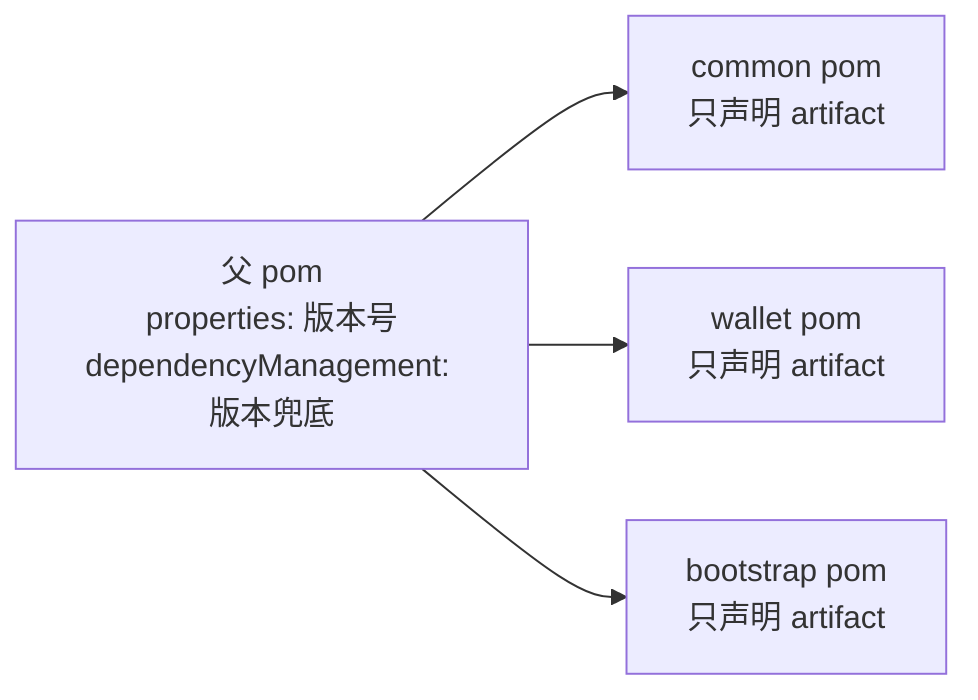

| 依赖 | 版本 | 在 Plan 1 的用途 | 后续 Plan 的用途 |
|---|---|---|---|
| spring-kafka | 3.2.4 | KafkaTemplate / KafkaListener / DefaultErrorHandler（Task 13/15/16） | 各业务事件 listener |
| shedlock | 5.16.0 | OutboxRelay 多实例互斥（Task 15） | scanner / sweep / treasury 定时任务全用 |
| bouncycastle | 1.78.1 | AES-GCM 加密 + secp256k1（Task 23/24/26） | BTC / ETH / TRON 各链签名 |
| web3j-crypto | 4.12.2 | BIP-32/39/44 派生 + Keccak（Task 25/26） | ETH 链签名（Plan 2） |
| testcontainers | 1.20.4 | MySQL 集成测试（Task 18/37） | 各链 e2e 测试 |
| micrometer | 1.13.6 | MQ + Ledger Prometheus 指标 | 全栈监控 |
| spring-statemachine | 4.0.0 | 不在 Plan 1 用 | withdraw / sweep 状态机（Plan 2/3） |

**版本选型原则**：

- **跟 Spring Boot BOM 走的不要在父 pom 重定义**：jackson / mybatis / mysql-connector 等已经在 spring-boot-dependencies 里管好，再写一遍版本属性反而容易和 BOM 不一致。
- **必须显式管的是非 BOM 内的依赖**：spring-kafka 虽然 Spring 系，但版本要和 broker 兼容，单独管控；shedlock / bouncycastle 完全外部，必须管。
- **testcontainers 用 BOM 而非单 artifact**：`testcontainers-bom` 一次性兜住 mysql / kafka / junit-jupiter 几个子模块的版本，避免内部不一致。
- **statemachine 4.0.0 vs 3.x**：4.0 已正式 GA 兼容 Spring 6 / Java 17+，与 Spring Boot 3.3 匹配。

**易踩的坑**：

- 父 pom 改了版本属性但没改 dependencyManagement：子模块仍取旧版本，因为 dependencyManagement 才是真正生效的兜底；只改 `<properties>` 的字符串等于没改。
- testcontainers 用 BOM 后，子模块仍写死版本：BOM 失效，子模块版本胡乱漂移。子模块只写 `<groupId>` + `<artifactId>`，**不写 version**。
- `mvn dependency:resolve -pl common` 失败：通常是父 pom 还没 install 到本地仓库（或缺少 jjwt-api 之类已有依赖的兼容版本）。先 `mvn install -N -DskipTests`（仅装父 pom）。

### Task 1: 在父 pom 中追加新依赖的版本属性与 dependencyManagement

**Files:**
- Modify: `pom.xml`（顶层）

- [ ] **Step 1.1: 在 `<properties>` 节加版本属性**

定位 `pom.xml:43` `<jjwt.version>0.12.6</jjwt.version>` 后追加：

```xml
        <spring-kafka.version>3.2.4</spring-kafka.version>
        <shedlock.version>5.16.0</shedlock.version>
        <bouncycastle.version>1.78.1</bouncycastle.version>
        <web3j.version>4.12.2</web3j.version>
        <testcontainers.version>1.20.4</testcontainers.version>
        <micrometer.version>1.13.6</micrometer.version>
        <spring-statemachine.version>4.0.0</spring-statemachine.version>
```

- [ ] **Step 1.2: 在 `<dependencyManagement><dependencies>` 节追加版本管理**

定位 `pom.xml:166` 最后一条 jjwt-jackson 之后追加：

```xml
            <dependency>
                <groupId>org.springframework.kafka</groupId>
                <artifactId>spring-kafka</artifactId>
                <version>${spring-kafka.version}</version>
            </dependency>
            <dependency>
                <groupId>net.javacrumbs.shedlock</groupId>
                <artifactId>shedlock-spring</artifactId>
                <version>${shedlock.version}</version>
            </dependency>
            <dependency>
                <groupId>net.javacrumbs.shedlock</groupId>
                <artifactId>shedlock-provider-jdbc-template</artifactId>
                <version>${shedlock.version}</version>
            </dependency>
            <dependency>
                <groupId>org.bouncycastle</groupId>
                <artifactId>bcprov-jdk18on</artifactId>
                <version>${bouncycastle.version}</version>
            </dependency>
            <dependency>
                <groupId>org.web3j</groupId>
                <artifactId>crypto</artifactId>
                <version>${web3j.version}</version>
            </dependency>
            <dependency>
                <groupId>org.testcontainers</groupId>
                <artifactId>testcontainers-bom</artifactId>
                <version>${testcontainers.version}</version>
                <type>pom</type>
                <scope>import</scope>
            </dependency>
            <dependency>
                <groupId>org.springframework.statemachine</groupId>
                <artifactId>spring-statemachine-core</artifactId>
                <version>${spring-statemachine.version}</version>
            </dependency>
```

- [ ] **Step 1.3: 验证 mvn 解析无错**

Run: `mvn -q -DskipTests dependency:resolve -pl common`
Expected: 无 BUILD FAILURE，所有依赖解析成功。

- [ ] **Step 1.4: 提交**

```bash
git add pom.xml
git commit -m "build: add kafka/shedlock/bc/web3j-crypto/testcontainers/statemachine deps"
```

---

## Phase 2 — 数据库 V2 迁移：16 张业务表 + outbox + consumed_record + shedlock

### 全景：表分组与 ER 关系

19 张表按职责分 7 组：

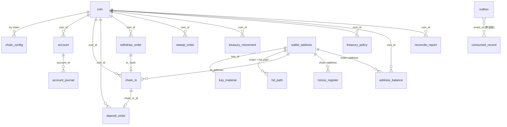

**七组表的职责**：

| 组 | 表 | 职责 |
|---|---|---|
| common-mq | outbox / consumed_record / shedlock | 消息总线基础设施（Phase 3） |
| 资产配置 | coin / chain_config | 币种、链、确认数、提现限额 |
| 地址与密钥 | wallet_address / hd_path / key_material | 地址、HD 派生路径占用、加密私钥 |
| 账户与流水 | account / account_journal | 用户余额、双账法流水（核心） |
| 链上交易 | chain_tx | 链上交易快照（含 reorg 状态） |
| 业务流程 | deposit_order / withdraw_order / sweep_order / treasury_movement | 充值/提现/归集/冷热调拨工单 |
| 归集与水位 | nonce_register / address_balance / treasury_policy | EVM nonce、地址余额缓存、冷热水位策略 |
| 对账 | reconcile_report | 三层对账日报 |

**全表共用约定**：

- **主键**：除复合主键的几张（`account_journal` 单主键 id；`nonce_register` / `address_balance` 复合主键），其余统一 `BIGINT PRIMARY KEY`，由 Snowflake 生成 → 趋势递增、避免 InnoDB 页分裂。
- **金额**：所有金额字段 `DECIMAL(38,18)`，38 位精度兼容 BTC / ETH（18 位小数）/ USDT 等所有现存代币的最小单位。**禁止**用 `DOUBLE`。
- **时间戳**：`DATETIME(3)` 含毫秒；不用 `TIMESTAMP`（避免 2038 / 时区漂移）；记 `created_at` + `updated_at`。
- **乐观锁**：会被并发 update 的表（account / *_order / nonce_register）加 `version INT NOT NULL DEFAULT 0`，CAS 更新时 `version=version+1 AND version=#{old}`。
- **字符集**：全表 `utf8mb4`，避免地址 / payload 里出现非 BMP 字符炸表。
- **Flyway 单文件 V2**：本期 16 张业务表 + 3 张消息表全部在 `V2__wallet_foundation.sql` 一个迁移内落盘，避免 PR review 时跨多个迁移找上下文。Plan 2/3/4/5 各自的新增字段走 V3/V4...。

**关键决策**：

- **不分库分表**：单库 InnoDB 撑得住——交易量 \* 流水放大系数（双账法 ≈ 2x）+ 7 年数据 ≈ 10 亿行级，热点表加分区 / 归档即可。
- **不引 NoSQL 副存储**：对账要求强一致快照，MySQL 是真理之源；地址余额这种"可能不准、定时刷新"的也用同一个 MySQL，少一层心智负担。
- **不用 Hibernate**：MyBatis-Plus 注解级 SQL + 复杂场景写 XML mapper，足够；ORM 在双账法这种"必须看到 SQL 形态"的场景反而是负担。

### Task 2: 拆分迁移脚本骨架

**Files:**
- Create: `bootstrap/src/main/resources/db/migration/V2__wallet_foundation.sql`

> 说明：本任务只放骨架与表头注释；具体表 DDL 在 Task 3-7 分批写入，避免单步过长。

- [ ] **Step 2.1: 新建 V2 迁移文件**

写入：

```sql
-- V2 wallet foundation: common-mq + wallet 16 业务表
-- Charset: utf8mb4，时间字段 DATETIME(3) 含毫秒
-- 所有金额 DECIMAL(38,18) 兼容 BTC/ETH/TRON
-- 主键统一 BIGINT（雪花 ID）；乐观锁字段 version；带 created_at/updated_at
-- 表清单：
--   common-mq:    outbox / consumed_record / shedlock
--   资产配置:     coin / chain_config
--   地址与密钥:   wallet_address / hd_path / key_material
--   账户与流水:   account / account_journal
--   链上交易:     chain_tx
--   业务流程:     deposit_order / withdraw_order / sweep_order / treasury_movement
--   归集与水位:   nonce_register / address_balance / treasury_policy
--   对账:         reconcile_report

-- 占位：以下 DDL 由 Task 3-7 分批补全
SELECT 1;
```

- [ ] **Step 2.2: 提交骨架**

```bash
git add bootstrap/src/main/resources/db/migration/V2__wallet_foundation.sql
git commit -m "chore(db): scaffold V2 wallet foundation migration"
```

### Task 3: 写入 common-mq 与资产配置 DDL（5 张表）

**Files:**
- Modify: `bootstrap/src/main/resources/db/migration/V2__wallet_foundation.sql`

- [ ] **Step 3.1: 替换占位 SELECT 1 为五张表**

将 `SELECT 1;` 替换为：

```sql
-- ========== common-mq ==========
CREATE TABLE outbox (
  id            BIGINT PRIMARY KEY,
  event_id      VARCHAR(64) NOT NULL,
  topic         VARCHAR(64) NOT NULL,
  partition_key VARCHAR(64),
  payload       MEDIUMTEXT NOT NULL,
  status        TINYINT NOT NULL,
  retry_count   INT NOT NULL DEFAULT 0,
  next_retry_at DATETIME(3),
  created_at    DATETIME(3) NOT NULL,
  UNIQUE KEY uk_event_id (event_id),
  KEY idx_status_next (status, next_retry_at)
) ENGINE=InnoDB DEFAULT CHARSET=utf8mb4;

CREATE TABLE consumed_record (
  event_id     VARCHAR(64) NOT NULL,
  handler_name VARCHAR(128) NOT NULL,
  consumed_at  DATETIME(3) NOT NULL,
  PRIMARY KEY (event_id, handler_name)
) ENGINE=InnoDB DEFAULT CHARSET=utf8mb4;

CREATE TABLE shedlock (
  name       VARCHAR(64) PRIMARY KEY,
  lock_until TIMESTAMP(3) NOT NULL,
  locked_at  TIMESTAMP(3) NOT NULL,
  locked_by  VARCHAR(255) NOT NULL
) ENGINE=InnoDB DEFAULT CHARSET=utf8mb4;

-- ========== 资产配置 ==========
CREATE TABLE coin (
  id        BIGINT PRIMARY KEY,
  symbol    VARCHAR(16) NOT NULL,
  chain     VARCHAR(16) NOT NULL,
  contract  VARCHAR(128),
  decimals  INT NOT NULL,
  status    TINYINT NOT NULL DEFAULT 1,
  created_at DATETIME(3) NOT NULL,
  updated_at DATETIME(3) NOT NULL,
  UNIQUE KEY uk_symbol_chain (symbol, chain)
) ENGINE=InnoDB DEFAULT CHARSET=utf8mb4;

CREATE TABLE chain_config (
  id                BIGINT PRIMARY KEY,
  chain             VARCHAR(16) NOT NULL,
  deposit_confirms  INT NOT NULL,
  withdraw_confirms INT NOT NULL,
  reorg_depth       INT NOT NULL,
  min_withdraw      DECIMAL(38,18) NOT NULL,
  max_withdraw      DECIMAL(38,18) NOT NULL,
  fee_strategy      VARCHAR(32) NOT NULL,
  max_gas_price_gwei DECIMAL(38,18),
  created_at        DATETIME(3) NOT NULL,
  updated_at        DATETIME(3) NOT NULL,
  UNIQUE KEY uk_chain (chain)
) ENGINE=InnoDB DEFAULT CHARSET=utf8mb4;
```

- [ ] **Step 3.2: 提交**

```bash
git add bootstrap/src/main/resources/db/migration/V2__wallet_foundation.sql
git commit -m "feat(db): V2 add outbox/consumed_record/shedlock/coin/chain_config"
```

### Task 4: 写入地址与密钥 DDL（3 张表）

**Files:**
- Modify: `bootstrap/src/main/resources/db/migration/V2__wallet_foundation.sql`

- [ ] **Step 4.1: 在 chain_config 之后追加**

```sql

-- ========== 地址与密钥 ==========
CREATE TABLE wallet_address (
  id          BIGINT PRIMARY KEY,
  user_id     BIGINT NOT NULL,
  chain       VARCHAR(16) NOT NULL,
  address     VARCHAR(128) NOT NULL,
  hd_path     VARCHAR(64) NOT NULL,
  key_id      VARCHAR(64) NOT NULL,
  status      TINYINT NOT NULL DEFAULT 1,
  created_at  DATETIME(3) NOT NULL,
  updated_at  DATETIME(3) NOT NULL,
  UNIQUE KEY uk_chain_addr (chain, address),
  KEY idx_user_chain (user_id, chain),
  KEY idx_key_id (key_id)
) ENGINE=InnoDB DEFAULT CHARSET=utf8mb4;

CREATE TABLE hd_path (
  id        BIGINT PRIMARY KEY,
  chain     VARCHAR(16) NOT NULL,
  hd_path   VARCHAR(64) NOT NULL,
  used_at   DATETIME(3) NOT NULL,
  UNIQUE KEY uk_chain_path (chain, hd_path)
) ENGINE=InnoDB DEFAULT CHARSET=utf8mb4;

CREATE TABLE key_material (
  id              BIGINT PRIMARY KEY,
  key_id          VARCHAR(64) NOT NULL,
  key_type        VARCHAR(16) NOT NULL,
  cipher_text     MEDIUMBLOB NOT NULL,
  iv              VARBINARY(32) NOT NULL,
  kms_alias       VARCHAR(128) NOT NULL,
  algo_version    INT NOT NULL DEFAULT 1,
  created_at      DATETIME(3) NOT NULL,
  UNIQUE KEY uk_key_id (key_id)
) ENGINE=InnoDB DEFAULT CHARSET=utf8mb4;
```

- [ ] **Step 4.2: 提交**

```bash
git add bootstrap/src/main/resources/db/migration/V2__wallet_foundation.sql
git commit -m "feat(db): V2 add wallet_address/hd_path/key_material"
```

### Task 5: 写入账户、流水、链上交易 DDL（3 张表）

**Files:**
- Modify: `bootstrap/src/main/resources/db/migration/V2__wallet_foundation.sql`

- [ ] **Step 5.1: 在 key_material 之后追加**

```sql

-- ========== 账户与流水（双账法）==========
CREATE TABLE account (
  id          BIGINT PRIMARY KEY,
  user_id     BIGINT NOT NULL,
  coin_id     BIGINT NOT NULL,
  available   DECIMAL(38,18) NOT NULL DEFAULT 0,
  frozen      DECIMAL(38,18) NOT NULL DEFAULT 0,
  version     INT NOT NULL DEFAULT 0,
  created_at  DATETIME(3) NOT NULL,
  updated_at  DATETIME(3) NOT NULL,
  UNIQUE KEY uk_user_coin (user_id, coin_id)
) ENGINE=InnoDB DEFAULT CHARSET=utf8mb4;

CREATE TABLE account_journal (
  id            BIGINT PRIMARY KEY,
  trace_id      VARCHAR(64) NOT NULL,
  account_id    BIGINT NOT NULL,
  coin_id       BIGINT NOT NULL,
  biz_type      VARCHAR(32) NOT NULL,
  biz_id        BIGINT NOT NULL,
  direction     TINYINT NOT NULL,
  amount        DECIMAL(38,18) NOT NULL,
  balance_after DECIMAL(38,18) NOT NULL,
  remark        VARCHAR(255),
  created_at    DATETIME(3) NOT NULL,
  UNIQUE KEY uk_trace_direction_account (trace_id, direction, account_id),
  KEY idx_account_time (account_id, created_at),
  KEY idx_biz (biz_type, biz_id)
) ENGINE=InnoDB DEFAULT CHARSET=utf8mb4;

-- ========== 链上交易快照 ==========
CREATE TABLE chain_tx (
  id            BIGINT PRIMARY KEY,
  chain         VARCHAR(16) NOT NULL,
  tx_hash       VARCHAR(128) NOT NULL,
  vout          INT NOT NULL DEFAULT 0,
  block_height  BIGINT NOT NULL,
  block_hash    VARCHAR(128) NOT NULL,
  parent_hash   VARCHAR(128) NOT NULL,
  from_address  VARCHAR(128),
  to_address    VARCHAR(128) NOT NULL,
  coin_id       BIGINT,
  amount        DECIMAL(38,18) NOT NULL,
  direction     TINYINT NOT NULL,
  confirm_count INT NOT NULL DEFAULT 0,
  status        TINYINT NOT NULL,
  raw_json      MEDIUMTEXT,
  created_at    DATETIME(3) NOT NULL,
  UNIQUE KEY uk_chain_hash_vout (chain, tx_hash, vout),
  KEY idx_to_addr (chain, to_address),
  KEY idx_chain_height (chain, block_height)
) ENGINE=InnoDB DEFAULT CHARSET=utf8mb4;
```

> 说明：`uk_trace_direction_account` 三字段联合唯一是双账法的安全幂等闸——同 trace 同 direction 在不同账户上必须能各自插入（freeze 场景两条 direction 不同；transferInternal 跨两个账户写双方各一条 +1/-1）。

- [ ] **Step 5.2: 提交**

```bash
git add bootstrap/src/main/resources/db/migration/V2__wallet_foundation.sql
git commit -m "feat(db): V2 add account/account_journal/chain_tx"
```

### Task 6: 写入业务流程 DDL（4 张表）

**Files:**
- Modify: `bootstrap/src/main/resources/db/migration/V2__wallet_foundation.sql`

- [ ] **Step 6.1: 在 chain_tx 之后追加**

```sql

-- ========== 业务流程 ==========
CREATE TABLE deposit_order (
  id            BIGINT PRIMARY KEY,
  user_id       BIGINT NOT NULL,
  coin_id       BIGINT NOT NULL,
  chain_tx_id   BIGINT NOT NULL,
  amount        DECIMAL(38,18) NOT NULL,
  status        VARCHAR(32) NOT NULL,
  confirm_count INT NOT NULL DEFAULT 0,
  version       INT NOT NULL DEFAULT 0,
  created_at    DATETIME(3) NOT NULL,
  updated_at    DATETIME(3) NOT NULL,
  UNIQUE KEY uk_chain_tx (chain_tx_id),
  KEY idx_user_status (user_id, status)
) ENGINE=InnoDB DEFAULT CHARSET=utf8mb4;

CREATE TABLE withdraw_order (
  id              BIGINT PRIMARY KEY,
  user_id         BIGINT NOT NULL,
  coin_id         BIGINT NOT NULL,
  chain           VARCHAR(16) NOT NULL,
  to_address      VARCHAR(128) NOT NULL,
  amount          DECIMAL(38,18) NOT NULL,
  fee             DECIMAL(38,18) NOT NULL DEFAULT 0,
  fee_estimate    DECIMAL(38,18),
  status          VARCHAR(32) NOT NULL,
  fail_reason     VARCHAR(255),
  risk_decision   VARCHAR(32),
  signed_raw      MEDIUMTEXT,
  tx_hash         VARCHAR(128),
  nonce           BIGINT,
  from_address    VARCHAR(128),
  replace_of_id   BIGINT,
  confirm_count   INT NOT NULL DEFAULT 0,
  version         INT NOT NULL DEFAULT 0,
  created_at      DATETIME(3) NOT NULL,
  updated_at      DATETIME(3) NOT NULL,
  KEY idx_status_time (status, created_at),
  KEY idx_user (user_id, status),
  KEY idx_chain_from_nonce (chain, from_address, nonce),
  UNIQUE KEY uk_tx_hash (tx_hash)
) ENGINE=InnoDB DEFAULT CHARSET=utf8mb4;

CREATE TABLE sweep_order (
  id            BIGINT PRIMARY KEY,
  chain         VARCHAR(16) NOT NULL,
  coin_id       BIGINT NOT NULL,
  src_address   VARCHAR(128) NOT NULL,
  dst_address   VARCHAR(128) NOT NULL,
  amount        DECIMAL(38,18) NOT NULL,
  status        VARCHAR(32) NOT NULL,
  drip_tx_hash  VARCHAR(128),
  sweep_tx_hash VARCHAR(128),
  nonce         BIGINT,
  retry_count   INT NOT NULL DEFAULT 0,
  version       INT NOT NULL DEFAULT 0,
  created_at    DATETIME(3) NOT NULL,
  updated_at    DATETIME(3) NOT NULL,
  KEY idx_chain_status (chain, status),
  UNIQUE KEY uk_sweep_tx (sweep_tx_hash)
) ENGINE=InnoDB DEFAULT CHARSET=utf8mb4;

CREATE TABLE treasury_movement (
  id            BIGINT PRIMARY KEY,
  chain         VARCHAR(16) NOT NULL,
  coin_id       BIGINT NOT NULL,
  direction     VARCHAR(16) NOT NULL,
  amount        DECIMAL(38,18) NOT NULL,
  status        VARCHAR(32) NOT NULL,
  psbt          MEDIUMTEXT,
  tx_hash       VARCHAR(128),
  proposer      VARCHAR(64),
  approver_list VARCHAR(512),
  created_at    DATETIME(3) NOT NULL,
  updated_at    DATETIME(3) NOT NULL,
  KEY idx_status (status)
) ENGINE=InnoDB DEFAULT CHARSET=utf8mb4;
```

- [ ] **Step 6.2: 提交**

```bash
git add bootstrap/src/main/resources/db/migration/V2__wallet_foundation.sql
git commit -m "feat(db): V2 add deposit/withdraw/sweep/treasury_movement"
```

### Task 7: 写入 nonce_register / address_balance / treasury_policy / reconcile_report DDL（4 张表）

**Files:**
- Modify: `bootstrap/src/main/resources/db/migration/V2__wallet_foundation.sql`

- [ ] **Step 7.1: 在 treasury_movement 之后追加**

```sql

-- ========== 归集与水位辅助 ==========
CREATE TABLE nonce_register (
  chain          VARCHAR(16) NOT NULL,
  address        VARCHAR(128) NOT NULL,
  next_nonce     BIGINT NOT NULL,
  on_chain_nonce BIGINT NOT NULL,
  reconciled_at  DATETIME(3) NOT NULL,
  version        INT NOT NULL DEFAULT 0,
  PRIMARY KEY (chain, address)
) ENGINE=InnoDB DEFAULT CHARSET=utf8mb4;

CREATE TABLE address_balance (
  chain         VARCHAR(16) NOT NULL,
  address       VARCHAR(128) NOT NULL,
  coin_id       BIGINT NOT NULL,
  balance       DECIMAL(38,18) NOT NULL,
  block_height  BIGINT NOT NULL,
  refreshed_at  DATETIME(3) NOT NULL,
  PRIMARY KEY (chain, address, coin_id)
) ENGINE=InnoDB DEFAULT CHARSET=utf8mb4;

CREATE TABLE treasury_policy (
  id                BIGINT PRIMARY KEY,
  chain             VARCHAR(16) NOT NULL,
  coin_id           BIGINT NOT NULL,
  hot_low_ratio     DECIMAL(5,4) NOT NULL,
  hot_high_ratio    DECIMAL(5,4) NOT NULL,
  hot_target_ratio  DECIMAL(5,4) NOT NULL,
  total_target      DECIMAL(38,18) NOT NULL,
  daily_outflow_avg DECIMAL(38,18),
  created_at        DATETIME(3) NOT NULL,
  updated_at        DATETIME(3) NOT NULL,
  UNIQUE KEY uk_chain_coin (chain, coin_id)
) ENGINE=InnoDB DEFAULT CHARSET=utf8mb4;

-- ========== 对账报告 ==========
CREATE TABLE reconcile_report (
  id            BIGINT PRIMARY KEY,
  report_date   DATE NOT NULL,
  chain         VARCHAR(16) NOT NULL,
  coin_id       BIGINT NOT NULL,
  ledger_total  DECIMAL(38,18),
  chain_total   DECIMAL(38,18),
  delta         DECIMAL(38,18),
  status        VARCHAR(16) NOT NULL,
  detail_json   MEDIUMTEXT,
  created_at    DATETIME(3) NOT NULL,
  UNIQUE KEY uk_date_chain_coin (report_date, chain, coin_id)
) ENGINE=InnoDB DEFAULT CHARSET=utf8mb4;
```

- [ ] **Step 7.2: 提交**

```bash
git add bootstrap/src/main/resources/db/migration/V2__wallet_foundation.sql
git commit -m "feat(db): V2 add nonce_register/address_balance/treasury_policy/reconcile_report"
```

### Task 8: 启动 bootstrap 验证 Flyway 应用 V2

**Files:**
- 仅运行命令

- [ ] **Step 8.1: 启动 infra**

Run: `cd infra && cp -n .env.example .env && docker compose up -d mysql redis kafka`
Expected: 三个容器健康，端口 3306/6379/29092 可用。

- [ ] **Step 8.2: 编译并启动 bootstrap，让 Flyway 跑 V2**

Run: `mvn -q -DskipTests -pl bootstrap -am package` 然后 `java -jar bootstrap/target/exchange-bootstrap-1.0.0-SNAPSHOT.jar --spring.profiles.active=dev &`，3 秒后 `curl http://localhost:8080/actuator/health`。
Expected: `{"status":"UP"}` 并且 mysql `exchange_dev` 库出现 19 张表。

- [ ] **Step 8.3: 校验表清单**

Run: `mysql -h127.0.0.1 -uroot -proot exchange_dev -e "show tables;"`
Expected：account / account_journal / address_balance / chain_config / chain_tx / coin / consumed_record / deposit_order / flyway_schema_history / hd_path / key_material / nonce_register / outbox / reconcile_report / shedlock / sweep_order / treasury_movement / treasury_policy / wallet_address / withdraw_order，共 20 行。

- [ ] **Step 8.4: 关闭后台进程**

Run: `pkill -f exchange-bootstrap-1.0.0-SNAPSHOT.jar`
Expected: 后台进程被终止。无文件改动需要提交。

---

## Phase 3 — common-mq 子包（消息总线）

### 全景：为什么需要 outbox + ShedLock + idempotent

**问题场景**：业务变更（落账 / 改单 / 改状态）写 MySQL，然后给下游发 Kafka 通知。如果中间任何一步失败：

- 业务已 commit，但 Kafka 没发 → 下游错过事件、对账不齐。
- Kafka 已发，但业务事务回滚 → 下游凭一条不存在的事件做了反应（"幽灵事件"）。

两阶段提交（XA）能解，但 MySQL + Kafka 跨堆栈 XA 几乎不可用，且性能差。**Outbox 模式**用一张本地表 `outbox` 当"准发事件"，把"业务表变更 + outbox 插入"放在同一个本地事务里。事务一 commit，"事件即将发"是必然事实；之后由独立的 Relay 进程把 outbox 的行真正搬到 Kafka，是 _at-least-once_。下游必须自己做幂等。

**模块拆解**：

```mermaid
flowchart LR
  subgraph App[应用进程内]
    Biz[业务 Service]
    TEP[TransactionalEventPublisher<br/>Propagation.MANDATORY]
    Relay[OutboxRelay<br/>@Scheduled + @SchedulerLock]
    KEP[KafkaEventPublisher<br/>即时发送，无事务保证]
    Cons[IdempotentEventHandler<br/>下游消费者基类]
  end

  subgraph DB[(MySQL)]
    OB[(outbox)]
    CR[(consumed_record)]
    SL[(shedlock)]
  end

  K[(Kafka<br/>topic + DLT)]

  Biz -- 同事务 --> TEP
  TEP -- insert PENDING --> OB
  Relay -- pickPending --> OB
  Relay -- send --> K
  Relay -- markSENT/markRetry --> OB
  Relay -.加锁.-> SL

  K --> Cons
  Cons -- exists? --> CR
  Cons -- markConsumed --> CR
  Cons -- 业务处理 --> Biz
```

**职责切分**：

| 组件 | 解决什么 | 关键约束 |
|---|---|---|
| `DomainEvent` / `AbstractDomainEvent` | 事件契约：`eventId`（去重键）、`aggregateId`（partition key）、`eventType`（topic）、`occurredAt` | `eventId` 必须全局唯一且稳定；下游凭它做幂等 |
| `TransactionalEventPublisher` | 把"发事件"降级为"在 outbox 里插一行"，与业务变更同事务 | `Propagation.MANDATORY`：必须有调用方事务，否则抛错 |
| `OutboxRelay` + `ShedLock` | 把 PENDING 行真正发到 Kafka；多实例下只有一个在跑 | 失败指数退避；同名锁 `outbox-relay` 全局互斥 |
| `KafkaEventPublisher` | 不需要事务保证的即时通知（监控、告警） | 不进 outbox，丢了就丢了 |
| `IdempotentEventHandler` | 消费侧重复消息的幂等闸 | `(event_id, handler_name)` 唯一约束做去重 |
| `consumed_record` 表 | 记录"哪个 handler 处理过哪个 event" | 复合主键，INSERT IGNORE 写入 |

**关键决策**：

- **outbox 不做按时间分区表**：单表撑得住（PENDING 行很快被 Relay 清掉，SENT 行可异步归档）。
- **Relay 不用 Kafka Connect Debezium**：CDC 引入额外组件，对项目复杂度不划算；轮询表 + 200ms~1s 延迟在交易场景完全可接受。
- **Relay 用 ShedLock 而非 Redis 分布式锁**：本来就在用 MySQL，ShedLock 把锁状态也落 MySQL，避免再引一层依赖。
- **下游幂等用表而非 Redis**：Redis 持久化弱，落表保证"消费过就一定消费过"——尤其面对账户变更这种不可逆操作。
- **DLQ 不在 IdempotentEventHandler 里**：交给 spring-kafka 的 `DefaultErrorHandler` 配置 DLT 路由，Handler 只做异常分类（`RetriableException` 透传 / 其他原样抛）。

**易踩的坑**：

- 调用 `TransactionalEventPublisher.publish` 时调用方没开事务：直接抛 `IllegalTransactionStateException`——这是设计想要的，不是 bug。
- 多实例都跑 `@Scheduled`，没开 ShedLock：同一行被两个 Relay 同时 send，下游收到重复消息。靠下游的 idempotent 兜底，但发送量翻倍，浪费 Kafka 配额。
- Outbox 行积压：Relay 挂了或 Kafka 不可用导致积压，必须有"PENDING 行年龄超过 N 分钟"告警。
- 下游 handler 内部用了 `@Transactional(REQUIRES_NEW)`：`markConsumed` 不在外层事务里，业务回滚但 mark 已 commit，会丢消息。本期默认所有 handler 单事务，不嵌套。

---

### Task 9: 在 common 模块加 spring-kafka / shedlock / micrometer 依赖

**Files:**
- Modify: `common/pom.xml`

- [ ] **Step 9.1: 在 `common/pom.xml` 的 `<dependencies>` 节末尾追加**

定位 `</dependencies>` 闭合前一行，追加：

```xml
        <dependency>
            <groupId>org.springframework.kafka</groupId>
            <artifactId>spring-kafka</artifactId>
        </dependency>
        <dependency>
            <groupId>net.javacrumbs.shedlock</groupId>
            <artifactId>shedlock-spring</artifactId>
        </dependency>
        <dependency>
            <groupId>net.javacrumbs.shedlock</groupId>
            <artifactId>shedlock-provider-jdbc-template</artifactId>
        </dependency>
        <dependency>
            <groupId>io.micrometer</groupId>
            <artifactId>micrometer-core</artifactId>
        </dependency>
        <dependency>
            <groupId>org.springframework.boot</groupId>
            <artifactId>spring-boot-starter-test</artifactId>
            <scope>test</scope>
        </dependency>
        <dependency>
            <groupId>org.springframework.kafka</groupId>
            <artifactId>spring-kafka-test</artifactId>
            <scope>test</scope>
        </dependency>
        <dependency>
            <groupId>org.testcontainers</groupId>
            <artifactId>kafka</artifactId>
            <scope>test</scope>
        </dependency>
        <dependency>
            <groupId>org.testcontainers</groupId>
            <artifactId>mysql</artifactId>
            <scope>test</scope>
        </dependency>
        <dependency>
            <groupId>org.testcontainers</groupId>
            <artifactId>junit-jupiter</artifactId>
            <scope>test</scope>
        </dependency>
```

- [ ] **Step 9.2: 验证**

Run: `mvn -q -DskipTests -pl common -am dependency:resolve`
Expected: BUILD SUCCESS。

- [ ] **Step 9.3: 提交**

```bash
git add common/pom.xml
git commit -m "build(common): add kafka/shedlock/testcontainers deps for common-mq"
```

### Task 10: 定义 DomainEvent / AbstractDomainEvent / RetriableException

**Files:**
- Create: `common/src/main/java/com/exchange/common/mq/DomainEvent.java`
- Create: `common/src/main/java/com/exchange/common/mq/AbstractDomainEvent.java`
- Create: `common/src/main/java/com/exchange/common/mq/RetriableException.java`
- Test: `common/src/test/java/com/exchange/common/mq/AbstractDomainEventTest.java`

- [ ] **Step 10.1: 写 DomainEvent.java**

```java
package com.exchange.common.mq;

public interface DomainEvent {
    String eventId();
    String aggregateId();
    String eventType();
    long occurredAt();
}
```

- [ ] **Step 10.2: 写 AbstractDomainEvent.java**

```java
package com.exchange.common.mq;

import com.exchange.common.util.SnowflakeIdGenerator;
import com.fasterxml.jackson.annotation.JsonIgnore;
import lombok.Getter;

@Getter
public abstract class AbstractDomainEvent implements DomainEvent {
    private final String eventId;
    private final long occurredAt;

    protected AbstractDomainEvent() {
        this.eventId = String.valueOf(SnowflakeIdGenerator.nextId());
        this.occurredAt = System.currentTimeMillis();
    }

    protected AbstractDomainEvent(String eventId, long occurredAt) {
        this.eventId = eventId;
        this.occurredAt = occurredAt;
    }

    @Override public String eventId() { return eventId; }
    @Override public long occurredAt() { return occurredAt; }
    @JsonIgnore @Override public abstract String aggregateId();
    @JsonIgnore @Override public abstract String eventType();
}
```

> 说明：如果现有 `SnowflakeIdGenerator` 不是 static 方法，先看一下 `common/src/main/java/com/exchange/common/util/SnowflakeIdGenerator.java`，按它的实际签名调用——`nextId()` 是常见命名，若是实例方法则改为 `bean.nextId()`。

- [ ] **Step 10.3: 写 RetriableException.java**

```java
package com.exchange.common.mq;

public class RetriableException extends RuntimeException {
    public RetriableException(String message) { super(message); }
    public RetriableException(String message, Throwable cause) { super(message, cause); }
}
```

- [ ] **Step 10.4: 写 AbstractDomainEventTest.java**

```java
package com.exchange.common.mq;

import org.junit.jupiter.api.Test;
import static org.assertj.core.api.Assertions.assertThat;

class AbstractDomainEventTest {

    static class FooEvent extends AbstractDomainEvent {
        private final String aggregateId;
        FooEvent(String aggregateId) { this.aggregateId = aggregateId; }
        @Override public String aggregateId() { return aggregateId; }
        @Override public String eventType() { return "test.foo.created"; }
    }

    @Test
    void event_id_and_occurred_at_are_auto_filled() {
        FooEvent e = new FooEvent("agg-1");
        assertThat(e.eventId()).isNotBlank();
        assertThat(e.occurredAt()).isPositive();
        assertThat(e.aggregateId()).isEqualTo("agg-1");
        assertThat(e.eventType()).isEqualTo("test.foo.created");
    }
}
```

- [ ] **Step 10.5: 跑测试**

Run: `mvn -q -pl common test -Dtest=AbstractDomainEventTest`
Expected: BUILD SUCCESS, 1 test passed.

- [ ] **Step 10.6: 提交**

```bash
git add common/src/main/java/com/exchange/common/mq/ common/src/test/java/com/exchange/common/mq/
git commit -m "feat(mq): DomainEvent/AbstractDomainEvent/RetriableException"
```

### Task 11: Outbox 实体 + Mapper + 状态枚举

**设计考虑**：

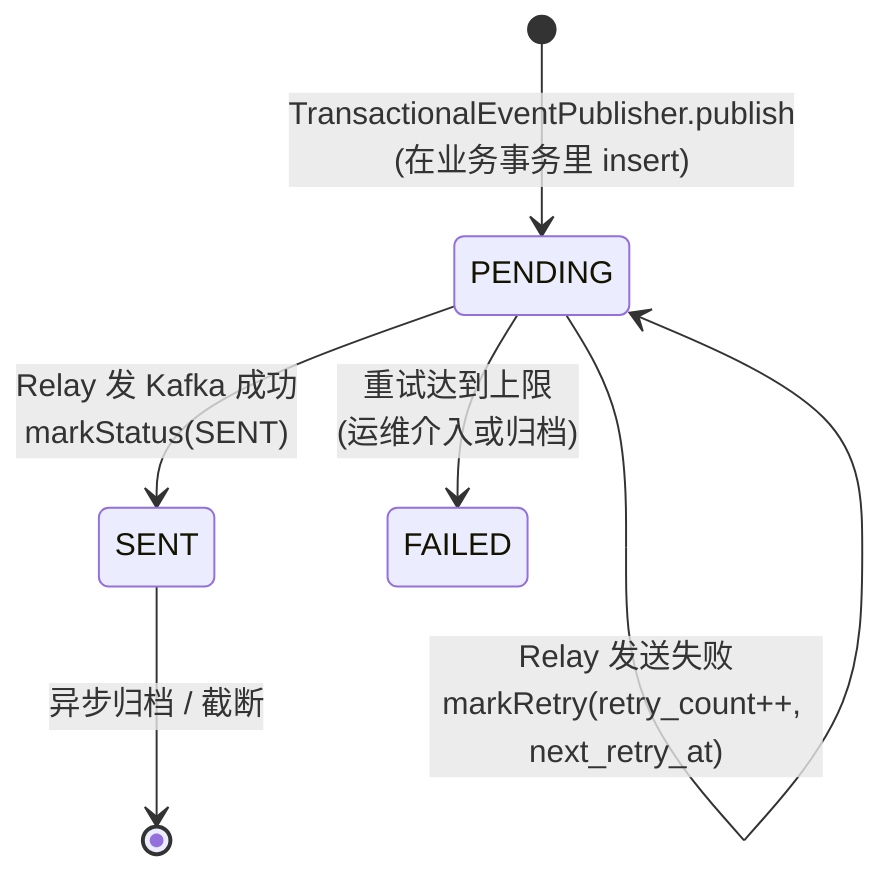

- **`event_id` 唯一约束**：业务侧用它做"事件已写入"的幂等键。同一业务操作重试时，第二次 insert 会被唯一约束挡掉，保证一条业务变更最多一条 outbox 行。
- **`status` 用 TINYINT 而非 enum 字符串**：节省字段宽度；`OutboxStatus.code` 是枚举值的真理，DB 字段只存数字。
- **`retry_count` 与 `next_retry_at` 拆开**：`retry_count` 决定退避级别（指数计算），`next_retry_at` 决定何时再可被 `pickPending` 选中。`pickPending` 的 `WHERE` 条件 `(next_retry_at IS NULL OR next_retry_at <= now)` 让首次未重试的行（NULL）和到期重试的行都能被选中。
- **`partition_key` 单独存**：Kafka 消息发送时需要 partition key 做有序保证（同 aggregate 的事件按时间序到同一分区）。从 payload JSON 里临时反序列化代价高，存字段直接拿。
- **`payload` 用 MEDIUMTEXT**：足够装下大部分 EventEnvelope JSON；如果未来出现超大事件（很少见），考虑外部对象存储 + 引用。
- **索引 `idx_status_next (status, next_retry_at)`**：`pickPending` 的核心查询走它；按 `status` 等值 + `next_retry_at` 范围扫，比单列 `status` 索引能多过滤一轮。
- **不放 `eventType` 字段**：Relay 不关心 type，只关心 topic。`eventType → topic` 的映射在 Publisher 端就已经做完。

**上下游契约**：
- 上游：`TransactionalEventPublisherImpl.insert` 写入 PENDING 行，必须在调用方事务内。
- 下游：`OutboxRelay.relay` 通过 `pickPending` 选行 → `kafkaTemplate.send` → `markStatus(SENT)` 或 `markRetry`。

**Files:**
- Create: `common/src/main/java/com/exchange/common/mq/outbox/OutboxStatus.java`
- Create: `common/src/main/java/com/exchange/common/mq/outbox/OutboxEntity.java`
- Create: `common/src/main/java/com/exchange/common/mq/outbox/OutboxMapper.java`

- [ ] **Step 11.1: OutboxStatus.java**

```java
package com.exchange.common.mq.outbox;

public enum OutboxStatus {
    PENDING(0), SENT(1), FAILED(2);

    public final int code;
    OutboxStatus(int code) { this.code = code; }

    public static OutboxStatus of(int code) {
        for (OutboxStatus s : values()) if (s.code == code) return s;
        throw new IllegalArgumentException("unknown OutboxStatus code: " + code);
    }
}
```

- [ ] **Step 11.2: OutboxEntity.java**

```java
package com.exchange.common.mq.outbox;

import com.baomidou.mybatisplus.annotation.IdType;
import com.baomidou.mybatisplus.annotation.TableId;
import com.baomidou.mybatisplus.annotation.TableName;
import lombok.Data;
import java.time.LocalDateTime;

@Data
@TableName("outbox")
public class OutboxEntity {
    @TableId(type = IdType.INPUT)
    private Long id;
    private String eventId;
    private String topic;
    private String partitionKey;
    private String payload;
    private Integer status;
    private Integer retryCount;
    private LocalDateTime nextRetryAt;
    private LocalDateTime createdAt;
}
```

- [ ] **Step 11.3: OutboxMapper.java**

```java
package com.exchange.common.mq.outbox;

import com.baomidou.mybatisplus.core.mapper.BaseMapper;
import org.apache.ibatis.annotations.Mapper;
import org.apache.ibatis.annotations.Param;
import org.apache.ibatis.annotations.Select;
import org.apache.ibatis.annotations.Update;
import java.time.LocalDateTime;
import java.util.List;

@Mapper
public interface OutboxMapper extends BaseMapper<OutboxEntity> {

    @Select("""
        SELECT * FROM outbox
        WHERE status = #{status}
          AND (next_retry_at IS NULL OR next_retry_at <= #{now})
        ORDER BY id
        LIMIT #{limit}
        """)
    List<OutboxEntity> pickPending(@Param("status") int status,
                                   @Param("now") LocalDateTime now,
                                   @Param("limit") int limit);

    @Update("UPDATE outbox SET status = #{status} WHERE id = #{id}")
    int markStatus(@Param("id") long id, @Param("status") int status);

    @Update("""
        UPDATE outbox
           SET retry_count = retry_count + 1,
               next_retry_at = #{nextRetryAt}
         WHERE id = #{id}
        """)
    int markRetry(@Param("id") long id, @Param("nextRetryAt") LocalDateTime nextRetryAt);
}
```

- [ ] **Step 11.4: 编译验证**

Run: `mvn -q -pl common -am compile`
Expected: BUILD SUCCESS。

- [ ] **Step 11.5: 提交**

```bash
git add common/src/main/java/com/exchange/common/mq/outbox/
git commit -m "feat(mq): outbox entity/mapper/status enum"
```

### Task 12: ConsumedRecord 实体 + Mapper + Store

**设计考虑**：

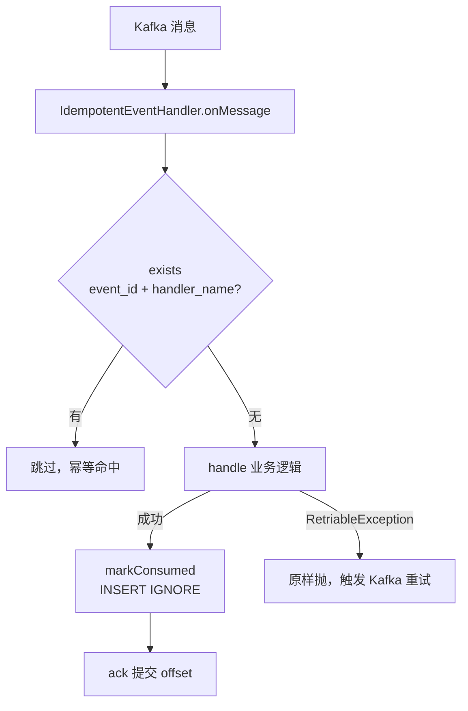

- **`(event_id, handler_name)` 复合主键**：同一事件被不同 handler 各处理一次，不互斥。比如一笔提现完成事件，"通知用户"和"更新风控水位"是两个 handler，都得各自跑一次。
- **没有自增 id**：复合主键就是天然唯一键，省一列。
- **`INSERT IGNORE` 而非 `ON DUPLICATE KEY UPDATE`**：第一次写入即定型，二次进来直接被唯一约束拒绝，零开销。`exists` 是先查后插的双保险——快速路径走查询，仅在 race 下才依赖 INSERT IGNORE。
- **不用 Redis 做去重**：Redis 持久化弱，掉一次数据就可能让账户事件被重复处理。MySQL 的持久性 + 双账法本身的幂等闸（`uk(trace_id, direction, account_id)`）才是真正可靠的兜底——本表只是"避免业务逻辑被重复执行"的快门。
- **不带 TTL**：consumed_record 不会无限增长——每个 event_id 雪花 ID 趋势递增，按 created_at 老化即可。本期不做归档，未来可加分区表 + 定时 drop 旧分区。

**与 outbox 的对称性**：
- 写侧（生产者）：业务事务 + outbox 表 + Relay = at-least-once 投递。
- 读侧（消费者）：Kafka offset + consumed_record 表 + IdempotentHandler = 业务逻辑 exactly-once 执行。
- 这一对配合起来才能在 Kafka 默认 at-least-once 语义之上做出"幂等等价 exactly-once"。

**Files:**
- Create: `common/src/main/java/com/exchange/common/mq/consumed/ConsumedRecordEntity.java`
- Create: `common/src/main/java/com/exchange/common/mq/consumed/ConsumedRecordMapper.java`
- Create: `common/src/main/java/com/exchange/common/mq/consumed/ConsumedRecordStore.java`

- [ ] **Step 12.1: ConsumedRecordEntity.java**

```java
package com.exchange.common.mq.consumed;

import com.baomidou.mybatisplus.annotation.TableName;
import lombok.Data;
import java.time.LocalDateTime;

@Data
@TableName("consumed_record")
public class ConsumedRecordEntity {
    private String eventId;
    private String handlerName;
    private LocalDateTime consumedAt;
}
```

- [ ] **Step 12.2: ConsumedRecordMapper.java**

```java
package com.exchange.common.mq.consumed;

import org.apache.ibatis.annotations.Insert;
import org.apache.ibatis.annotations.Mapper;
import org.apache.ibatis.annotations.Param;
import org.apache.ibatis.annotations.Select;
import java.time.LocalDateTime;

@Mapper
public interface ConsumedRecordMapper {

    @Select("""
        SELECT COUNT(*) FROM consumed_record
        WHERE event_id = #{eventId} AND handler_name = #{handler}
        """)
    int countByKey(@Param("eventId") String eventId,
                   @Param("handler") String handler);

    @Insert("""
        INSERT IGNORE INTO consumed_record(event_id, handler_name, consumed_at)
        VALUES(#{eventId}, #{handler}, #{consumedAt})
        """)
    int insertIgnore(@Param("eventId") String eventId,
                     @Param("handler") String handler,
                     @Param("consumedAt") LocalDateTime consumedAt);
}
```

- [ ] **Step 12.3: ConsumedRecordStore.java**

```java
package com.exchange.common.mq.consumed;

import lombok.RequiredArgsConstructor;
import org.springframework.stereotype.Component;
import java.time.LocalDateTime;

@Component
@RequiredArgsConstructor
public class ConsumedRecordStore {

    private final ConsumedRecordMapper mapper;

    public boolean exists(String eventId, String handlerName) {
        return mapper.countByKey(eventId, handlerName) > 0;
    }

    public void markConsumed(String eventId, String handlerName) {
        mapper.insertIgnore(eventId, handlerName, LocalDateTime.now());
    }
}
```

- [ ] **Step 12.4: 编译**

Run: `mvn -q -pl common -am compile`
Expected: BUILD SUCCESS。

- [ ] **Step 12.5: 提交**

```bash
git add common/src/main/java/com/exchange/common/mq/consumed/
git commit -m "feat(mq): consumed_record entity/mapper/store"
```

### Task 13: Kafka 配置 + EventEnvelope + KafkaEventPublisher（即时发送）

**设计考虑**：

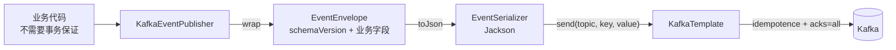

- **`KafkaEventPublisher` 是"无事务保证"的即时发送通道**：用于不需要持久化保证的场景（监控、Slack 通知、日志投递）。账户、订单类的关键事件**必须走 `TransactionalEventPublisher` + outbox**，不要直接调它。
- **Producer 三件套配置**：
  - `enable.idempotence=true`：单 Producer 实例内防重发，避免网络重试导致 Kafka 端出现重复消息。
  - `acks=all`：所有 in-sync replica 写入才算成功，配合 broker 端 `min.insync.replicas≥2` 才能在单节点宕机下不丢消息。
  - `max.in.flight.requests.per.connection=5`：开 idempotence 后必须 ≤5（Kafka 限制），同时保证同一分区内有序——开 idempotence 时 broker 用 sequence number 重排，应用层无需担心乱序。
- **`EventEnvelope` 加 `schemaVersion`**：事件结构演进的逃生通道。早期 v1 字段不变；v2 加新字段时下游能根据 schemaVersion 判断走老逻辑还是新逻辑，避免直接改字段引发反序列化失败。
- **partition key 用 `aggregateId`**：同一聚合（同一账户、同一订单）的事件必到同一分区 → 分区内有序 = 该聚合的事件全局有序。这是后续做"按 aggregate 串行消费"的前置条件。
- **`@ConditionalOnProperty(exchange.mq.enabled, matchIfMissing=true)`**：默认开启，但单测和某些不需要 Kafka 的部署场景可以 `exchange.mq.enabled=false` 整段绕开。`matchIfMissing` 确保不显式配置时也走默认开启。

**Files:**
- Create: `common/src/main/java/com/exchange/common/mq/kafka/EventEnvelope.java`
- Create: `common/src/main/java/com/exchange/common/mq/kafka/KafkaConfig.java`
- Create: `common/src/main/java/com/exchange/common/mq/EventPublisher.java`
- Create: `common/src/main/java/com/exchange/common/mq/kafka/KafkaEventPublisher.java`
- Create: `common/src/main/java/com/exchange/common/mq/serializer/EventSerializer.java`

- [ ] **Step 13.1: EventEnvelope.java**

```java
package com.exchange.common.mq.kafka;

import com.exchange.common.mq.DomainEvent;
import lombok.AllArgsConstructor;
import lombok.Data;
import lombok.NoArgsConstructor;

@Data
@NoArgsConstructor
@AllArgsConstructor
public class EventEnvelope {
    private int schemaVersion;
    private String eventType;
    private String eventId;
    private long occurredAt;
    private String aggregateId;
    private Object payload;

    public static EventEnvelope wrap(DomainEvent event) {
        return new EventEnvelope(1, event.eventType(), event.eventId(),
                event.occurredAt(), event.aggregateId(), event);
    }
}
```

- [ ] **Step 13.2: EventSerializer.java**

```java
package com.exchange.common.mq.serializer;

import com.exchange.common.mq.kafka.EventEnvelope;
import com.exchange.common.util.JsonUtil;
import org.springframework.stereotype.Component;

@Component
public class EventSerializer {
    public String toJson(EventEnvelope env) {
        return JsonUtil.toJson(env);
    }

    public EventEnvelope fromJson(String json) {
        return JsonUtil.fromJson(json, EventEnvelope.class);
    }
}
```

> 说明：依赖现有 `com.exchange.common.util.JsonUtil`。若 JsonUtil 接口名不同，按实际改 `toJson`/`fromJson` 调用。

- [ ] **Step 13.3: KafkaConfig.java**

```java
package com.exchange.common.mq.kafka;

import org.apache.kafka.clients.producer.ProducerConfig;
import org.apache.kafka.common.serialization.StringSerializer;
import org.springframework.boot.autoconfigure.condition.ConditionalOnProperty;
import org.springframework.context.annotation.Bean;
import org.springframework.context.annotation.Configuration;
import org.springframework.kafka.core.DefaultKafkaProducerFactory;
import org.springframework.kafka.core.KafkaTemplate;
import org.springframework.kafka.core.ProducerFactory;
import java.util.HashMap;
import java.util.Map;

@Configuration
@ConditionalOnProperty(name = "exchange.mq.enabled", havingValue = "true", matchIfMissing = true)
public class KafkaConfig {

    @Bean
    public ProducerFactory<String, String> producerFactory(
            org.springframework.boot.autoconfigure.kafka.KafkaProperties props) {
        Map<String, Object> cfg = new HashMap<>(props.buildProducerProperties(null));
        cfg.put(ProducerConfig.KEY_SERIALIZER_CLASS_CONFIG, StringSerializer.class);
        cfg.put(ProducerConfig.VALUE_SERIALIZER_CLASS_CONFIG, StringSerializer.class);
        cfg.put(ProducerConfig.ENABLE_IDEMPOTENCE_CONFIG, true);
        cfg.put(ProducerConfig.ACKS_CONFIG, "all");
        cfg.put(ProducerConfig.MAX_IN_FLIGHT_REQUESTS_PER_CONNECTION, 5);
        return new DefaultKafkaProducerFactory<>(cfg);
    }

    @Bean
    public KafkaTemplate<String, String> kafkaTemplate(ProducerFactory<String, String> pf) {
        return new KafkaTemplate<>(pf);
    }
}
```

- [ ] **Step 13.4: EventPublisher.java（接口）**

```java
package com.exchange.common.mq;

public interface EventPublisher {
    void publish(DomainEvent event);
    void publish(String topic, DomainEvent event);
}
```

- [ ] **Step 13.5: KafkaEventPublisher.java**

```java
package com.exchange.common.mq.kafka;

import com.exchange.common.mq.DomainEvent;
import com.exchange.common.mq.EventPublisher;
import com.exchange.common.mq.serializer.EventSerializer;
import lombok.RequiredArgsConstructor;
import org.springframework.kafka.core.KafkaTemplate;
import org.springframework.stereotype.Component;

@Component
@RequiredArgsConstructor
public class KafkaEventPublisher implements EventPublisher {

    private final KafkaTemplate<String, String> kafkaTemplate;
    private final EventSerializer serializer;

    @Override
    public void publish(DomainEvent event) {
        publish(event.eventType(), event);
    }

    @Override
    public void publish(String topic, DomainEvent event) {
        String json = serializer.toJson(EventEnvelope.wrap(event));
        kafkaTemplate.send(topic, event.aggregateId(), json);
    }
}
```

- [ ] **Step 13.6: 编译**

Run: `mvn -q -pl common -am compile`
Expected: BUILD SUCCESS。

- [ ] **Step 13.7: 提交**

```bash
git add common/src/main/java/com/exchange/common/mq/
git commit -m "feat(mq): EventEnvelope/KafkaConfig/EventPublisher/KafkaEventPublisher"
```

### Task 14: TransactionalEventPublisher 接口与实现（写 outbox）

**设计考虑**：

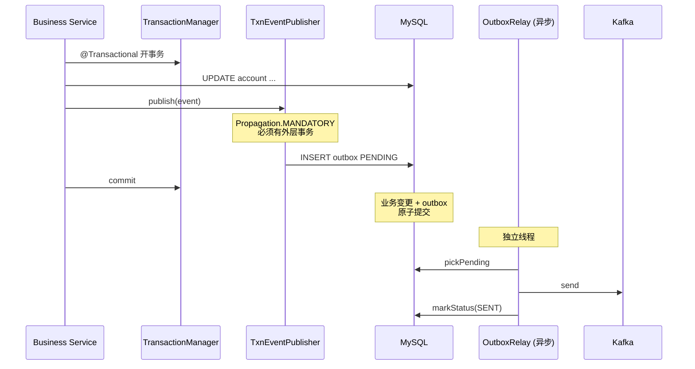

- **为什么是 `Propagation.MANDATORY` 而不是 `REQUIRED` / `REQUIRES_NEW`**：
  - `REQUIRED`（默认）：没有事务就新开一个。Publisher 单独开事务 → outbox 行 commit 后业务事务回滚 → 出现"业务没成但事件已送达"的幻象。**严重 bug**。
  - `REQUIRES_NEW`：强制开新事务，更糟，业务和 outbox 完全异构事务，无任何原子性保证。
  - `MANDATORY`：必须有调用方事务，否则抛 `IllegalTransactionStateException`。在编译期 + 启动期不能保证调用者一定开事务，但运行期第一次错误调用就直接炸——把 bug 前置到调用方编写阶段，而不是潜伏到生产事故。
- **失败场景闭环**：
  - 业务 commit + outbox commit + Kafka 发送成功 → 正常路径。
  - 业务 commit + outbox commit + Kafka 发送失败 → outbox 保留 PENDING，Relay 后续重试。**这是 outbox 模式的核心价值**。
  - 业务回滚 → outbox 也回滚（同事务）→ 无脏事件。
  - Publisher 调用时没事务 → 立刻抛错，调用方修复。
- **不在 Publisher 内做 Kafka 发送**：发送动作完全交给 Relay。如果 Publisher 同步发，又遇到 Kafka 卡死，业务事务被拖死，反而比传统直发还糟。
- **`event_id` 的来源**：`AbstractDomainEvent` 默认用 SnowflakeIdGenerator.nextDefaultId() 生成；如需"业务键即事件 id"（更强的去重语义，比如同一笔提现重发），子类构造时传入业务键作为 `eventId`。
- **`outbox.id` 用 Snowflake 而非自增**：避免单点发号瓶颈、便于跨表 join 排查；趋势递增对 InnoDB 主键友好。

**Files:**
- Create: `common/src/main/java/com/exchange/common/mq/TransactionalEventPublisher.java`
- Create: `common/src/main/java/com/exchange/common/mq/outbox/TransactionalEventPublisherImpl.java`
- Test: `common/src/test/java/com/exchange/common/mq/outbox/TransactionalEventPublisherImplTest.java`

- [ ] **Step 14.1: TransactionalEventPublisher.java**

```java
package com.exchange.common.mq;

public interface TransactionalEventPublisher {
    void publish(DomainEvent event);
    void publish(String topic, DomainEvent event);
}
```

- [ ] **Step 14.2: TransactionalEventPublisherImpl.java**

```java
package com.exchange.common.mq.outbox;

import com.exchange.common.mq.DomainEvent;
import com.exchange.common.mq.TransactionalEventPublisher;
import com.exchange.common.mq.kafka.EventEnvelope;
import com.exchange.common.mq.serializer.EventSerializer;
import com.exchange.common.util.SnowflakeIdGenerator;
import lombok.RequiredArgsConstructor;
import org.springframework.stereotype.Component;
import org.springframework.transaction.annotation.Propagation;
import org.springframework.transaction.annotation.Transactional;
import java.time.LocalDateTime;

@Component
@RequiredArgsConstructor
public class TransactionalEventPublisherImpl implements TransactionalEventPublisher {

    private final OutboxMapper outboxMapper;
    private final EventSerializer serializer;

    @Override
    public void publish(DomainEvent event) {
        publish(event.eventType(), event);
    }

    @Override
    @Transactional(propagation = Propagation.MANDATORY)
    public void publish(String topic, DomainEvent event) {
        OutboxEntity entity = new OutboxEntity();
        entity.setId(SnowflakeIdGenerator.nextId());
        entity.setEventId(event.eventId());
        entity.setTopic(topic);
        entity.setPartitionKey(event.aggregateId());
        entity.setPayload(serializer.toJson(EventEnvelope.wrap(event)));
        entity.setStatus(OutboxStatus.PENDING.code);
        entity.setRetryCount(0);
        entity.setCreatedAt(LocalDateTime.now());
        outboxMapper.insert(entity);
    }
}
```

> 说明：`Propagation.MANDATORY` 强制要求调用方处于事务中——这是 outbox 模式的核心保证：业务变更与 outbox 写入必须同事务。

- [ ] **Step 14.3: TransactionalEventPublisherImplTest.java**

```java
package com.exchange.common.mq.outbox;

import com.exchange.common.mq.AbstractDomainEvent;
import com.exchange.common.mq.serializer.EventSerializer;
import org.junit.jupiter.api.Test;
import org.mockito.ArgumentCaptor;
import static org.assertj.core.api.Assertions.assertThat;
import static org.mockito.Mockito.*;

class TransactionalEventPublisherImplTest {

    static class FooEvent extends AbstractDomainEvent {
        @Override public String aggregateId() { return "agg-1"; }
        @Override public String eventType() { return "test.foo"; }
    }

    @Test
    void publish_writes_pending_outbox_row() {
        OutboxMapper mapper = mock(OutboxMapper.class);
        EventSerializer serializer = mock(EventSerializer.class);
        when(serializer.toJson(any())).thenReturn("{}");

        TransactionalEventPublisherImpl pub =
                new TransactionalEventPublisherImpl(mapper, serializer);
        FooEvent e = new FooEvent();

        pub.publish(e);

        ArgumentCaptor<OutboxEntity> cap = ArgumentCaptor.forClass(OutboxEntity.class);
        verify(mapper).insert(cap.capture());
        OutboxEntity row = cap.getValue();
        assertThat(row.getEventId()).isEqualTo(e.eventId());
        assertThat(row.getTopic()).isEqualTo("test.foo");
        assertThat(row.getPartitionKey()).isEqualTo("agg-1");
        assertThat(row.getStatus()).isEqualTo(OutboxStatus.PENDING.code);
        assertThat(row.getRetryCount()).isZero();
    }
}
```

- [ ] **Step 14.4: 跑测试**

Run: `mvn -q -pl common test -Dtest=TransactionalEventPublisherImplTest`
Expected: 1 test passed.

- [ ] **Step 14.5: 提交**

```bash
git add common/src/main/java/com/exchange/common/mq/ common/src/test/java/com/exchange/common/mq/outbox/
git commit -m "feat(mq): TransactionalEventPublisher writes outbox in same tx"
```

### Task 15: OutboxRelay（独立线程批量投递）+ ShedLock

**设计考虑**：

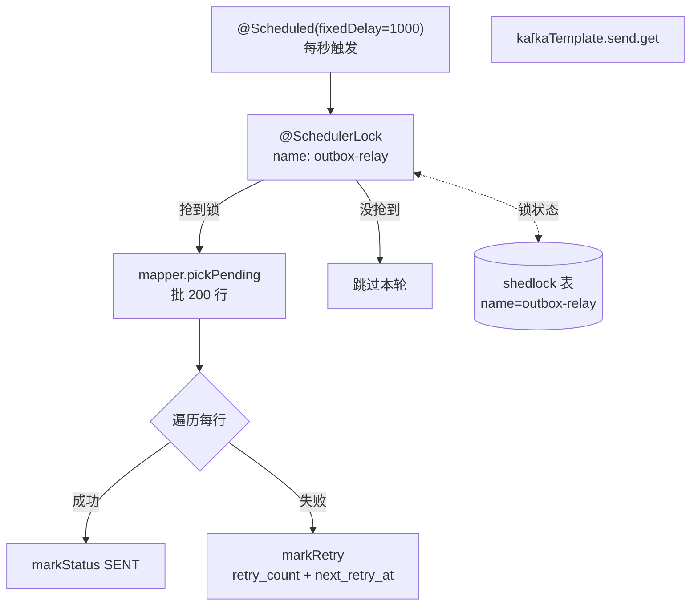

**关键决策**：

- **`fixedDelay=1000ms`**：上一轮结束到下一轮开始的间隔，不是固定频率。Relay 慢于 1 秒时会自然背压，不会堆任务。1 秒延迟在交易场景可接受；想压更低代价是 DB 轮询负载，不划算。
- **批量 200 行**：单轮最多发 200 条。够吞吐（200 \* 1QPS = 200msg/s/instance），但又不会让锁被占太久导致其他实例长时间空转。
- **ShedLock 的 `lockAtMostFor=30s`**：锁最多被持有 30 秒，超时强行释放。防止 Relay 进程崩溃时锁卡死。值要 ≥ 一轮处理的最大耗时（200 行 _ 单条最多 100ms = 20s），留 50% 余量。
- **ShedLock 的 `lockAtLeastFor=500ms`**：锁至少持有 500ms，即使任务很快结束也不立刻释放。防止"分布式时钟轻微偏差导致同一行被两个实例都拿到"——A 实例 100ms 跑完释放锁，B 实例时钟稍快、立刻抢到锁 + 看到了 A 还没 commit 的更新 = 重发。500ms 是 DB 主从复制延迟的安全阈值。
- **失败指数退避公式 `min(60 * 2^min(retry, 8), 600)`**：
  - retry=0 → 60s
  - retry=1 → 120s
  - retry=3 → 480s
  - retry≥4 → 600s（10 分钟封顶）
  - 8 次后 retry_count 不再放大延迟。延迟封顶 600s 避免 outbox 行被无限"延后"。本期不做"超过 N 次自动转 FAILED"，靠运维监控介入。
- **`.get()` 同步阻塞而非 `.thenAccept()`**：批内顺序处理简化错误归因。Relay 是单线程批处理，吞吐由批大小 \* 每秒次数决定，不需要并发。如果未来需要更高吞吐，开多个 Relay 实例 + ShedLock 调度，比单实例内部并发更稳。
- **`InterruptedException` 处理**：恢复中断标志（`Thread.currentThread().interrupt()`）后直接 return，不写 markRetry——下一轮再重试。
- **`@Scheduled` 必须配合 `@EnableScheduling`**：在 `ShedLockConfig` 上声明，避免污染其他不需要调度的 import。

**易踩的坑**：

- 不开 ShedLock 直接 `@Scheduled`：多副本部署时每个实例都跑，发送量被放大到副本数倍，下游 idempotent 表瞬间膨胀。
- `lockAtMostFor` 设小了：Relay 处理一轮没跑完锁就被释放，第二个实例进来抢到锁 + 看到老数据，重发。
- 错误处理把 `RuntimeException` 全吞了：Relay 永远不抛异常，下一轮立刻继续。这是设计选择——发送失败属于"对单条而言失败"，不应让整个 Relay 退出。但要监控 `markRetry` 的频率，超阈值告警。

**Files:**
- Create: `common/src/main/java/com/exchange/common/mq/outbox/OutboxRelay.java`
- Create: `common/src/main/java/com/exchange/common/mq/outbox/ShedLockConfig.java`
- Test: `common/src/test/java/com/exchange/common/mq/outbox/OutboxRelayTest.java`

- [ ] **Step 15.1: ShedLockConfig.java**

```java
package com.exchange.common.mq.outbox;

import net.javacrumbs.shedlock.core.LockProvider;
import net.javacrumbs.shedlock.provider.jdbctemplate.JdbcTemplateLockProvider;
import net.javacrumbs.shedlock.spring.annotation.EnableSchedulerLock;
import org.springframework.boot.autoconfigure.condition.ConditionalOnProperty;
import org.springframework.context.annotation.Bean;
import org.springframework.context.annotation.Configuration;
import org.springframework.jdbc.core.JdbcTemplate;
import org.springframework.scheduling.annotation.EnableScheduling;

@Configuration
@EnableScheduling
@EnableSchedulerLock(defaultLockAtMostFor = "60s")
@ConditionalOnProperty(name = "exchange.mq.enabled", havingValue = "true", matchIfMissing = true)
public class ShedLockConfig {

    @Bean
    public LockProvider lockProvider(JdbcTemplate jdbcTemplate) {
        return new JdbcTemplateLockProvider(
                JdbcTemplateLockProvider.Configuration.builder()
                        .withJdbcTemplate(jdbcTemplate)
                        .usingDbTime()
                        .build());
    }
}
```

- [ ] **Step 15.2: OutboxRelay.java**

```java
package com.exchange.common.mq.outbox;

import com.exchange.common.mq.kafka.EventEnvelope;
import com.exchange.common.mq.serializer.EventSerializer;
import lombok.RequiredArgsConstructor;
import lombok.extern.slf4j.Slf4j;
import net.javacrumbs.shedlock.spring.annotation.SchedulerLock;
import org.springframework.kafka.core.KafkaTemplate;
import org.springframework.scheduling.annotation.Scheduled;
import org.springframework.stereotype.Component;
import java.time.LocalDateTime;
import java.util.List;
import java.util.concurrent.ExecutionException;

@Slf4j
@Component
@RequiredArgsConstructor
public class OutboxRelay {

    private static final int BATCH = 200;

    private final OutboxMapper mapper;
    private final KafkaTemplate<String, String> kafkaTemplate;
    private final EventSerializer serializer;

    @Scheduled(fixedDelay = 1000)
    @SchedulerLock(name = "outbox-relay", lockAtMostFor = "30s", lockAtLeastFor = "500ms")
    public void relay() {
        List<OutboxEntity> rows = mapper.pickPending(
                OutboxStatus.PENDING.code, LocalDateTime.now(), BATCH);
        for (OutboxEntity row : rows) sendOne(row);
    }

    private void sendOne(OutboxEntity row) {
        try {
            kafkaTemplate.send(row.getTopic(), row.getPartitionKey(), row.getPayload())
                         .get();
            mapper.markStatus(row.getId(), OutboxStatus.SENT.code);
        } catch (InterruptedException ie) {
            Thread.currentThread().interrupt();
        } catch (ExecutionException | RuntimeException e) {
            int next = row.getRetryCount() + 1;
            long delaySec = Math.min(60L * (1L << Math.min(next, 8)), 600L);
            mapper.markRetry(row.getId(), LocalDateTime.now().plusSeconds(delaySec));
            log.warn("outbox send failed id={} retry={} cause={}", row.getId(), next, e.toString());
        }
    }
}
```

- [ ] **Step 15.3: OutboxRelayTest.java（mock 单测）**

```java
package com.exchange.common.mq.outbox;

import com.exchange.common.mq.serializer.EventSerializer;
import org.apache.kafka.clients.producer.RecordMetadata;
import org.apache.kafka.common.TopicPartition;
import org.junit.jupiter.api.Test;
import org.springframework.kafka.core.KafkaTemplate;
import org.springframework.kafka.support.SendResult;
import java.time.LocalDateTime;
import java.util.List;
import java.util.concurrent.CompletableFuture;
import static org.mockito.ArgumentMatchers.any;
import static org.mockito.Mockito.*;

class OutboxRelayTest {

    @Test
    void successful_send_marks_sent() {
        OutboxMapper mapper = mock(OutboxMapper.class);
        KafkaTemplate<String, String> tpl = mock(KafkaTemplate.class);
        EventSerializer ser = mock(EventSerializer.class);

        OutboxEntity row = new OutboxEntity();
        row.setId(1L);
        row.setTopic("t");
        row.setPartitionKey("k");
        row.setPayload("{}");
        row.setRetryCount(0);
        row.setStatus(OutboxStatus.PENDING.code);
        when(mapper.pickPending(eq(0), any(LocalDateTime.class), eq(200)))
                .thenReturn(List.of(row));

        SendResult<String, String> res = mock(SendResult.class);
        RecordMetadata md = new RecordMetadata(new TopicPartition("t", 0), 0, 0, 0L, 0, 0);
        when(res.getRecordMetadata()).thenReturn(md);
        when(tpl.send("t", "k", "{}")).thenReturn(CompletableFuture.completedFuture(res));

        new OutboxRelay(mapper, tpl, ser).relay();

        verify(mapper).markStatus(1L, OutboxStatus.SENT.code);
        verify(mapper, never()).markRetry(anyLong(), any());
    }

    @Test
    void failed_send_marks_retry_with_backoff() {
        OutboxMapper mapper = mock(OutboxMapper.class);
        KafkaTemplate<String, String> tpl = mock(KafkaTemplate.class);
        EventSerializer ser = mock(EventSerializer.class);

        OutboxEntity row = new OutboxEntity();
        row.setId(2L);
        row.setTopic("t");
        row.setPartitionKey("k");
        row.setPayload("{}");
        row.setRetryCount(0);
        row.setStatus(OutboxStatus.PENDING.code);
        when(mapper.pickPending(eq(0), any(LocalDateTime.class), eq(200)))
                .thenReturn(List.of(row));

        CompletableFuture<SendResult<String, String>> failed = new CompletableFuture<>();
        failed.completeExceptionally(new RuntimeException("kafka down"));
        when(tpl.send("t", "k", "{}")).thenReturn(failed);

        new OutboxRelay(mapper, tpl, ser).relay();

        verify(mapper, never()).markStatus(anyLong(), anyInt());
        verify(mapper).markRetry(eq(2L), any(LocalDateTime.class));
    }
}
```

- [ ] **Step 15.4: 跑测试**

Run: `mvn -q -pl common test -Dtest=OutboxRelayTest`
Expected: 2 tests passed.

- [ ] **Step 15.5: 提交**

```bash
git add common/src/main/java/com/exchange/common/mq/outbox/ common/src/test/java/com/exchange/common/mq/outbox/
git commit -m "feat(mq): OutboxRelay with ShedLock + exponential backoff"
```

### Task 16: IdempotentEventHandler 抽象消费者

**设计考虑**：

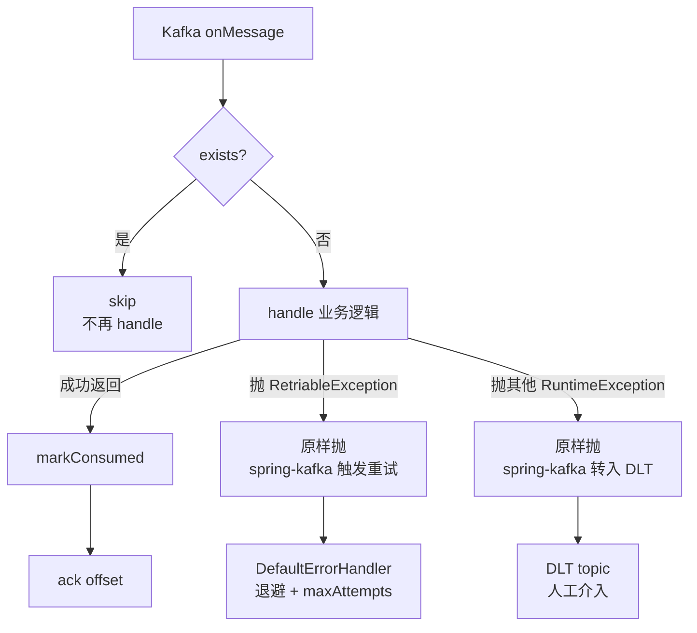

**关键决策**：

- **"先查后处理后标记"的顺序**：
  1. `exists?` 是快速路径，命中直接返回，不走业务逻辑。
  2. `handle()` 跑业务（可能写多张表、调多个外部接口）。
  3. 成功后 `markConsumed`。
  - **顺序很重要**：如果先 mark 后 handle，handle 失败但 mark 已落 → 下次跳过 → 业务永远没执行。
  - 如果 handle 与 mark 不同事务，且 handle 内部有副作用（例如调外部接口），可能出现"业务执行了但 mark 失败" → 下次重复执行。所以**默认要求 handle + mark 在同一个 Spring 事务**：onMessage 的调用方（Spring Kafka 的 `MessageListener` 包装）开外层 `@Transactional`，handle + markConsumed 共享。
- **异常分类的二分法**：
  - `RetriableException`：transient 失败（DB 死锁、外部接口超时）。原样抛 → spring-kafka 的 `DefaultErrorHandler` 按退避策略重试。**没标记 markConsumed**，重试时还会再走一次 `exists?` 检查。
  - 其他 `RuntimeException`：non-retriable（数据格式错、业务校验失败）。原样抛 → `DefaultErrorHandler` 按 `maxAttempts` 用尽后转 DLT topic 等待人工介入。
  - 二分法的好处：业务代码不需要写"是否要重试"的复杂判断，只需要决定异常的类型。
- **DLQ 不在本类内**：`IdempotentEventHandler` 只做"幂等闸 + 异常类型"，**不直接发 DLT**。DLT 路由是 Spring Kafka 的基础设施配置（在 `MqAutoConfiguration` 或各业务 listener 自己的 `KafkaListenerContainerFactory` 上配 `DefaultErrorHandler` + `DeadLetterPublishingRecoverer`）。这样不同业务可以独立调整重试次数 / DLT 命名。
- **`handlerName` 必须稳定**：作为 consumed_record 的复合键之一。重命名 = 同一事件被该 handler 重新处理一次（之前的所有 mark 失效）。建议用 `<bounded-context>.<event>.<intent>` 格式，例如 `wallet.deposit-confirmed.notify-user`。

**易踩的坑**：

- handle 内部 `@Transactional(REQUIRES_NEW)`：mark 不在外层事务里，handle 执行成功后外层因别的原因回滚，mark 已落 → 业务回滚但下次跳过 → 丢消息。**禁止**。
- 把 `IllegalArgumentException`（数据格式错）当 `RetriableException` 抛：永远重试到 DLT，浪费 broker 资源。要明确分类。
- handler 内部用 ThreadLocal 但没清理：消费 pool 复用线程，残留状态影响下一条。本基类不解决，要求子类自行处理。

**Files:**
- Create: `common/src/main/java/com/exchange/common/mq/IdempotentEventHandler.java`
- Test: `common/src/test/java/com/exchange/common/mq/IdempotentEventHandlerTest.java`

- [ ] **Step 16.1: IdempotentEventHandler.java**

```java
package com.exchange.common.mq;

import com.exchange.common.mq.consumed.ConsumedRecordStore;
import lombok.extern.slf4j.Slf4j;

@Slf4j
public abstract class IdempotentEventHandler<T extends DomainEvent> {

    private final ConsumedRecordStore consumedRecordStore;

    protected IdempotentEventHandler(ConsumedRecordStore consumedRecordStore) {
        this.consumedRecordStore = consumedRecordStore;
    }

    public final void onMessage(T event) {
        if (consumedRecordStore.exists(event.eventId(), handlerName())) {
            log.debug("idempotent skip event={} handler={}", event.eventId(), handlerName());
            return;
        }
        try {
            handle(event);
            consumedRecordStore.markConsumed(event.eventId(), handlerName());
        } catch (RetriableException e) {
            throw e;
        } catch (RuntimeException e) {
            log.error("non-retriable error event={} handler={} cause={}",
                    event.eventId(), handlerName(), e.toString(), e);
            throw e;
        }
    }

    protected abstract void handle(T event);
    protected abstract String handlerName();
}
```

> 说明：DLQ 路由由 spring-kafka 的 `DefaultErrorHandler` 配置接管，本类只负责"幂等闸 + 异常分类"，不直接发 DLQ。

- [ ] **Step 16.2: IdempotentEventHandlerTest.java**

```java
package com.exchange.common.mq;

import com.exchange.common.mq.consumed.ConsumedRecordStore;
import org.junit.jupiter.api.Test;
import java.util.concurrent.atomic.AtomicInteger;
import static org.assertj.core.api.Assertions.*;
import static org.mockito.Mockito.*;

class IdempotentEventHandlerTest {

    static class Foo extends AbstractDomainEvent {
        @Override public String aggregateId() { return "a"; }
        @Override public String eventType() { return "t.foo"; }
    }

    static class FooHandler extends IdempotentEventHandler<Foo> {
        final AtomicInteger calls = new AtomicInteger();
        FooHandler(ConsumedRecordStore s) { super(s); }
        @Override protected void handle(Foo event) { calls.incrementAndGet(); }
        @Override protected String handlerName() { return "test.foo.handler"; }
    }

    @Test
    void duplicate_event_skipped() {
        ConsumedRecordStore store = mock(ConsumedRecordStore.class);
        FooHandler h = new FooHandler(store);
        Foo e = new Foo();
        when(store.exists(e.eventId(), "test.foo.handler")).thenReturn(true);
        h.onMessage(e);
        assertThat(h.calls.get()).isZero();
        verify(store, never()).markConsumed(any(), any());
    }

    @Test
    void first_event_handled_then_marked() {
        ConsumedRecordStore store = mock(ConsumedRecordStore.class);
        FooHandler h = new FooHandler(store);
        Foo e = new Foo();
        when(store.exists(e.eventId(), "test.foo.handler")).thenReturn(false);
        h.onMessage(e);
        assertThat(h.calls.get()).isOne();
        verify(store).markConsumed(e.eventId(), "test.foo.handler");
    }

    @Test
    void retriable_exception_propagates_without_marking() {
        ConsumedRecordStore store = mock(ConsumedRecordStore.class);
        FooHandler h = new FooHandler(store) {
            @Override protected void handle(Foo event) { throw new RetriableException("transient"); }
        };
        Foo e = new Foo();
        when(store.exists(e.eventId(), "test.foo.handler")).thenReturn(false);
        assertThatThrownBy(() -> h.onMessage(e)).isInstanceOf(RetriableException.class);
        verify(store, never()).markConsumed(any(), any());
    }
}
```

- [ ] **Step 16.3: 跑测试**

Run: `mvn -q -pl common test -Dtest=IdempotentEventHandlerTest`
Expected: 3 tests passed.

- [ ] **Step 16.4: 提交**

```bash
git add common/src/main/java/com/exchange/common/mq/IdempotentEventHandler.java common/src/test/java/com/exchange/common/mq/IdempotentEventHandlerTest.java
git commit -m "feat(mq): IdempotentEventHandler with retriable/non-retriable split"
```

### Task 17: MqAutoConfiguration + 自动装配 import 文件

**设计考虑**：

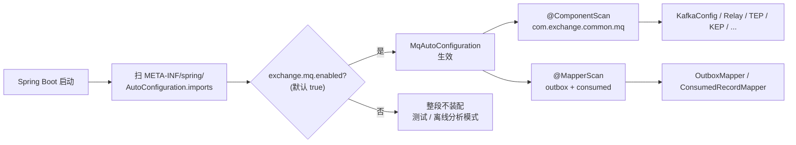

**关键决策**：

- **为什么用 AutoConfiguration 而不是放在 bootstrap 全局扫描**：
  - common 是被多个模块依赖的基础库。bootstrap 的 `@SpringBootApplication` 默认只扫自己的包；让它去扫 common 里的子包会污染 bootstrap 配置。
  - AutoConfiguration 是 Spring Boot 标准玩法：基础库自带装配，使用方零配置即可享受全部 Bean。
- **`@ConditionalOnProperty(matchIfMissing=true)`**：默认装配；`exchange.mq.enabled=false` 时整段绕开。Hooks 到 `KafkaConfig` 和 `ShedLockConfig` 上的同名条件，三处一致就能整体禁用。
- **`@MapperScan` 显式列子包**：MyBatis-Plus 的 `@MapperScan` 不能直接装在 common 里扫 `com.exchange.common.mq` 全包——会扫到非 mapper 接口报错。**显式列出 mapper 所在的两个子包** `outbox` + `consumed` 更精准。
- **`@ComponentScan` 限定在 mq 包内**：避免扫到 common 其他子包（`util` / `config` 等已经有自己的装配路径）。
- **AutoConfiguration.imports 文件位置**：Spring Boot 2.7+ 弃用 `spring.factories`，新位置在 `META-INF/spring/org.springframework.boot.autoconfigure.AutoConfiguration.imports`，每行一个全限定类名。
- **顺序无关**：本期没有显式 `@AutoConfigureBefore/After`。Bean 之间通过依赖注入自然排序。如果将来出现循环依赖（比如 KafkaConfig 依赖 MqMetrics、MqMetrics 又监听 KafkaTemplate），再用 `@AutoConfigureOrder` 拆。

**易踩的坑**：

- 忘了写 `imports` 文件，只放 `@Configuration` 类：使用方启动时这个类不会被发现，所有 Bean 都不存在但不报错——业务代码注入 `EventPublisher` 时才在启动期失败，难定位。
- 把 `MqAutoConfiguration` 写到 `bootstrap` 模块：违反"common 自带装配"的设计，且循环依赖 bootstrap → common → bootstrap。
- `@MapperScan` 写错路径：MyBatis 启动期会报"NoClassDefFoundError"或"Property 'sqlSessionFactory' is required"。复查 `imports` 文件列出的 base packages。

**Files:**
- Create: `common/src/main/java/com/exchange/common/mq/MqAutoConfiguration.java`
- Create: `common/src/main/resources/META-INF/spring/org.springframework.boot.autoconfigure.AutoConfiguration.imports`

- [ ] **Step 17.1: MqAutoConfiguration.java**

```java
package com.exchange.common.mq;

import org.mybatis.spring.annotation.MapperScan;
import org.springframework.boot.autoconfigure.condition.ConditionalOnProperty;
import org.springframework.context.annotation.ComponentScan;
import org.springframework.context.annotation.Configuration;

@Configuration
@ConditionalOnProperty(name = "exchange.mq.enabled", havingValue = "true", matchIfMissing = true)
@ComponentScan(basePackages = "com.exchange.common.mq")
@MapperScan(basePackages = {
        "com.exchange.common.mq.outbox",
        "com.exchange.common.mq.consumed"
})
public class MqAutoConfiguration {
}
```

- [ ] **Step 17.2: AutoConfiguration.imports**

写入：

```
com.exchange.common.mq.MqAutoConfiguration
```

- [ ] **Step 17.3: 编译**

Run: `mvn -q -pl bootstrap -am package -DskipTests`
Expected: BUILD SUCCESS。

- [ ] **Step 17.4: 提交**

```bash
git add common/src/main/java/com/exchange/common/mq/MqAutoConfiguration.java common/src/main/resources/META-INF/
git commit -m "feat(mq): autoconfiguration entry"
```

### Task 18: common-mq 集成测试（Testcontainers Kafka + MySQL）

**设计考虑**：

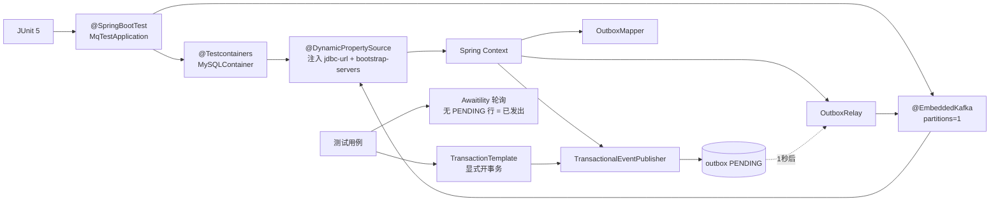

**关键决策**：

- **MySQL 用 Testcontainers，Kafka 用 EmbeddedKafka**：
  - MySQL 用 Testcontainers：版本与生产严格一致（mysql:8.0），跑 Flyway 迁移验证 DDL 正确性；EmbeddedMysql 已不再维护。
  - Kafka 用 `@EmbeddedKafka`：spring-kafka-test 自带，启动比 KafkaContainer 快 5-10 秒，集成测试不需要测真 Kafka 的高级特性（如多 broker、partition reassign）。
  - 取舍：Kafka 集群级行为（如 broker 故障切换）需要 KafkaContainer，本期不测；business 流程测试 EmbeddedKafka 够用。
- **`@DynamicPropertySource` 替代 `application-test.yml` 硬编码**：MySQL 容器启动后才知道 jdbc-url（端口随机），EmbeddedKafka 的 `brokers` 也是运行时分配的。`DynamicPropertySource` 在 Spring Context 启动前注入到 `Environment`，YAML 占位符 `${mysql.url}` 才能解析。
- **`MqTestApplication` 放 test 目录**：不污染 main 的启动入口；`@SpringBootApplication` 默认扫所在包，所以放 `com.exchange.common.mq` 包下能扫到所有 `@Component`。
- **业务测试用 `TransactionTemplate` 而非 `@Transactional`**：`@Transactional` 在测试方法上的语义是"测试结束自动回滚"，与 `Propagation.MANDATORY` 配合 OK，但事务**不会真正 commit**——outbox 行根本没落表，Relay 看不到。所以**必须用 `TransactionTemplate.executeWithoutResult` 显式开事务并 commit**，让 outbox 行真实可见。
- **`Awaitility` 而非 `Thread.sleep`**：异步流程的等待用轮询断言，最多等 10 秒。早达到立刻继续，慢一点也不会 sleep 死等。CI 环境时序波动大，`sleep(2s)` 经常 flaky。
- **断言条件 `noneMatch eventId`**：不直接断言"SENT 行存在"——SENT 行可能被异步归档；用"PENDING 行不再含此 eventId" 反向证明已发送。

**易踩的坑**：

- 用 `@Transactional` 装饰整个测试方法 + 调 `TransactionalEventPublisher.publish`：方法结束 Spring 回滚事务，outbox 行被回滚没落表，Relay 永远看不到 → 测试超时失败。**必须用 TransactionTemplate**。
- 容器启动慢导致测试超时：`MySQLContainer` 首次跑要拉镜像，CI 上配镜像缓存或预热。
- `@EmbeddedKafka` 与 `KafkaTemplate` 的 bootstrap-servers 不一致：依赖 `spring.embedded.kafka.brokers` 系统属性传递；`@DynamicPropertySource` 必须显式 `add("kafka.bootstrap", () -> System.getProperty("spring.embedded.kafka.brokers"))`。
- ShedLock 的锁残留：测试用同一张 shedlock 表，连续跑两个测试时上一轮锁还没过期 → 后一轮 Relay 不工作。可以在 `@AfterEach` 清空 shedlock 表，或者把 `lockAtMostFor` 在 mqtest profile 里调成 5s。

**Files:**
- Create: `common/src/test/java/com/exchange/common/mq/MqIntegrationTest.java`
- Create: `common/src/test/resources/application-mqtest.yml`

- [ ] **Step 18.1: application-mqtest.yml**

```yaml
spring:
  kafka:
    bootstrap-servers: ${kafka.bootstrap}
  datasource:
    url: ${mysql.url}
    username: test
    password: test
  flyway:
    enabled: true
    locations: classpath:db/migration
exchange:
  mq:
    enabled: true
```

- [ ] **Step 18.2: MqIntegrationTest.java**

```java
package com.exchange.common.mq;

import com.exchange.common.mq.outbox.OutboxMapper;
import com.exchange.common.mq.outbox.OutboxStatus;
import org.junit.jupiter.api.Test;
import org.springframework.beans.factory.annotation.Autowired;
import org.springframework.boot.test.context.SpringBootTest;
import org.springframework.kafka.test.context.EmbeddedKafka;
import org.springframework.test.context.ActiveProfiles;
import org.springframework.test.context.DynamicPropertyRegistry;
import org.springframework.test.context.DynamicPropertySource;
import org.springframework.transaction.annotation.Transactional;
import org.testcontainers.containers.MySQLContainer;
import org.testcontainers.junit.jupiter.Container;
import org.testcontainers.junit.jupiter.Testcontainers;
import java.time.LocalDateTime;
import java.util.concurrent.TimeUnit;
import static org.assertj.core.api.Assertions.assertThat;
import static org.awaitility.Awaitility.await;

@SpringBootTest(classes = MqTestApplication.class)
@ActiveProfiles("mqtest")
@Testcontainers
@EmbeddedKafka(partitions = 1, topics = {"test.foo"})
class MqIntegrationTest {

    @Container
    static MySQLContainer<?> mysql = new MySQLContainer<>("mysql:8.0")
            .withUsername("test").withPassword("test").withDatabaseName("exchange_dev");

    @DynamicPropertySource
    static void props(DynamicPropertyRegistry r) {
        r.add("mysql.url", mysql::getJdbcUrl);
        r.add("kafka.bootstrap", () -> System.getProperty("spring.embedded.kafka.brokers"));
    }

    @Autowired TransactionalEventPublisher txPublisher;
    @Autowired OutboxMapper outboxMapper;

    static class FooEvent extends AbstractDomainEvent {
        @Override public String aggregateId() { return "agg"; }
        @Override public String eventType() { return "test.foo"; }
    }

    @Test
    @Transactional
    void publish_then_relay_to_kafka() {
        FooEvent e = new FooEvent();
        txPublisher.publish(e);
        // 退出事务后，OutboxRelay 应在 1-2 秒内拾取
    }

    @Test
    void relay_marks_sent() {
        // 单独事务写入一条 outbox，等 relay 处理
        FooEvent e = new FooEvent();
        runInTx(() -> txPublisher.publish(e));
        await().atMost(10, TimeUnit.SECONDS).untilAsserted(() -> {
            var rows = outboxMapper.pickPending(OutboxStatus.PENDING.code,
                    LocalDateTime.now().plusYears(1), 100);
            assertThat(rows).noneMatch(r -> r.getEventId().equals(e.eventId()));
        });
    }

    private void runInTx(Runnable r) {
        new org.springframework.transaction.support.TransactionTemplate(
                txManager()).executeWithoutResult(s -> r.run());
    }

    @Autowired private org.springframework.transaction.PlatformTransactionManager txManager;
    private org.springframework.transaction.PlatformTransactionManager txManager() { return txManager; }
}
```

- [ ] **Step 18.3: MqTestApplication.java（最小启动类）**

Create: `common/src/test/java/com/exchange/common/mq/MqTestApplication.java`

```java
package com.exchange.common.mq;

import org.springframework.boot.autoconfigure.SpringBootApplication;

@SpringBootApplication
public class MqTestApplication {
}
```

> 说明：放在 `test` 目录下，仅供测试驱动 Spring Boot 上下文使用。

- [ ] **Step 18.4: 跑集成测试**

Run: `mvn -q -pl common test -Dtest=MqIntegrationTest`
Expected: 2 tests passed（首次拉镜像耗时较长）。

- [ ] **Step 18.5: 提交**

```bash
git add common/src/test/
git commit -m "test(mq): integration test with testcontainers + embedded kafka"
```

---

## Phase 4 — wallet.chain.api：链抽象 SPI 与 DTO

> 说明：本阶段只创建接口与 POJO DTO，没有运行期逻辑，因此跳过 TDD，单测在后续 Plan 实现具体链时落。

### 全景：链抽象方向是单向的

整个钱包要支持 BTC / ETH / TRON 三种完全不同的链模型（UTXO / Account+EVM / Account+Energy）。如果不抽象，各业务模块（scanner、withdraw、sweep）会被迫到处 `if (chain == BTC) ... else if (chain == ETH) ...`——再加一条链就要改全代码库。

**方向**：业务模块（`wallet.core` / `wallet.scanner` / `wallet.withdraw` 等）**只依赖** `wallet.chain.api`（接口 + DTO），**绝不直接依赖** `wallet.chain.btc/eth/tron`。新增公链 = 新建 `wallet.chain.<name>` 子包实现 5 个 SPI，业务代码零改动。

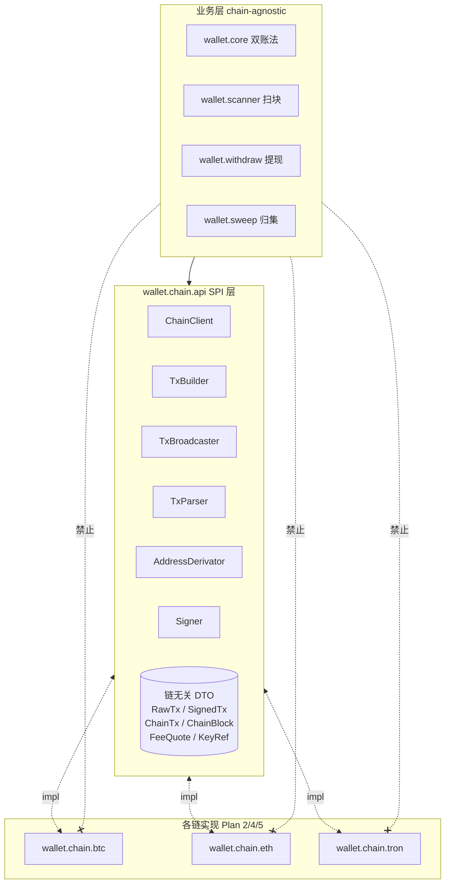

**5 个 SPI 接口的职责**：

| SPI | 职责 | 典型实现 |
|---|---|---|
| `ChainClient` | 链上读：getBlock / getTx / getBalance / getOnChainNonce | Web3j RPC / bitcoinj P2P / trident gRPC |
| `TxBuilder` | 构造未签名 RawTx：`(transferRequest, feeQuote) → RawTx` | 各链不同（EIP-1559 / PSBT / TriggerSmartContract） |
| `TxBroadcaster` | 把 SignedTx 发到链 + 返回 txHash | sendRawTransaction / sendTransaction |
| `TxParser` | 把链上交易解析成业务事件：识别 ERC20 Transfer / 内部转账 / coinbase / 多 input | 解 Log topics / 解 vout / 解 contract data |
| `AddressDerivator` | 从公钥/HD path 派生地址 | EIP-55 / Bech32 / Base58 |

`Signer` 是单独一类（在 `wallet.chain.api` 顶层而非 5 SPI 内）：业务侧拿到 `RawTx` 调 `Signer.sign(RawTx, KeyRef)` → `SignedTx`，签名实现细节（私钥获取 / 链特定签名算法）由 `wallet.signer` 统一封装，不让业务代码碰私钥。

**链无关 DTO 的设计思路**：

- **`RawTx` / `SignedTx` 是 byte[]+metadata**：不强行抽公共字段。BTC PSBT 和 ETH RLP 字节布局完全不同，只在容器上统一（含 chain / aggregateRef），具体序列化交给各链实现。
- **`ChainTx`**：扫块产物，统一字段 `(chain, txHash, vout, blockHeight, blockHash, parentHash, fromAddress, toAddress, coinId, amount, direction, confirmCount, status, rawJson)`。`vout` 默认 0，BTC 多输出时 1 笔 tx 在多行——`uk(chain, tx_hash, vout)`保证幂等。
- **`FeeQuote` / `FeeQuoteRequest`**：手续费估算的输入输出。具体策略在 `wallet.fee.FeeStrategy` 各链实现里。
- **`KeyRef`**：不直接存私钥；只存 `keyId + hdPath + chain`，让 Signer 去查 `key_material` 表。

**关键决策**：

- **不抽公共基类**：用接口 + DTO，避免菱形继承。Java 21 的 sealed interface 也不用——会限制扩展性。
- **不用 SPI 自动发现**（`ServiceLoader`）：直接用 Spring Bean + `Map<Chain, Bean>` 路由，可控、可测、可替换。
- **DTO 都是 immutable record / Lombok @Value**：跨线程传递安全，签名前后字段不可变。

### Task 19: 在 wallet pom 加 web3j-crypto / bouncycastle / spring-kafka 依赖

**设计考虑**：

wallet 模块在本期开始引 4 类新依赖：

- **web3j-crypto + bouncycastle**：HD 派生（BIP-32/39/44）+ AES-GCM 加密 + secp256k1 签名（Plan 2 ETH 用）。**只引 web3j-crypto** 而非完整 web3j——后者还包括 RPC 客户端等，不在 Plan 1 范围。
- **spring-kafka**：业务事件 listener 需要（提现确认 / 充值入账等）。Producer 端通过 common-mq 走 outbox，但 Listener 端各业务模块直接用 `@KafkaListener`。
- **测试相关**：spring-kafka-test、testcontainers/mysql/kafka 用于 Plan 2/3/4/5 的 e2e 测试。本期 wallet 模块还没集成测试，但提前把测试依赖加上避免后续每次都改 pom。

**这一步只动 pom，不写代码**——`mvn -pl wallet -am compile` 验证 BUILD SUCCESS 即过。

**Files:**
- Modify: `wallet/pom.xml`

- [ ] **Step 19.1: 在 `<dependencies>` 节末尾追加**

```xml
        <dependency>
            <groupId>com.exchange</groupId>
            <artifactId>exchange-risk</artifactId>
        </dependency>
        <dependency>
            <groupId>org.bouncycastle</groupId>
            <artifactId>bcprov-jdk18on</artifactId>
        </dependency>
        <dependency>
            <groupId>org.web3j</groupId>
            <artifactId>crypto</artifactId>
        </dependency>
        <dependency>
            <groupId>org.springframework.statemachine</groupId>
            <artifactId>spring-statemachine-core</artifactId>
        </dependency>
        <dependency>
            <groupId>org.springframework.boot</groupId>
            <artifactId>spring-boot-starter-test</artifactId>
            <scope>test</scope>
        </dependency>
        <dependency>
            <groupId>org.testcontainers</groupId>
            <artifactId>mysql</artifactId>
            <scope>test</scope>
        </dependency>
        <dependency>
            <groupId>org.testcontainers</groupId>
            <artifactId>junit-jupiter</artifactId>
            <scope>test</scope>
        </dependency>
```

> 说明：web3j-crypto 是 web3j 拆分包之一，仅含椭圆曲线 / BIP32/BIP39，不引整套 web3j（Plan 2 才引）。

- [ ] **Step 19.2: 验证编译**

Run: `mvn -q -pl wallet -am dependency:resolve`
Expected: BUILD SUCCESS。

- [ ] **Step 19.3: 提交**

```bash
git add wallet/pom.xml
git commit -m "build(wallet): add bc/web3j-crypto/statemachine/risk deps"
```

### Task 20: Chain 枚举 + 链无关 DTO（一组）

**设计考虑**：

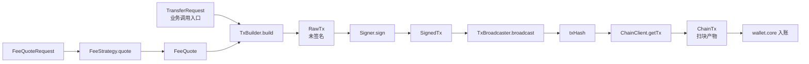

**字段设计要点**：

- **`Chain` 枚举**：`BTC / ETH / TRON`，加 `code()`（短码，用作 DB 字段值）。**不用整数枚举**——SQL 里 `chain = 'ETH'` 比 `chain = 1` 更可读。
- **`TransferRequest`**：业务侧的转账请求，含 `(chain, coinId, fromAddress?, toAddress, amount, memo?)`。BTC 不一定需要 fromAddress（UTXO 选择由 builder 决定），所以可选。
- **`RawTx`**：`(chain, payloadBytes, expectedTxHash?, metadata: Map<String,Object>)`。EVM 实现把 nonce / gasPrice 放 metadata；BTC 实现把 selectedUtxos 放 metadata。
- **`SignedTx`**：`(chain, signedBytes, txHash)`。txHash 在签名后才确定。
- **`ChainTx`**：与 DB 表对齐，方便 scanner 直接 `mapper.insert`。
- **`KeyRef`**：`(keyId, hdPath, chain)`——只是个引用，Signer 去 `key_material` 表查。**不放私钥字段**。
- **`DerivedAddress`**：`(address, hdPath, publicKey)`，`AddressDerivator.derive` 的返回。
- **`FeeQuote`**：`(chain, feeAmount, feeUnit, breakdown: Map)`。EVM 的 breakdown 含 `maxFeePerGas / maxPriorityFeePerGas / gasLimit`，BTC 含 `satPerVByte / vsize`。
- **`TxStatus`**：`PENDING / CONFIRMED / DROPPED / REPLACED`。"REPLACED" 给 EVM 提现加速场景预留。

**关键决策**：

- **DTO 用 Lombok `@Value` 而非 record**：record 在 Jackson 反序列化某些场景需要额外配置；项目其他地方都用 `@Value`，统一风格。
- **`amount` 用 BigDecimal 而非链原生最小单位（wei / satoshi）**：业务层统一 `DECIMAL(38,18)`，链特定的精度转换（wei ↔ ether）在 chain 实现内做。
- **不抽 `Tx` 通用基类**：不同链 raw 字节没有公共字段，硬抽是过度设计。

**Files:**
- Create: `wallet/src/main/java/com/exchange/wallet/chain/api/Chain.java`
- Create: `wallet/src/main/java/com/exchange/wallet/chain/api/dto/RawTx.java`
- Create: `wallet/src/main/java/com/exchange/wallet/chain/api/dto/SignedTx.java`
- Create: `wallet/src/main/java/com/exchange/wallet/chain/api/dto/ChainTx.java`
- Create: `wallet/src/main/java/com/exchange/wallet/chain/api/dto/ChainBlock.java`
- Create: `wallet/src/main/java/com/exchange/wallet/chain/api/dto/TransferRequest.java`
- Create: `wallet/src/main/java/com/exchange/wallet/chain/api/dto/TxStatus.java`
- Create: `wallet/src/main/java/com/exchange/wallet/chain/api/dto/KeyRef.java`
- Create: `wallet/src/main/java/com/exchange/wallet/chain/api/dto/DerivedAddress.java`
- Create: `wallet/src/main/java/com/exchange/wallet/chain/api/dto/FeeQuote.java`
- Create: `wallet/src/main/java/com/exchange/wallet/chain/api/dto/FeeQuoteRequest.java`

- [ ] **Step 20.1: Chain.java**

```java
package com.exchange.wallet.chain.api;

public enum Chain {
    BTC, ETH, TRON;

    public static Chain of(String name) {
        return Chain.valueOf(name.toUpperCase());
    }
}
```

- [ ] **Step 20.2: RawTx.java**

```java
package com.exchange.wallet.chain.api.dto;

import com.exchange.wallet.chain.api.Chain;
import lombok.Builder;
import lombok.Data;
import java.util.Map;

@Data
@Builder
public class RawTx {
    private Chain chain;
    private String fromAddress;
    private String toAddress;
    private String coinSymbol;
    private String contract;             // 合约地址，原生币为 null
    private java.math.BigDecimal amount;
    private Long nonce;                  // ETH/TRON
    private byte[] rawBytes;             // 链特化的未签名 tx 字节
    private Map<String, Object> chainSpecific;  // 链特化补充字段（gas/gasPrice/feeRate/...）
}
```

- [ ] **Step 20.3: SignedTx.java**

```java
package com.exchange.wallet.chain.api.dto;

import com.exchange.wallet.chain.api.Chain;
import lombok.Builder;
import lombok.Data;

@Data
@Builder
public class SignedTx {
    private Chain chain;
    private String fromAddress;
    private byte[] signedBytes;          // 链特化的已签名 tx 字节
    private String hexEncoded;           // 便于落库的 hex 形式
    private String predictedTxHash;      // 签名后即可计算的 txHash（部分链支持）
}
```

- [ ] **Step 20.4: ChainTx.java**

```java
package com.exchange.wallet.chain.api.dto;

import com.exchange.wallet.chain.api.Chain;
import lombok.Builder;
import lombok.Data;
import java.math.BigDecimal;

@Data
@Builder
public class ChainTx {
    private Chain chain;
    private String txHash;
    private int vout;                    // BTC vout / ETH ERC20 logIndex
    private long blockHeight;
    private String blockHash;
    private String parentHash;
    private String fromAddress;
    private String toAddress;
    private String coinSymbol;
    private String contract;
    private BigDecimal amount;
    private int direction;               // 1 入站 0 出站
    private int confirmCount;
    private String rawJson;
}
```

- [ ] **Step 20.5: ChainBlock.java**

```java
package com.exchange.wallet.chain.api.dto;

import com.exchange.wallet.chain.api.Chain;
import lombok.Builder;
import lombok.Data;

@Data
@Builder
public class ChainBlock {
    private Chain chain;
    private long height;
    private String hash;
    private String parentHash;
    private long timestampMs;
    private Object rawBlock;             // 链特化原始结构，TxParser 用
}
```

- [ ] **Step 20.6: TransferRequest.java**

```java
package com.exchange.wallet.chain.api.dto;

import com.exchange.wallet.chain.api.Chain;
import lombok.Builder;
import lombok.Data;
import java.math.BigDecimal;

@Data
@Builder
public class TransferRequest {
    private Chain chain;
    private String coinSymbol;
    private String contract;             // 原生币 null
    private String fromAddress;
    private String toAddress;
    private BigDecimal amount;
    private Long nonce;                  // 由 NonceAllocator 分配后填入
    private FeeQuote fee;                // 由 FeeStrategy 估算后填入
}
```

- [ ] **Step 20.7: TxStatus.java**

```java
package com.exchange.wallet.chain.api.dto;

import lombok.Builder;
import lombok.Data;

@Data
@Builder
public class TxStatus {
    public enum Phase { NOT_FOUND, PENDING, MINED_OK, MINED_FAILED, DROPPED }

    private Phase phase;
    private long blockHeight;
    private int confirmCount;
    private String failureReason;
}
```

- [ ] **Step 20.8: KeyRef.java**

```java
package com.exchange.wallet.chain.api.dto;

import com.exchange.wallet.chain.api.Chain;
import lombok.Builder;
import lombok.Data;

@Data
@Builder
public class KeyRef {
    private Chain chain;
    private String keyId;                // 关联 key_material.key_id
    private String hdPath;               // 派生路径
    private String address;              // 期望地址（校验用）
}
```

- [ ] **Step 20.9: DerivedAddress.java**

```java
package com.exchange.wallet.chain.api.dto;

import com.exchange.wallet.chain.api.Chain;
import lombok.Builder;
import lombok.Data;

@Data
@Builder
public class DerivedAddress {
    private Chain chain;
    private String address;
    private String hdPath;
    private String publicKeyHex;
}
```

- [ ] **Step 20.10: FeeQuote.java**

```java
package com.exchange.wallet.chain.api.dto;

import com.exchange.wallet.chain.api.Chain;
import lombok.Builder;
import lombok.Data;
import java.math.BigDecimal;
import java.util.Map;

@Data
@Builder
public class FeeQuote {
    private Chain chain;
    private BigDecimal feeAmount;        // 链原生币计价的总 fee
    private String feeCoinSymbol;        // ETH 用 ETH，TRON 用 TRX，BTC 用 BTC
    private Map<String, Object> chainSpecific;  // EIP-1559: maxFeePerGas, maxPriorityFeePerGas, gasLimit; BTC: feeRate, vsize; TRON: energy, bandwidth
}
```

- [ ] **Step 20.11: FeeQuoteRequest.java**

```java
package com.exchange.wallet.chain.api.dto;

import com.exchange.wallet.chain.api.Chain;
import lombok.Builder;
import lombok.Data;
import java.math.BigDecimal;

@Data
@Builder
public class FeeQuoteRequest {
    private Chain chain;
    private String coinSymbol;
    private String contract;
    private String fromAddress;
    private String toAddress;
    private BigDecimal amount;
    private String urgency;              // NORMAL / FAST
}
```

- [ ] **Step 20.12: 编译**

Run: `mvn -q -pl wallet -am compile`
Expected: BUILD SUCCESS。

- [ ] **Step 20.13: 提交**

```bash
git add wallet/src/main/java/com/exchange/wallet/chain/api/
git commit -m "feat(chain-api): Chain enum + 10 chain-agnostic DTOs"
```

### Task 21: 链抽象 SPI 接口（5 个）

**设计考虑**：

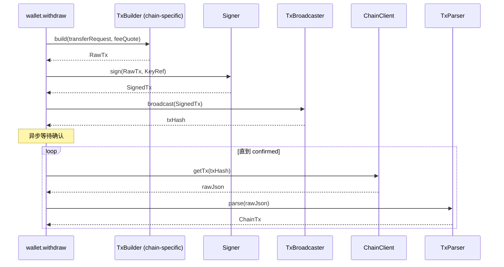

**5 个接口的方法签名约定**：

```java
interface ChainClient {
    Chain chain();
    ChainBlock getBlock(long height);
    long getLatestHeight();
    ChainTx getTx(String txHash);
    BigDecimal getBalance(String address, Long coinId);
    long getOnChainNonce(String address);   // EVM 专用，UTXO 链返回 0
}

interface TxBuilder {
    Chain chain();
    RawTx build(TransferRequest req, FeeQuote fee);
}

interface TxBroadcaster {
    Chain chain();
    String broadcast(SignedTx signedTx);
}

interface TxParser {
    Chain chain();
    ChainTx parse(String rawJson);          // 单 tx
    List<ChainTx> parse(ChainBlock block);  // 整块
}

interface AddressDerivator {
    Chain chain();
    DerivedAddress derive(byte[] publicKey, String hdPath);
}
```

**关键决策**：

- **每个接口都有 `chain()` 方法**：用于 Spring `Map<Chain, ChainClient>` 路由。Bean 启动时按 `chain()` 注册到 map。
- **`getOnChainNonce` 在 ChainClient 而非单独抽象**：BTC/TRON 返回 0 即可（业务层 nonce 分配只对 EVM 生效）；不为这一个方法多抽一层。
- **`TxParser.parse` 双签名**：scanner 整块解析快，单 tx 查询用得上单 tx 解析。
- **不在 SPI 暴露 raw RPC 客户端**：`ChainClient` 是高层抽象；如果某个链的高级特性需要业务层用（罕见），单独加方法到 SPI，不绕过抽象。

**Files:**
- Create: `wallet/src/main/java/com/exchange/wallet/chain/api/ChainClient.java`
- Create: `wallet/src/main/java/com/exchange/wallet/chain/api/TxBuilder.java`
- Create: `wallet/src/main/java/com/exchange/wallet/chain/api/TxBroadcaster.java`
- Create: `wallet/src/main/java/com/exchange/wallet/chain/api/TxParser.java`
- Create: `wallet/src/main/java/com/exchange/wallet/chain/api/AddressDerivator.java`

- [ ] **Step 21.1: ChainClient.java**

```java
package com.exchange.wallet.chain.api;

import com.exchange.wallet.chain.api.dto.ChainBlock;
import com.exchange.wallet.chain.api.dto.TxStatus;
import java.math.BigDecimal;

public interface ChainClient {
    Chain chain();
    BigDecimal getBalance(String address, String coinSymbol);
    long getLatestHeight();
    ChainBlock getBlock(long height);
    TxStatus queryTxStatus(String txHash);
    long getOnChainNonce(String address);   // BTC 不支持时返回 0
}
```

- [ ] **Step 21.2: TxBuilder.java**

```java
package com.exchange.wallet.chain.api;

import com.exchange.wallet.chain.api.dto.RawTx;
import com.exchange.wallet.chain.api.dto.TransferRequest;

public interface TxBuilder {
    Chain chain();
    RawTx buildTransfer(TransferRequest req);
}
```

- [ ] **Step 21.3: TxBroadcaster.java**

```java
package com.exchange.wallet.chain.api;

import com.exchange.wallet.chain.api.dto.SignedTx;

public interface TxBroadcaster {
    Chain chain();
    String broadcast(SignedTx signedTx);
}
```

- [ ] **Step 21.4: TxParser.java**

```java
package com.exchange.wallet.chain.api;

import com.exchange.wallet.chain.api.dto.ChainBlock;
import com.exchange.wallet.chain.api.dto.ChainTx;
import java.util.List;

public interface TxParser {
    Chain chain();
    List<ChainTx> parse(ChainBlock block);
}
```

- [ ] **Step 21.5: AddressDerivator.java**

```java
package com.exchange.wallet.chain.api;

import com.exchange.wallet.chain.api.dto.DerivedAddress;

public interface AddressDerivator {
    Chain chain();
    DerivedAddress derive(byte[] hdSeed, String hdPath);
}
```

- [ ] **Step 21.6: 编译**

Run: `mvn -q -pl wallet -am compile`
Expected: BUILD SUCCESS。

- [ ] **Step 21.7: 提交**

```bash
git add wallet/src/main/java/com/exchange/wallet/chain/api/
git commit -m "feat(chain-api): ChainClient/TxBuilder/TxBroadcaster/TxParser/AddressDerivator SPI"
```

### Task 22: Signer 接口

**设计考虑**：

`Signer` 单独抽出来不归入 5 SPI：业务层（withdraw / sweep）调用 `Signer.sign(rawTx, keyRef)` 拿到 `SignedTx`，**永远不应接触私钥字节**。私钥的提取、解密、签名、清零，全在 `wallet.signer` 包内闭环。

```mermaid
flowchart LR
    Biz[业务层<br/>不接触私钥] --> S[Signer.sign]
    S --> CSS[ChainSpecificSigner<br/>按 chain 路由]
    CSS --> KMS[KmsProvider<br/>取出明文私钥 byte]
    KMS --> Algo[secp256k1 / EdDSA<br/>签名计算]
    Algo --> Wipe[byte[] 清零]
    Wipe --> Out[SignedTx 返回]

    Biz -. 禁止 .-x KMS
    Biz -. 禁止 .-x Algo
```

接口长这样：

```java
interface Signer {
    SignedTx sign(RawTx rawTx, KeyRef keyRef);
}
```

**关键决策**：

- **Signer 不是 5 SPI 之一**：5 SPI 各链一份实现（`btcChainClient` / `ethChainClient`），但 **Signer 只有一份默认实现**（`SignerImpl`），内部按 chain 路由到 `ChainSpecificSigner` 子接口。这样业务层依赖一个 `Signer` Bean，不需要 chain 路由。
- **入参 `KeyRef` 而非私钥**：Signer 自己去 KmsProvider 取私钥；调用方拿不到、也不应该拿到私钥。
- **`KeyRef.hdPath` 必填**：哪怕同一个 keyId 也可能派生多个子私钥（每个地址一条 hdPath），KeyRef 必须含 hdPath 才能精确定位。

详细的 ChainSpecificSigner / KmsProvider / 清零机制在 Phase 5 落地。本 Task 只定接口签名。

**Files:**
- Create: `wallet/src/main/java/com/exchange/wallet/chain/api/Signer.java`

- [ ] **Step 22.1: Signer.java**

```java
package com.exchange.wallet.chain.api;

import com.exchange.wallet.chain.api.dto.KeyRef;
import com.exchange.wallet.chain.api.dto.RawTx;
import com.exchange.wallet.chain.api.dto.SignedTx;

public interface Signer {
    SignedTx sign(RawTx rawTx, KeyRef keyRef);
}
```

> 说明：Signer 不是按链分实现——它是 wallet.signer 内的统一入口。内部根据 RawTx.chain 路由到 ChainSpecificSigner（在 Phase 5 创建）。

- [ ] **Step 22.2: 编译**

Run: `mvn -q -pl wallet -am compile`
Expected: BUILD SUCCESS。

- [ ] **Step 22.3: 提交**

```bash
git add wallet/src/main/java/com/exchange/wallet/chain/api/Signer.java
git commit -m "feat(chain-api): Signer SPI"
```

---

## Phase 5 — wallet.signer：密钥与签名

### 全景：私钥生命周期 + 签名隔离

钱包的命门是私钥。本 Phase 把"如何派生 → 如何加密 → 如何存 → 如何用 → 如何清零"五件事彻底封闭在 `wallet.signer` 子包内，业务代码通过 `KeyRef` + `Signer` 间接使用，永远拿不到明文私钥字节。

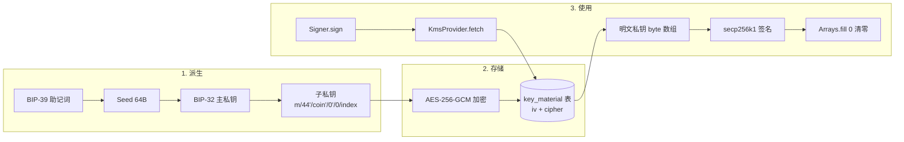

**Phase 5 内部分工**：

| Task | 组件 | 职责 |
|---|---|---|
| 23 | `AesGcmCipher` | AES-256-GCM 工具类 + `wipe` 清零工具 |
| 24 | `KmsProvider` 接口 + `LocalKeystoreKmsProvider` | KMS 抽象 + 本地 keystore 实现（生产替换为 AWS KMS / HashiCorp Vault） |
| 25 | `Bip39MnemonicService` | 助记词生成 / 校验 / 转 seed |
| 26 | `Bip32HdKeyDeriver` | 主私钥派生 + 子私钥派生（BIP-44 路径） |
| 27 | `KeyMaterial` 实体 + Service | 加密私钥落 DB + 取出解密 |
| 28 | `ChainSpecificSigner` + `SignerImpl` | 链特定签名 + 路由 + 私钥清零 |

**关键决策**：

- **AES-256-GCM 而非 AES-CBC**：GCM 自带认证（防篡改），CBC 必须额外配 HMAC，多一步出错的可能。GCM 的 12B IV + 16B Tag 是工业标准。
- **KmsProvider 是抽象**：本期落地本地 keystore（用主密钥加密 keystore 文件、再用 keystore 解每条 key_material）；生产环境替换为云 KMS（KeyId 是云 KMS 的 ARN）即可，业务代码不动。
- **只在内存中持有明文私钥几毫秒**：`fetch → sign → wipe` 在同一个方法栈内完成，不放 ThreadLocal、不放 Bean 字段、不参与日志 / toString / 异常 message。
- **`wipe` 不止是好习惯**：JVM heap 上的 byte[] GC 后字节可能在内存里残留任意长，触发 dump 时被读出。`Arrays.fill(privKey, (byte)0)` 立刻清零是基础动作。
- **HD 派生路径用 BIP-44**：`m/44'/coinType'/account'/change/index`。coinType 按 SLIP-44 注册值（BTC=0、ETH=60、TRX=195）。
- **不使用 `String` 持有私钥**：String 不可变 → 没法清零，留在 String pool 里直到 GC + 之后还可能在 dump 里。一律用 `byte[]` / `char[]`。

**易踩的坑**：

- 把私钥写日志：异常被 Spring 包装成 message 抛出 → 进 ELK → 永久外泄。所以**异常 message 严禁含私钥字节**；签名相关异常用通用文案 + 不带 cause 透传。
- 私钥放进 toString：Lombok `@Data` 默认含 toString，私钥字段必须 `@ToString.Exclude`。
- 同 hdPath 重复派生且重复落表：`uk_key_id` 防止；同时业务层用 `hd_path` 表保留"已用 path"避免重复分配。
- KmsProvider 实现忘了清零它内部用的中间 byte[]：审计时审到自己实现的 Provider 全链路。

---

> **以下是 Phase 5 内 Task 23-28 的逐项设计考虑**——每段在自己 Task 实现前。先通读概览，再到 Task 章节看 Step 步骤。

#### Task 23 设计考虑：AES-GCM 加密工具

**设计考虑**：

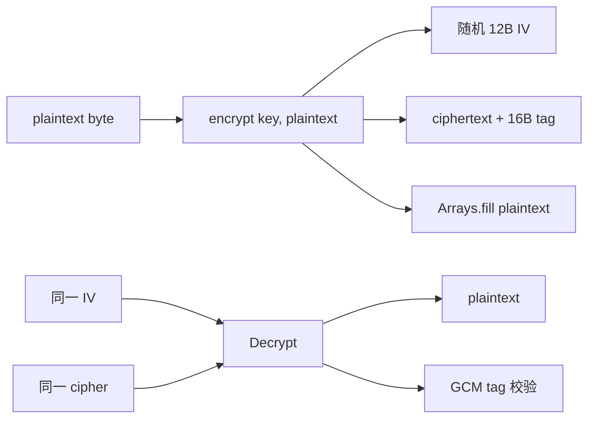

**接口约定**：

```java
class AesGcmCipher {
    record Encrypted(byte[] iv, byte[] cipher) {}
    Encrypted encrypt(byte[] key, byte[] plaintext);
    byte[] decrypt(byte[] key, byte[] iv, byte[] cipher);  // tag 校验失败抛 AEADBadTagException
    static void wipe(byte[] sensitive);
}
```

**关键决策**：

- **IV 用 SecureRandom 12B 随机**：GCM 推荐 12B。**严禁固定 IV**——同 key 重用 IV = AES-GCM 的灾难（可被逆推 key）。
- **Tag 长度固定 16B (128 bit)**：标准强度。8B 也能用但安全余量低。
- **加密返回 `(iv, cipher)` 二元组**：调用方分别落 DB 字段 `iv` 和 `cipher_text`，方便审计和换密钥。
- **`wipe` 静态方法**：`Arrays.fill(buf, (byte)0)` 包一层语义化命名，让代码 review 时一眼看到"这里在清零"。
- **Bouncy Castle vs JDK 默认**：JDK 自带 AES-GCM 已经够用；引 BC 是为了某些链特殊算法（secp256k1 等）。AES 用 JDK 默认 provider 即可，性能通常更好。

**易踩的坑**：

- IV 用 `new byte[12]`（全 0）：全 0 IV 加密同 key + 不同 plaintext 仍会泄漏 XOR 关系，不安全。**必须 SecureRandom**。
- 用 `String(plaintext)` 做日志：byte[] 转 String 后清零无意义（String 不可变）。
- 解密失败的异常 message 含 cipher：cipher 本身不敏感（缺 key 解不开），但仍按"不写敏感字段"原则处理。

#### Task 24 设计考虑：KmsProvider 抽象

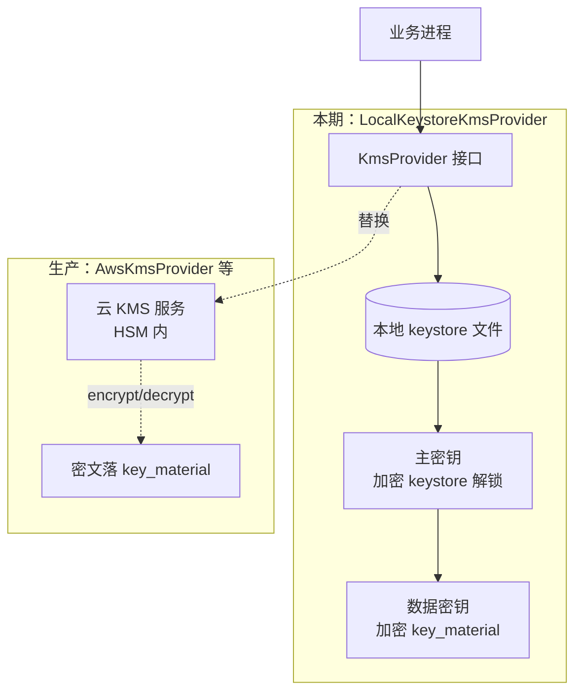

**接口约定**：

```java
interface KmsProvider {
    /** 用 KMS 加密明文，返回密文 + IV + KMS alias */
    Encrypted wrap(byte[] plaintext);

    /** 用 KMS 解密 */
    byte[] unwrap(byte[] iv, byte[] cipher, String kmsAlias);
}
```

**关键决策**：

- **接口先于实现**：业务代码绑接口，不绑 LocalKeystoreKmsProvider。生产换云 KMS 时只是换 Bean，调用代码零改动。
- **本期实现用本地 keystore 而非"裸明文密钥"**：keystore 用 PBE-SHA256 + AES + 密码（启动时由运维输入）解锁，再持有数据密钥；keystore 文件即使丢也无法直接拿到数据密钥。
- **`kms_alias` 字段**：每条 `key_material` 记录用哪个 KMS key 加密。轮换 KMS 主密钥时新数据写新 alias，老数据沿用旧 alias，逐步迁移。
- **不暴露主密钥本身**：本地实现里主密钥也是 byte[] 形式只在 Provider 内存活，对外只暴露 wrap/unwrap。

#### Task 25 设计考虑：BIP-39 助记词

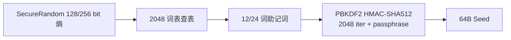

**关键决策**：

- **熵长度选 256 bit（24 词）**：12 词足够安全，但 24 词是行业默认（Ledger/Trezor），更利于跨钱包导入导出。
- **`passphrase` 可选**：作为助记词后接的"二次密码"参与 PBKDF2；本期默认空 passphrase，结构上预留。
- **生成助记词的 SecureRandom 必须用真 RNG**：`SecureRandom.getInstanceStrong()` 在 Linux 走 `/dev/random`。容器化环境注意熵池——可装 `haveged` / `rng-tools`。
- **助记词只在生成时可见，立即加密落 key_material 然后清零**：明文助记词不留任何可恢复痕迹（不日志、不 stdout、不 toString）。
- **校验位**：BIP-39 后 4 bit 校验，工具实现要校验导入的助记词合法性，不让坏助记词进系统。

#### Task 26 设计考虑：BIP-32/44 HD 派生

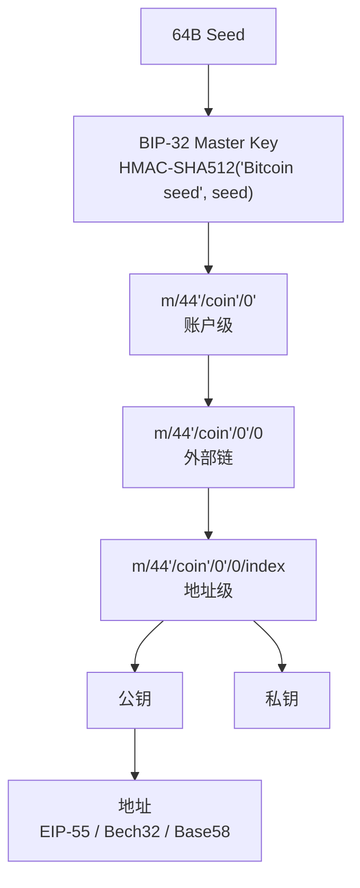

**关键决策**：

- **路径用 BIP-44 标准**：`m/44'/coinType'/account'/change/index`。`coinType` 用 SLIP-44 注册值（BTC=0、ETH=60、TRX=195）。
- **Hardened derivation（带撇号 `'`）只用前三段**：`m/44'/coin'/account'`。change / index 用非 hardened，方便给观察钱包导出 xpub。
- **`hd_path` 表**：记"哪条链的哪个 index 已分配"，避免重复派生同一地址。本期顺序分配，未来可改"哈希到非顺序 index"做隐私增强。
- **派生过程是确定性的**：同 seed + 同 path = 同私钥。这是冷热分层 + 灾备恢复的基础。
- **不使用 ED25519 / SR25519**：BTC/ETH/TRON 都是 secp256k1，统一一套派生即可。

#### Task 27 设计考虑：KeyMaterial 持久化

```mermaid
flowchart LR
    Gen[Bip32HdKeyDeriver] --> Priv[私钥 byte]
    Priv --> KMS[KmsProvider.wrap]
    KMS --> Iv[iv]
    KMS --> Cipher[cipher_text]
    Iv --> Save[KeyMaterialService.save]
    Cipher --> Save
    Save --> DB[(key_material 表)]
    Save --> Wipe[wipe priv]

    Use[Signer.sign] --> Fetch[KeyMaterialService.fetch]
    Fetch --> DB
    DB --> KMS2[KmsProvider.unwrap]
    KMS2 --> Plain[明文 byte 仅栈帧内存活]
    Plain --> Sign[签名]
    Sign --> Wipe2[wipe]
```

**关键决策**：

- **`key_id` 是业务标识**：通常用雪花 ID 或 `<chain>-<aggregateId>` 形式。`key_material` 表 + `wallet_address` 表通过 `key_id` 关联。
- **`algo_version` 字段**：当前固定 1（AES-256-GCM）。预留升级到 AES-256-SIV / 国密 SM4-GCM 的迁移空间。
- **`KeyMaterialService.fetch` 返回 byte[]**：调用方（`SignerImpl` 内部）签完立刻 wipe；不要返回 String、不要 hex-encode。
- **不缓存 fetch 结果**：每次签名都现解密，避免长期持有明文。性能开销几毫秒可接受。
- **批量预派生**：地址池是预派生的（`AddressPoolService`，Task 38），所以 KeyMaterialService 高频用在写入侧；读取侧只在签名时触发。

#### Task 28 设计考虑：Signer 路由 + 私钥清零

```mermaid
flowchart LR
    Biz[业务] --> Sign[SignerImpl.sign]
    Sign --> Route{按 rawTx.chain 路由}
    Route -- BTC --> BCS[BtcSigner<br/>secp256k1 + Bitcoin DER]
    Route -- ETH --> ECS[EthSigner<br/>secp256k1 + EIP-1559]
    Route -- TRON --> TCS[TronSigner<br/>secp256k1 + Tron Tx]

    BCS --> KM[KeyMaterialService]
    ECS --> KM
    TCS --> KM

    KM --> Plain[明文 byte]
    BCS -. sign + wipe .-> Out
    ECS -. sign + wipe .-> Out
    TCS -. sign + wipe .-> Out
    Out[SignedTx]
```

**接口约定**：

```java
interface ChainSpecificSigner {
    Chain chain();
    SignedTx sign(RawTx rawTx, byte[] privKey);   // privKey 由调用方负责清零
}

@Component
class SignerImpl implements Signer {
    SignedTx sign(RawTx raw, KeyRef ref) {
        ChainSpecificSigner css = router.get(raw.chain());
        byte[] priv = keyMaterialService.fetch(ref);  // 内部已 unwrap
        try {
            return css.sign(raw, priv);
        } finally {
            AesGcmCipher.wipe(priv);   // 必清
        }
    }
}
```

**关键决策**：

- **`SignerImpl` 是单例**：业务依赖一个 `Signer` Bean；按 chain 路由对调用方透明。各链的 `ChainSpecificSigner` 实现在 Plan 2/4/5 各自的 chain 子包内提供。
- **`fetch` + `sign` + `wipe` 在 try/finally 同栈帧**：哪怕 sign 抛异常也保证清零。
- **`ChainSpecificSigner.sign` 不直接接 KeyRef**：拿 byte[] 私钥是设计选择——隔离"取私钥"和"用私钥"两个职责，便于审计。
- **没拿到对应链的 ChainSpecificSigner Bean → 启动期失败**：用 `Map<Chain, ChainSpecificSigner>` 注入，路由 miss 时立刻抛错；不要运行期才发现。

**易踩的坑**：

- `ChainSpecificSigner` 实现内部把 `priv` 转成了 BC 的 `BigInteger`（不可清零）：BC API 不可避免要传 BigInteger，**但 BigInteger 用完后无法清零**。妥协办法：让 `priv` 在 `BigInteger` 化前后都尽快脱离作用域，签完 `priv = null` + 触发 GC 也只是 best effort。安全上限于 BC 的 API 设计，已知不完美但不可越过。
- 多线程并发调 `sign`：每次 `fetch` 都新 byte[]，无共享，线程安全。但 `KmsProvider.unwrap` 内部如果用了非线程安全的 `Cipher` 实例（JDK 默认行为）会出错——本期实现确保每次新建 `Cipher` 实例。


### Task 23: AES-GCM 加密工具 + 单测

**Files:**
- Create: `wallet/src/main/java/com/exchange/wallet/signer/kms/AesGcmCipher.java`
- Test: `wallet/src/test/java/com/exchange/wallet/signer/kms/AesGcmCipherTest.java`

- [ ] **Step 23.1: AesGcmCipher.java**

```java
package com.exchange.wallet.signer.kms;

import lombok.Data;
import javax.crypto.Cipher;
import javax.crypto.spec.GCMParameterSpec;
import javax.crypto.spec.SecretKeySpec;
import java.security.SecureRandom;
import java.util.Arrays;

public final class AesGcmCipher {

    public static final int IV_BYTES = 12;
    public static final int TAG_BITS = 128;

    private static final SecureRandom RNG = new SecureRandom();

    @Data
    public static class Cipherblob {
        private final byte[] iv;
        private final byte[] cipherText;
    }

    public Cipherblob encrypt(byte[] key, byte[] plaintext) {
        if (key.length != 32) throw new IllegalArgumentException("AES-256 key must be 32 bytes");
        byte[] iv = new byte[IV_BYTES];
        RNG.nextBytes(iv);
        try {
            Cipher c = Cipher.getInstance("AES/GCM/NoPadding");
            c.init(Cipher.ENCRYPT_MODE, new SecretKeySpec(key, "AES"),
                    new GCMParameterSpec(TAG_BITS, iv));
            return new Cipherblob(iv, c.doFinal(plaintext));
        } catch (Exception e) {
            throw new IllegalStateException("AES-GCM encrypt failed", e);
        }
    }

    public byte[] decrypt(byte[] key, byte[] iv, byte[] cipherText) {
        if (key.length != 32) throw new IllegalArgumentException("AES-256 key must be 32 bytes");
        try {
            Cipher c = Cipher.getInstance("AES/GCM/NoPadding");
            c.init(Cipher.DECRYPT_MODE, new SecretKeySpec(key, "AES"),
                    new GCMParameterSpec(TAG_BITS, iv));
            return c.doFinal(cipherText);
        } catch (Exception e) {
            throw new IllegalStateException("AES-GCM decrypt failed", e);
        }
    }

    public static void wipe(byte[] data) {
        if (data != null) Arrays.fill(data, (byte) 0);
    }
}
```

- [ ] **Step 23.2: AesGcmCipherTest.java**

```java
package com.exchange.wallet.signer.kms;

import org.junit.jupiter.api.Test;
import java.nio.charset.StandardCharsets;
import java.security.SecureRandom;
import static org.assertj.core.api.Assertions.*;

class AesGcmCipherTest {

    private final AesGcmCipher cipher = new AesGcmCipher();

    @Test
    void encrypt_decrypt_roundtrip() {
        byte[] key = new byte[32];
        new SecureRandom().nextBytes(key);
        byte[] plaintext = "super-secret-mnemonic seed".getBytes(StandardCharsets.UTF_8);

        AesGcmCipher.Cipherblob blob = cipher.encrypt(key, plaintext);
        byte[] decoded = cipher.decrypt(key, blob.getIv(), blob.getCipherText());

        assertThat(decoded).isEqualTo(plaintext);
        assertThat(blob.getIv()).hasSize(AesGcmCipher.IV_BYTES);
    }

    @Test
    void wrong_key_fails() {
        byte[] key1 = new byte[32];
        byte[] key2 = new byte[32];
        new SecureRandom().nextBytes(key1);
        new SecureRandom().nextBytes(key2);
        AesGcmCipher.Cipherblob blob = cipher.encrypt(key1, "x".getBytes());
        assertThatThrownBy(() -> cipher.decrypt(key2, blob.getIv(), blob.getCipherText()))
                .isInstanceOf(IllegalStateException.class);
    }

    @Test
    void invalid_key_length_rejected() {
        assertThatThrownBy(() -> cipher.encrypt(new byte[16], new byte[]{1}))
                .isInstanceOf(IllegalArgumentException.class);
    }
}
```

- [ ] **Step 23.3: 跑测试**

Run: `mvn -q -pl wallet test -Dtest=AesGcmCipherTest`
Expected: 3 tests passed.

- [ ] **Step 23.4: 提交**

```bash
git add wallet/src/main/java/com/exchange/wallet/signer/kms/ wallet/src/test/java/com/exchange/wallet/signer/kms/
git commit -m "feat(signer): AES-256-GCM cipher with wipe utility"
```

### Task 24: KmsProvider 接口 + 本地 keystore 实现

**Files:**
- Create: `wallet/src/main/java/com/exchange/wallet/signer/kms/KmsProvider.java`
- Create: `wallet/src/main/java/com/exchange/wallet/signer/kms/LocalKeystoreKmsProvider.java`
- Test: `wallet/src/test/java/com/exchange/wallet/signer/kms/LocalKeystoreKmsProviderTest.java`

- [ ] **Step 24.1: KmsProvider.java**

```java
package com.exchange.wallet.signer.kms;

public interface KmsProvider {
    byte[] resolveDataKey(String alias);   // 解出 32 字节 AES 数据密钥
    String defaultAlias();
}
```

- [ ] **Step 24.2: LocalKeystoreKmsProvider.java**

```java
package com.exchange.wallet.signer.kms;

import lombok.RequiredArgsConstructor;
import org.springframework.beans.factory.annotation.Value;
import org.springframework.stereotype.Component;
import java.security.SecureRandom;
import java.util.Base64;
import java.util.Map;
import java.util.concurrent.ConcurrentHashMap;

@Component
@RequiredArgsConstructor
public class LocalKeystoreKmsProvider implements KmsProvider {

    @Value("${wallet.signer.kms.local-master-key-base64:}")
    private String masterKeyB64;

    @Value("${wallet.signer.kms.default-alias:local:default}")
    private String defaultAlias;

    private final Map<String, byte[]> cache = new ConcurrentHashMap<>();

    @Override
    public byte[] resolveDataKey(String alias) {
        return cache.computeIfAbsent(alias, k -> {
            if (masterKeyB64 != null && !masterKeyB64.isBlank()) {
                byte[] decoded = Base64.getDecoder().decode(masterKeyB64);
                if (decoded.length != 32) {
                    throw new IllegalStateException("local master key must be 32 bytes (base64)");
                }
                return decoded;
            }
            // 兜底：生成进程内随机密钥（仅 dev 环境用）
            byte[] generated = new byte[32];
            new SecureRandom().nextBytes(generated);
            return generated;
        });
    }

    @Override
    public String defaultAlias() {
        return defaultAlias;
    }
}
```

> 说明：生产替换为 AwsKmsProvider 时实现同样的 `resolveDataKey` 接口（调用 KMS Decrypt API），上层零改动。dev 环境可以在 `application-dev.yml` 注入 `WALLET_SIGNER_KMS_LOCAL_MASTER_KEY_BASE64=<base64-encoded-32-bytes>`。

- [ ] **Step 24.3: LocalKeystoreKmsProviderTest.java**

```java
package com.exchange.wallet.signer.kms;

import org.junit.jupiter.api.Test;
import org.springframework.test.util.ReflectionTestUtils;
import java.util.Base64;
import static org.assertj.core.api.Assertions.assertThat;

class LocalKeystoreKmsProviderTest {

    @Test
    void uses_configured_master_key() {
        LocalKeystoreKmsProvider p = new LocalKeystoreKmsProvider();
        byte[] key = new byte[32];
        for (int i = 0; i < 32; i++) key[i] = (byte) i;
        ReflectionTestUtils.setField(p, "masterKeyB64", Base64.getEncoder().encodeToString(key));
        ReflectionTestUtils.setField(p, "defaultAlias", "local:default");

        assertThat(p.resolveDataKey("local:default")).isEqualTo(key);
        assertThat(p.resolveDataKey("local:default")).isEqualTo(key);  // 同 alias 复用 cache
    }

    @Test
    void generates_random_key_when_unset() {
        LocalKeystoreKmsProvider p = new LocalKeystoreKmsProvider();
        ReflectionTestUtils.setField(p, "masterKeyB64", "");
        ReflectionTestUtils.setField(p, "defaultAlias", "local:default");

        byte[] k1 = p.resolveDataKey("local:default");
        byte[] k2 = p.resolveDataKey("local:default");
        assertThat(k1).hasSize(32).isEqualTo(k2);  // cache 内幂等
    }
}
```

- [ ] **Step 24.4: 跑测试**

Run: `mvn -q -pl wallet test -Dtest=LocalKeystoreKmsProviderTest`
Expected: 2 tests passed.

- [ ] **Step 24.5: 提交**

```bash
git add wallet/src/main/java/com/exchange/wallet/signer/kms/ wallet/src/test/java/com/exchange/wallet/signer/kms/LocalKeystoreKmsProviderTest.java
git commit -m "feat(signer): KmsProvider abstraction + local keystore impl"
```

### Task 25: BIP-39 助记词工具

**Files:**
- Create: `wallet/src/main/java/com/exchange/wallet/signer/hd/Bip39MnemonicService.java`
- Test: `wallet/src/test/java/com/exchange/wallet/signer/hd/Bip39MnemonicServiceTest.java`

- [ ] **Step 25.1: Bip39MnemonicService.java**

```java
package com.exchange.wallet.signer.hd;

import org.springframework.stereotype.Component;
import org.web3j.crypto.MnemonicUtils;
import java.security.SecureRandom;

@Component
public class Bip39MnemonicService {

    private static final SecureRandom RNG = new SecureRandom();

    public String generateMnemonic() {
        byte[] entropy = new byte[16];   // 128 bit → 12 词
        RNG.nextBytes(entropy);
        return MnemonicUtils.generateMnemonic(entropy);
    }

    public byte[] mnemonicToSeed(String mnemonic, String passphrase) {
        return MnemonicUtils.generateSeed(mnemonic, passphrase == null ? "" : passphrase);
    }

    public boolean validate(String mnemonic) {
        return MnemonicUtils.validateMnemonic(mnemonic);
    }
}
```

- [ ] **Step 25.2: Bip39MnemonicServiceTest.java**

```java
package com.exchange.wallet.signer.hd;

import org.junit.jupiter.api.Test;
import static org.assertj.core.api.Assertions.assertThat;

class Bip39MnemonicServiceTest {

    private final Bip39MnemonicService svc = new Bip39MnemonicService();

    @Test
    void generated_mnemonic_is_valid_12_words() {
        String mnemonic = svc.generateMnemonic();
        assertThat(mnemonic.split(" ")).hasSize(12);
        assertThat(svc.validate(mnemonic)).isTrue();
    }

    @Test
    void seed_is_64_bytes() {
        String mnemonic = svc.generateMnemonic();
        byte[] seed = svc.mnemonicToSeed(mnemonic, "");
        assertThat(seed).hasSize(64);
    }

    @Test
    void same_mnemonic_same_seed() {
        String mnemonic = "abandon abandon abandon abandon abandon abandon abandon abandon abandon abandon abandon about";
        byte[] s1 = svc.mnemonicToSeed(mnemonic, "");
        byte[] s2 = svc.mnemonicToSeed(mnemonic, "");
        assertThat(s1).isEqualTo(s2);
    }
}
```

- [ ] **Step 25.3: 跑测试**

Run: `mvn -q -pl wallet test -Dtest=Bip39MnemonicServiceTest`
Expected: 3 tests passed.

- [ ] **Step 25.4: 提交**

```bash
git add wallet/src/main/java/com/exchange/wallet/signer/hd/ wallet/src/test/java/com/exchange/wallet/signer/hd/
git commit -m "feat(signer): BIP-39 mnemonic service"
```

### Task 26: BIP-32/44 HD 路径派生

**Files:**
- Create: `wallet/src/main/java/com/exchange/wallet/signer/hd/Bip32HdKeyDeriver.java`
- Test: `wallet/src/test/java/com/exchange/wallet/signer/hd/Bip32HdKeyDeriverTest.java`

- [ ] **Step 26.1: Bip32HdKeyDeriver.java**

```java
package com.exchange.wallet.signer.hd;

import lombok.Data;
import org.springframework.stereotype.Component;
import org.web3j.crypto.Bip32ECKeyPair;

@Component
public class Bip32HdKeyDeriver {

    @Data
    public static class HdKey {
        private final byte[] privateKey;     // 32 bytes
        private final byte[] publicKey;      // 65 bytes uncompressed, leading 0x04
        private final String path;
    }

    public HdKey derive(byte[] seed, String hdPath) {
        Bip32ECKeyPair master = Bip32ECKeyPair.generateKeyPair(seed);
        int[] indices = parsePath(hdPath);
        Bip32ECKeyPair derived = Bip32ECKeyPair.deriveKeyPair(master, indices);
        byte[] priv = derived.getPrivateKey().toByteArray();
        priv = leftPad32(priv);
        byte[] pub = derived.getPublicKey().toByteArray();
        return new HdKey(priv, pub, hdPath);
    }

    private static int[] parsePath(String hdPath) {
        // 形如 m/44'/60'/0'/0/123
        if (!hdPath.startsWith("m/")) throw new IllegalArgumentException("hdPath must start with m/");
        String[] parts = hdPath.substring(2).split("/");
        int[] out = new int[parts.length];
        for (int i = 0; i < parts.length; i++) {
            String p = parts[i];
            boolean hard = p.endsWith("'");
            int n = Integer.parseInt(hard ? p.substring(0, p.length() - 1) : p);
            out[i] = hard ? (n | 0x80000000) : n;
        }
        return out;
    }

    private static byte[] leftPad32(byte[] in) {
        if (in.length == 32) return in;
        byte[] out = new byte[32];
        if (in.length < 32) {
            System.arraycopy(in, 0, out, 32 - in.length, in.length);
        } else {
            System.arraycopy(in, in.length - 32, out, 0, 32);
        }
        return out;
    }
}
```

- [ ] **Step 26.2: Bip32HdKeyDeriverTest.java**

```java
package com.exchange.wallet.signer.hd;

import org.junit.jupiter.api.Test;
import static org.assertj.core.api.Assertions.assertThat;

class Bip32HdKeyDeriverTest {

    private final Bip39MnemonicService bip39 = new Bip39MnemonicService();
    private final Bip32HdKeyDeriver deriver = new Bip32HdKeyDeriver();

    @Test
    void deterministic_derivation() {
        // BIP-39 test vector: "abandon" × 11 + "about" → 已知 seed
        String mnemonic = "abandon abandon abandon abandon abandon abandon abandon abandon abandon abandon abandon about";
        byte[] seed = bip39.mnemonicToSeed(mnemonic, "");
        Bip32HdKeyDeriver.HdKey k1 = deriver.derive(seed, "m/44'/60'/0'/0/0");
        Bip32HdKeyDeriver.HdKey k2 = deriver.derive(seed, "m/44'/60'/0'/0/0");
        assertThat(k1.getPrivateKey()).hasSize(32).isEqualTo(k2.getPrivateKey());
    }

    @Test
    void different_paths_different_keys() {
        String mnemonic = "abandon abandon abandon abandon abandon abandon abandon abandon abandon abandon abandon about";
        byte[] seed = bip39.mnemonicToSeed(mnemonic, "");
        Bip32HdKeyDeriver.HdKey k0 = deriver.derive(seed, "m/44'/60'/0'/0/0");
        Bip32HdKeyDeriver.HdKey k1 = deriver.derive(seed, "m/44'/60'/0'/0/1");
        assertThat(k0.getPrivateKey()).isNotEqualTo(k1.getPrivateKey());
    }

    @Test
    void rejects_bad_path() {
        org.assertj.core.api.Assertions.assertThatThrownBy(
                () -> deriver.derive(new byte[64], "44'/60'/0'/0/0"))
                .isInstanceOf(IllegalArgumentException.class);
    }
}
```

- [ ] **Step 26.3: 跑测试**

Run: `mvn -q -pl wallet test -Dtest=Bip32HdKeyDeriverTest`
Expected: 3 tests passed.

- [ ] **Step 26.4: 提交**

```bash
git add wallet/src/main/java/com/exchange/wallet/signer/hd/Bip32HdKeyDeriver.java wallet/src/test/java/com/exchange/wallet/signer/hd/Bip32HdKeyDeriverTest.java
git commit -m "feat(signer): BIP-32/44 HD key deriver"
```

### Task 27: KeyMaterial 实体 + Mapper + Service

**Files:**
- Create: `wallet/src/main/java/com/exchange/wallet/signer/KeyMaterialEntity.java`
- Create: `wallet/src/main/java/com/exchange/wallet/signer/KeyMaterialMapper.java`
- Create: `wallet/src/main/java/com/exchange/wallet/signer/KeyMaterialService.java`

- [ ] **Step 27.1: KeyMaterialEntity.java**

```java
package com.exchange.wallet.signer;

import com.baomidou.mybatisplus.annotation.IdType;
import com.baomidou.mybatisplus.annotation.TableId;
import com.baomidou.mybatisplus.annotation.TableName;
import lombok.Data;
import java.time.LocalDateTime;

@Data
@TableName("key_material")
public class KeyMaterialEntity {
    @TableId(type = IdType.INPUT)
    private Long id;
    private String keyId;
    private String keyType;             // HD_SEED / SINGLE
    private byte[] cipherText;
    private byte[] iv;
    private String kmsAlias;
    private Integer algoVersion;
    private LocalDateTime createdAt;
}
```

- [ ] **Step 27.2: KeyMaterialMapper.java**

```java
package com.exchange.wallet.signer;

import com.baomidou.mybatisplus.core.mapper.BaseMapper;
import org.apache.ibatis.annotations.Mapper;
import org.apache.ibatis.annotations.Param;
import org.apache.ibatis.annotations.Select;

@Mapper
public interface KeyMaterialMapper extends BaseMapper<KeyMaterialEntity> {

    @Select("SELECT * FROM key_material WHERE key_id = #{keyId} LIMIT 1")
    KeyMaterialEntity findByKeyId(@Param("keyId") String keyId);
}
```

- [ ] **Step 27.3: KeyMaterialService.java**

```java
package com.exchange.wallet.signer;

import com.exchange.common.util.SnowflakeIdGenerator;
import com.exchange.wallet.signer.kms.AesGcmCipher;
import com.exchange.wallet.signer.kms.KmsProvider;
import lombok.RequiredArgsConstructor;
import org.springframework.stereotype.Service;
import java.time.LocalDateTime;
import java.util.UUID;

@Service
@RequiredArgsConstructor
public class KeyMaterialService {

    private final KeyMaterialMapper mapper;
    private final KmsProvider kmsProvider;
    private final AesGcmCipher cipher = new AesGcmCipher();

    /** 生成新的 HD 种子并加密落库；返回 keyId */
    public String storeHdSeed(byte[] seed) {
        String keyId = "hd-" + UUID.randomUUID();
        byte[] dataKey = kmsProvider.resolveDataKey(kmsProvider.defaultAlias());
        AesGcmCipher.Cipherblob blob = cipher.encrypt(dataKey, seed);

        KeyMaterialEntity row = new KeyMaterialEntity();
        row.setId(SnowflakeIdGenerator.nextId());
        row.setKeyId(keyId);
        row.setKeyType("HD_SEED");
        row.setCipherText(blob.getCipherText());
        row.setIv(blob.getIv());
        row.setKmsAlias(kmsProvider.defaultAlias());
        row.setAlgoVersion(1);
        row.setCreatedAt(LocalDateTime.now());
        mapper.insert(row);
        return keyId;
    }

    /** 解密返回明文种子。调用方必须用完后 wipe。 */
    public byte[] loadSeed(String keyId) {
        KeyMaterialEntity row = mapper.findByKeyId(keyId);
        if (row == null) throw new IllegalArgumentException("keyId not found: " + keyId);
        byte[] dataKey = kmsProvider.resolveDataKey(row.getKmsAlias());
        return cipher.decrypt(dataKey, row.getIv(), row.getCipherText());
    }
}
```

- [ ] **Step 27.4: 编译**

Run: `mvn -q -pl wallet -am compile`
Expected: BUILD SUCCESS。

- [ ] **Step 27.5: 提交**

```bash
git add wallet/src/main/java/com/exchange/wallet/signer/KeyMaterial*
git commit -m "feat(signer): KeyMaterial entity/mapper/service with KMS-wrapped storage"
```

### Task 28: ChainSpecificSigner 接口 + Signer 实现（路由 + 私钥清零）

**Files:**
- Create: `wallet/src/main/java/com/exchange/wallet/signer/ChainSpecificSigner.java`
- Create: `wallet/src/main/java/com/exchange/wallet/signer/SignerImpl.java`
- Test: `wallet/src/test/java/com/exchange/wallet/signer/SignerImplTest.java`

- [ ] **Step 28.1: ChainSpecificSigner.java**

```java
package com.exchange.wallet.signer;

import com.exchange.wallet.chain.api.Chain;
import com.exchange.wallet.chain.api.dto.RawTx;
import com.exchange.wallet.chain.api.dto.SignedTx;

public interface ChainSpecificSigner {
    Chain chain();
    SignedTx sign(RawTx rawTx, byte[] privateKey);
}
```

- [ ] **Step 28.2: SignerImpl.java**

```java
package com.exchange.wallet.signer;

import com.exchange.wallet.chain.api.Chain;
import com.exchange.wallet.chain.api.Signer;
import com.exchange.wallet.chain.api.dto.KeyRef;
import com.exchange.wallet.chain.api.dto.RawTx;
import com.exchange.wallet.chain.api.dto.SignedTx;
import com.exchange.wallet.signer.hd.Bip32HdKeyDeriver;
import com.exchange.wallet.signer.kms.AesGcmCipher;
import lombok.RequiredArgsConstructor;
import lombok.extern.slf4j.Slf4j;
import org.springframework.stereotype.Component;
import java.util.List;
import java.util.Map;
import java.util.stream.Collectors;

@Slf4j
@Component
@RequiredArgsConstructor
public class SignerImpl implements Signer {

    private final KeyMaterialService keyMaterialService;
    private final Bip32HdKeyDeriver deriver;
    private final List<ChainSpecificSigner> chainSigners;

    @Override
    public SignedTx sign(RawTx rawTx, KeyRef keyRef) {
        if (rawTx.getChain() != keyRef.getChain()) {
            throw new IllegalArgumentException("chain mismatch: rawTx=" + rawTx.getChain()
                    + " keyRef=" + keyRef.getChain());
        }

        Map<Chain, ChainSpecificSigner> registry = chainSigners.stream()
                .collect(Collectors.toMap(ChainSpecificSigner::chain, s -> s));
        ChainSpecificSigner cs = registry.get(rawTx.getChain());
        if (cs == null) {
            throw new IllegalStateException("no ChainSpecificSigner for " + rawTx.getChain());
        }

        byte[] seed = null;
        Bip32HdKeyDeriver.HdKey hd = null;
        byte[] priv = null;
        try {
            seed = keyMaterialService.loadSeed(keyRef.getKeyId());
            hd = deriver.derive(seed, keyRef.getHdPath());
            priv = hd.getPrivateKey();
            return cs.sign(rawTx, priv);
        } finally {
            AesGcmCipher.wipe(seed);
            if (hd != null) {
                AesGcmCipher.wipe(hd.getPrivateKey());
            }
            // priv 是 hd.privateKey 的引用，已清；保险再清一次
            AesGcmCipher.wipe(priv);
        }
    }
}
```

- [ ] **Step 28.3: SignerImplTest.java**

```java
package com.exchange.wallet.signer;

import com.exchange.wallet.chain.api.Chain;
import com.exchange.wallet.chain.api.dto.KeyRef;
import com.exchange.wallet.chain.api.dto.RawTx;
import com.exchange.wallet.chain.api.dto.SignedTx;
import com.exchange.wallet.signer.hd.Bip32HdKeyDeriver;
import org.junit.jupiter.api.Test;
import org.mockito.ArgumentCaptor;
import java.util.List;
import static org.assertj.core.api.Assertions.*;
import static org.mockito.Mockito.*;

class SignerImplTest {

    static class FakeChainSigner implements ChainSpecificSigner {
        SignedTx returnValue = SignedTx.builder().chain(Chain.ETH).hexEncoded("0xdead").build();
        byte[] privateKeyAtCall;
        @Override public Chain chain() { return Chain.ETH; }
        @Override public SignedTx sign(RawTx rawTx, byte[] privateKey) {
            // 拷贝当时的内容用于断言（清零后再断言会全 0）
            privateKeyAtCall = privateKey.clone();
            return returnValue;
        }
    }

    @Test
    void routes_to_matching_chain_signer_and_wipes_after_use() {
        KeyMaterialService kms = mock(KeyMaterialService.class);
        Bip32HdKeyDeriver deriver = mock(Bip32HdKeyDeriver.class);
        FakeChainSigner ethSigner = new FakeChainSigner();
        SignerImpl signer = new SignerImpl(kms, deriver, List.of(ethSigner));

        byte[] seed = new byte[64];
        for (int i = 0; i < seed.length; i++) seed[i] = (byte) i;
        when(kms.loadSeed("k1")).thenReturn(seed);

        byte[] priv = new byte[32];
        for (int i = 0; i < 32; i++) priv[i] = (byte) (i + 100);
        Bip32HdKeyDeriver.HdKey hd = new Bip32HdKeyDeriver.HdKey(priv, new byte[65], "m/44'/60'/0'/0/0");
        when(deriver.derive(seed, "m/44'/60'/0'/0/0")).thenReturn(hd);

        RawTx raw = RawTx.builder().chain(Chain.ETH).build();
        KeyRef ref = KeyRef.builder().chain(Chain.ETH).keyId("k1").hdPath("m/44'/60'/0'/0/0").build();

        SignedTx out = signer.sign(raw, ref);

        assertThat(out.getHexEncoded()).isEqualTo("0xdead");
        assertThat(ethSigner.privateKeyAtCall).contains((byte) 100);  // 调用时是真实 key
        assertThat(priv).containsOnly((byte) 0);                       // 调用后被 wipe
        assertThat(seed).containsOnly((byte) 0);
    }

    @Test
    void chain_mismatch_rejected() {
        SignerImpl signer = new SignerImpl(mock(KeyMaterialService.class),
                mock(Bip32HdKeyDeriver.class), List.of(new FakeChainSigner()));
        RawTx raw = RawTx.builder().chain(Chain.BTC).build();
        KeyRef ref = KeyRef.builder().chain(Chain.ETH).build();
        assertThatThrownBy(() -> signer.sign(raw, ref))
                .isInstanceOf(IllegalArgumentException.class);
    }

    @Test
    void no_chain_signer_registered() {
        SignerImpl signer = new SignerImpl(mock(KeyMaterialService.class),
                mock(Bip32HdKeyDeriver.class), List.of());
        RawTx raw = RawTx.builder().chain(Chain.ETH).build();
        KeyRef ref = KeyRef.builder().chain(Chain.ETH).build();
        assertThatThrownBy(() -> signer.sign(raw, ref))
                .isInstanceOf(IllegalStateException.class);
    }
}
```

- [ ] **Step 28.4: 跑测试**

Run: `mvn -q -pl wallet test -Dtest=SignerImplTest`
Expected: 3 tests passed.

- [ ] **Step 28.5: 提交**

```bash
git add wallet/src/main/java/com/exchange/wallet/signer/ChainSpecificSigner.java wallet/src/main/java/com/exchange/wallet/signer/SignerImpl.java wallet/src/test/java/com/exchange/wallet/signer/SignerImplTest.java
git commit -m "feat(signer): SignerImpl with chain routing and post-use key wipe"
```

---

## Phase 6 — wallet.nonce：并发 nonce 分配

### 全景：为什么 nonce 是 EVM 世界的隐形一等公民

EVM 链（ETH / BSC / Polygon...）的每笔交易必须带一个**严格连续递增**的 nonce。同一地址第 N+1 笔提现要等第 N 笔的 nonce 被链处理才能广播——nonce=5 还没上链，发了 nonce=6，链上节点会拒收（"nonce too high"）；nonce=5 已上链，再发 nonce=5，链拒（"nonce too low"）；同 nonce 两笔不同 gasPrice = "替换交易"（用于加速 / 取消）。

单笔可控；麻烦在**并发**：交易所每秒可能并发处理几十笔提现，全部从同一个热钱包出账。这时多线程都要对同一地址发号 nonce，不能撞、不能跳、不能丢。

```mermaid
flowchart TB
    subgraph Concurrent[并发提现]
        T1[线程1<br/>提现 0.5 ETH]
        T2[线程2<br/>提现 1.2 ETH]
        T3[线程3<br/>提现 0.3 ETH]
    end

    Alloc[NonceAllocator]
    DB[(nonce_register<br/>chain+address PK<br/>next_nonce + version)]
    Cache[(Redis Lua<br/>兜底分配)]
    Reconciler[NonceReconciler<br/>启动校准 + 定时巡检]
    Chain[链上 RPC<br/>getOnChainNonce]

    T1 --> Alloc
    T2 --> Alloc
    T3 --> Alloc

    Alloc -- 主路径 --> DB
    Alloc -. 降级 .-> Cache

    Reconciler --> Chain
    Reconciler --> DB
```

**Phase 6 内部分工**：

| Task | 组件 | 职责 |
|---|---|---|
| 29 | `NonceRegister` 实体 + Mapper | DB 表与 CAS 更新 SQL |
| 30 | `NonceAllocator` 接口 + `DbOptimisticNonceAllocator` | 三级保障：DB 乐观锁主、Redis Lua 兜底、启动校准 |

**关键决策**：

- **`(chain, address)` 复合主键 + `next_nonce` + `version`**：DB 是真理之源；分配 nonce = `UPDATE nonce_register SET next_nonce=next_nonce+1, version=version+1 WHERE chain=? AND address=? AND version=#{old}`。CAS 失败 = 并发冲突，重试。
- **Redis Lua 仅作兜底**：`INCR nonce:eth:0xabc...`。仅在 DB 暂时不可用时降级使用，恢复后用 `Reconciler` 把 Redis 的高水位写回 DB。生产路径不依赖 Redis 一致性。
- **`NonceReconciler` 启动校准 + 定时巡检**：进程启动时用 `ChainClient.getOnChainNonce(address)` 拿链上已用最大 nonce，写到 `on_chain_nonce`；如果 DB 的 `next_nonce` < 链上 nonce + pending 数，说明丢号，按链上的实际值修正。
- **不用 ZK / etcd**：MySQL 完全够用，引 ZK 是额外运维负担。
- **不用 synchronized 进程内串行**：单进程内 synchronized 看似简单，但多副本部署立刻失效；DB 乐观锁天然分布式安全。
- **CAS 重试有上限**：默认 5 次，超过则抛 `RetriableException` 让上层退避；不要无限重试制造雪崩。

**易踩的坑**：

- 提现广播失败但不回滚 nonce：链上没消耗这个 nonce，DB 还往前走 → "nonce 空洞"，所有后续提现卡在那里。需要业务侧捕获广播异常 + 显式调 `NonceReconciler` 矫正。
- 提现加速场景：相同 nonce + 更高 gasPrice 替换。**不要再分配新 nonce**——直接用 withdraw_order 里已有的 nonce 字段。这要靠业务层正确建模而非 NonceAllocator 内部判断。
- 启动校准前就处理提现：链上 nonce=10，DB 还是 0，第一笔提现拿到 nonce=0，被链拒。所以启动校准必须在 web server ready 之前完成。
- 多个进程都跑 reconcile：用 ShedLock `nonce-reconcile` 锁互斥。

### Task 29: NonceRegister 实体 + Mapper

**Files:**
- Create: `wallet/src/main/java/com/exchange/wallet/nonce/NonceRegisterEntity.java`
- Create: `wallet/src/main/java/com/exchange/wallet/nonce/NonceRegisterMapper.java`

- [ ] **Step 29.1: NonceRegisterEntity.java**

```java
package com.exchange.wallet.nonce;

import com.baomidou.mybatisplus.annotation.TableName;
import lombok.Data;
import java.time.LocalDateTime;

@Data
@TableName("nonce_register")
public class NonceRegisterEntity {
    private String chain;
    private String address;
    private Long nextNonce;
    private Long onChainNonce;
    private LocalDateTime reconciledAt;
    private Integer version;
}
```

- [ ] **Step 29.2: NonceRegisterMapper.java**

```java
package com.exchange.wallet.nonce;

import com.baomidou.mybatisplus.core.mapper.BaseMapper;
import org.apache.ibatis.annotations.Insert;
import org.apache.ibatis.annotations.Mapper;
import org.apache.ibatis.annotations.Param;
import org.apache.ibatis.annotations.Select;
import org.apache.ibatis.annotations.Update;
import java.time.LocalDateTime;

@Mapper
public interface NonceRegisterMapper extends BaseMapper<NonceRegisterEntity> {

    @Select("""
        SELECT * FROM nonce_register
        WHERE chain = #{chain} AND address = #{address}
        """)
    NonceRegisterEntity find(@Param("chain") String chain, @Param("address") String address);

    @Insert("""
        INSERT IGNORE INTO nonce_register(chain, address, next_nonce, on_chain_nonce, reconciled_at, version)
        VALUES(#{chain}, #{address}, #{nextNonce}, #{onChainNonce}, #{reconciledAt}, 0)
        """)
    int insertIfAbsent(@Param("chain") String chain,
                       @Param("address") String address,
                       @Param("nextNonce") long nextNonce,
                       @Param("onChainNonce") long onChainNonce,
                       @Param("reconciledAt") LocalDateTime reconciledAt);

    @Update("""
        UPDATE nonce_register
           SET next_nonce = next_nonce + 1,
               version = version + 1
         WHERE chain = #{chain} AND address = #{address} AND version = #{version}
        """)
    int casIncrement(@Param("chain") String chain,
                     @Param("address") String address,
                     @Param("version") int version);

    @Update("""
        UPDATE nonce_register
           SET next_nonce = #{nextNonce},
               on_chain_nonce = #{onChainNonce},
               reconciled_at = #{now},
               version = version + 1
         WHERE chain = #{chain} AND address = #{address}
        """)
    int reconcile(@Param("chain") String chain,
                  @Param("address") String address,
                  @Param("nextNonce") long nextNonce,
                  @Param("onChainNonce") long onChainNonce,
                  @Param("now") LocalDateTime now);
}
```

- [ ] **Step 29.3: 编译**

Run: `mvn -q -pl wallet -am compile`
Expected: BUILD SUCCESS。

- [ ] **Step 29.4: 提交**

```bash
git add wallet/src/main/java/com/exchange/wallet/nonce/
git commit -m "feat(nonce): NonceRegister entity/mapper with CAS increment"
```

### Task 30: NonceAllocator 接口 + DB 乐观锁实现

**设计考虑**：

```mermaid
flowchart TB
    Start[allocate chain, address] --> Read[SELECT next_nonce, version]
    Read --> CAS[UPDATE SET next_nonce+1<br/>WHERE version=#old]
    CAS -- affected=1 --> Ret[返回 next_nonce-1]
    CAS -- affected=0 --> Retry{重试 < 5?}
    Retry -- 是 --> Read
    Retry -- 否 --> RE[抛 RetriableException]

    Ret -- 异常未广播 --> Rev[NonceReconciler 校准]
```

**接口约定**：

```java
interface NonceAllocator {
    /** 占用并返回下一个可用 nonce；失败抛 RetriableException */
    long allocate(Chain chain, String address);

    /** 广播失败时归还 nonce（next_nonce-1，仅当当前 next_nonce=#allocated+1） */
    void release(Chain chain, String address, long allocatedNonce);
}
```

**关键决策**：

- **CAS 而非 SELECT FOR UPDATE**：行锁会阻塞别的事务（提现高并发下退化为串行），CAS 不阻塞、自旋重试，吞吐高。
- **`release` 难做完美**：分配后 → 别的线程已分配过更大 nonce → release 不能简单减回去。**做法**：release 只在 `next_nonce == allocated + 1` 时成功；否则记录 nonce 空洞由 Reconciler 处理。
- **`Reconciler` 周期 5 分钟**：用 ShedLock 互斥；对每个监控地址查 `getOnChainNonce` + `withdraw_order WHERE status IN (BROADCASTED, CONFIRMED) AND chain=? AND from_address=?` 的最大 nonce，三者比对。
- **不在 NonceAllocator 内部做广播**：分配 nonce 和广播交易是两个责任。Allocator 只管发号，广播由 withdraw 状态机处理。
- **`allocate` 必须在业务事务外调用**：本步骤是独立短事务，与业务事务解耦。如果嵌入业务事务，业务事务一长就持锁久 → 别的线程 CAS 失败重试不断。

**易踩的坑**：

- 把 `allocate` 放到业务 `@Transactional` 内：业务回滚 nonce 没释放（业务事务回滚 ≠ Allocator 事务回滚，二者不同事务），nonce 浪费。本期把 `allocate` 设计成独立事务（`Propagation.REQUIRES_NEW`）。
- 提现失败重试时复用旧 nonce：业务层必须先 `release` 老 nonce 再 `allocate` 新 nonce；或更简单的——失败重试只重试广播本身，不再分新 nonce。
- 多链 / 同地址：复合主键含 chain，互不干扰。但同链同地址（多个热钱包共用一个？）必须强制约束"一地址只属于一种角色"。

**Files:**
- Create: `wallet/src/main/java/com/exchange/wallet/nonce/NonceAllocator.java`
- Create: `wallet/src/main/java/com/exchange/wallet/nonce/DbOptimisticNonceAllocator.java`
- Test: `wallet/src/test/java/com/exchange/wallet/nonce/DbOptimisticNonceAllocatorTest.java`

- [ ] **Step 30.1: NonceAllocator.java**

```java
package com.exchange.wallet.nonce;

import com.exchange.wallet.chain.api.Chain;

public interface NonceAllocator {
    long allocate(Chain chain, String fromAddress);
    void reconcile(Chain chain, String fromAddress, long onChainPendingNonce);
}
```

- [ ] **Step 30.2: DbOptimisticNonceAllocator.java**

```java
package com.exchange.wallet.nonce;

import com.exchange.wallet.chain.api.Chain;
import lombok.RequiredArgsConstructor;
import lombok.extern.slf4j.Slf4j;
import org.springframework.stereotype.Component;
import java.time.LocalDateTime;

@Slf4j
@Component
@RequiredArgsConstructor
public class DbOptimisticNonceAllocator implements NonceAllocator {

    private static final int MAX_RETRIES = 5;

    private final NonceRegisterMapper mapper;

    @Override
    public long allocate(Chain chain, String fromAddress) {
        for (int i = 0; i < MAX_RETRIES; i++) {
            NonceRegisterEntity row = mapper.find(chain.name(), fromAddress);
            if (row == null) {
                throw new IllegalStateException(
                        "nonce register not initialized for chain=" + chain + " addr=" + fromAddress
                                + ". call reconcile() once before allocate.");
            }
            long nonce = row.getNextNonce();
            int updated = mapper.casIncrement(chain.name(), fromAddress, row.getVersion());
            if (updated == 1) return nonce;
            log.debug("nonce CAS contention chain={} addr={} retry={}", chain, fromAddress, i + 1);
        }
        throw new IllegalStateException("nonce allocate failed after retries chain=" + chain
                + " addr=" + fromAddress);
    }

    @Override
    public void reconcile(Chain chain, String fromAddress, long onChainPendingNonce) {
        int rows = mapper.insertIfAbsent(chain.name(), fromAddress,
                onChainPendingNonce, onChainPendingNonce, LocalDateTime.now());
        if (rows == 0) {
            // 已存在，按链上 pending 重新校准 next_nonce
            mapper.reconcile(chain.name(), fromAddress,
                    onChainPendingNonce, onChainPendingNonce, LocalDateTime.now());
        }
        log.info("nonce reconciled chain={} addr={} pending={}", chain, fromAddress, onChainPendingNonce);
    }
}
```

> 说明：本实现仅用 DB 乐观锁；Redis Lua 兜底层在 Plan 2 实施时按多实例并发压测结果决定是否补，避免过度设计。

- [ ] **Step 30.3: DbOptimisticNonceAllocatorTest.java**

```java
package com.exchange.wallet.nonce;

import com.exchange.wallet.chain.api.Chain;
import org.junit.jupiter.api.Test;
import static org.assertj.core.api.Assertions.*;
import static org.mockito.Mockito.*;

class DbOptimisticNonceAllocatorTest {

    @Test
    void allocate_returns_current_and_increments() {
        NonceRegisterMapper mapper = mock(NonceRegisterMapper.class);
        NonceRegisterEntity row = new NonceRegisterEntity();
        row.setChain("ETH"); row.setAddress("0xabc");
        row.setNextNonce(7L); row.setVersion(3);
        when(mapper.find("ETH", "0xabc")).thenReturn(row);
        when(mapper.casIncrement("ETH", "0xabc", 3)).thenReturn(1);

        DbOptimisticNonceAllocator a = new DbOptimisticNonceAllocator(mapper);
        long n = a.allocate(Chain.ETH, "0xabc");
        assertThat(n).isEqualTo(7L);
    }

    @Test
    void retries_on_contention() {
        NonceRegisterMapper mapper = mock(NonceRegisterMapper.class);
        NonceRegisterEntity row1 = new NonceRegisterEntity();
        row1.setNextNonce(5L); row1.setVersion(1);
        NonceRegisterEntity row2 = new NonceRegisterEntity();
        row2.setNextNonce(6L); row2.setVersion(2);
        when(mapper.find("ETH", "0x1"))
                .thenReturn(row1).thenReturn(row2);
        when(mapper.casIncrement("ETH", "0x1", 1)).thenReturn(0);
        when(mapper.casIncrement("ETH", "0x1", 2)).thenReturn(1);

        DbOptimisticNonceAllocator a = new DbOptimisticNonceAllocator(mapper);
        long n = a.allocate(Chain.ETH, "0x1");
        assertThat(n).isEqualTo(6L);
    }

    @Test
    void uninitialized_register_throws() {
        NonceRegisterMapper mapper = mock(NonceRegisterMapper.class);
        when(mapper.find(any(), any())).thenReturn(null);
        DbOptimisticNonceAllocator a = new DbOptimisticNonceAllocator(mapper);
        assertThatThrownBy(() -> a.allocate(Chain.ETH, "0x2"))
                .isInstanceOf(IllegalStateException.class)
                .hasMessageContaining("not initialized");
    }
}
```

- [ ] **Step 30.4: 跑测试**

Run: `mvn -q -pl wallet test -Dtest=DbOptimisticNonceAllocatorTest`
Expected: 3 tests passed.

- [ ] **Step 30.5: 提交**

```bash
git add wallet/src/main/java/com/exchange/wallet/nonce/ wallet/src/test/java/com/exchange/wallet/nonce/
git commit -m "feat(nonce): NonceAllocator with DB optimistic CAS + reconcile"
```

---

## Phase 7 — wallet.fee：手续费抽象

### 全景：手续费的链间差异

每条链的手续费模型差到无法共用一套字段：

```mermaid
flowchart LR
    subgraph BTC[BTC sat/vB]
        BV[vsize 估算] --> BS[satPerVByte]
        BS --> BT[total = vsize * sat/vB]
    end

    subgraph ETH[ETH EIP-1559]
        EE[gasLimit 估算] --> EM[maxFeePerGas]
        EM --> EP[maxPriorityFeePerGas]
        EP --> ET[total = gasLimit * gasPrice]
    end

    subgraph TRON[TRON energy/bandwidth]
        TE[energy 估算] --> TF[fee_payer 模式]
        TF --> TT[bandwidth 计算 + sun]
    end
```

| 链 | 单位 | 估算依赖 | 加速机制 |
|---|---|---|---|
| BTC | sat/vB | mempool feerate / `estimatesmartfee` | RBF |
| ETH | wei (gas) | 最近块 baseFee + priorityFee | 同 nonce 替换 |
| TRON | sun (energy + bandwidth) | 合约调用估算 + 主账户质押情况 | fee_payer 代付 |

`wallet.fee.FeeStrategy` 给一个统一接口，业务层（withdraw / sweep）调它估算手续费、不关心底下是 BTC 还是 ETH；具体策略实现 **在各链 plan 里落地**（Plan 2 ETH / Plan 4 BTC / Plan 5 TRON）。Plan 1 只搭骨架。

**职责切分**：

```mermaid
flowchart LR
    Biz[wallet.withdraw / sweep] --> FR[FeeStrategyRegistry]
    FR -- by chain --> FS[FeeStrategy 接口]
    FS -.impl.- ETH[EthFeeStrategy<br/>Plan 2]
    FS -.impl.- BTC[BtcFeeStrategy<br/>Plan 4]
    FS -.impl.- TRON[TronFeeStrategy<br/>Plan 5]
```

### Task 31: FeeStrategy 接口 + Registry

**设计考虑**：

接口设计：

```java
interface FeeStrategy {
    Chain chain();
    /** 估算 fee；breakdown 含链特定字段 */
    FeeQuote quote(FeeQuoteRequest req);
}

@Component
class FeeStrategyRegistry {
    private final Map<Chain, FeeStrategy> strategies;
    public FeeStrategy of(Chain chain) {
        FeeStrategy s = strategies.get(chain);
        if (s == null) throw new IllegalStateException("no FeeStrategy for " + chain);
        return s;
    }
}
```

**关键决策**：

- **`FeeQuote.breakdown` 用 `Map<String, Object>`**：链特定字段塞进 map。EVM 放 `gasLimit / maxFeePerGas / maxPriorityFeePerGas`；BTC 放 `vsize / satPerVByte / utxoCount`；TRON 放 `energy / bandwidth / feePayer`。**业务层不要直接读 map**——具体链的 `TxBuilder` 和 `FeeStrategy` 有完整知识，业务只 `quote → 用作 builder 入参`。
- **接口在 Plan 1 落、实现在各链 plan 落**：避免 Plan 1 引入 BTC / ETH / TRON 的 RPC 客户端依赖；本 Phase 只产出"业务能编译过 + 单元测试用 fake 实现"。
- **不抽 `accelerate` 方法**：加速路径完全是链特定的——EVM 调高 gasPrice；BTC 调 RBF；TRON 不能加速（重发会被 dup 拦）。本期不抽，由各链的 `wallet.withdraw` 状态机处理。
- **Registry 启动时填充**：用 Spring `Map<Chain, FeeStrategy>` 注入，由 `chain()` key 自动归类。多链实现时不需要手动注册。

**Files:**
- Create: `wallet/src/main/java/com/exchange/wallet/fee/FeeStrategy.java`
- Create: `wallet/src/main/java/com/exchange/wallet/fee/FeeStrategyRegistry.java`
- Test: `wallet/src/test/java/com/exchange/wallet/fee/FeeStrategyRegistryTest.java`

- [ ] **Step 31.1: FeeStrategy.java**

```java
package com.exchange.wallet.fee;

import com.exchange.wallet.chain.api.Chain;
import com.exchange.wallet.chain.api.dto.FeeQuote;
import com.exchange.wallet.chain.api.dto.FeeQuoteRequest;

public interface FeeStrategy {
    Chain chain();
    FeeQuote quote(FeeQuoteRequest req);
}
```

- [ ] **Step 31.2: FeeStrategyRegistry.java**

```java
package com.exchange.wallet.fee;

import com.exchange.wallet.chain.api.Chain;
import com.exchange.wallet.chain.api.dto.FeeQuote;
import com.exchange.wallet.chain.api.dto.FeeQuoteRequest;
import lombok.RequiredArgsConstructor;
import org.springframework.stereotype.Component;
import java.util.List;
import java.util.Map;
import java.util.stream.Collectors;

@Component
@RequiredArgsConstructor
public class FeeStrategyRegistry {

    private final List<FeeStrategy> strategies;

    private Map<Chain, FeeStrategy> registry;

    public FeeQuote quote(FeeQuoteRequest req) {
        FeeStrategy s = lookup().get(req.getChain());
        if (s == null) throw new IllegalStateException("no FeeStrategy for chain=" + req.getChain());
        return s.quote(req);
    }

    private synchronized Map<Chain, FeeStrategy> lookup() {
        if (registry == null) {
            registry = strategies.stream()
                    .collect(Collectors.toMap(FeeStrategy::chain, s -> s));
        }
        return registry;
    }
}
```

- [ ] **Step 31.3: FeeStrategyRegistryTest.java**

```java
package com.exchange.wallet.fee;

import com.exchange.wallet.chain.api.Chain;
import com.exchange.wallet.chain.api.dto.FeeQuote;
import com.exchange.wallet.chain.api.dto.FeeQuoteRequest;
import org.junit.jupiter.api.Test;
import java.math.BigDecimal;
import java.util.List;
import static org.assertj.core.api.Assertions.*;

class FeeStrategyRegistryTest {

    static class FakeEthFee implements FeeStrategy {
        @Override public Chain chain() { return Chain.ETH; }
        @Override public FeeQuote quote(FeeQuoteRequest r) {
            return FeeQuote.builder().chain(Chain.ETH).feeAmount(new BigDecimal("0.001")).build();
        }
    }

    @Test
    void routes_by_chain() {
        FeeStrategyRegistry reg = new FeeStrategyRegistry(List.of(new FakeEthFee()));
        FeeQuote q = reg.quote(FeeQuoteRequest.builder().chain(Chain.ETH).build());
        assertThat(q.getFeeAmount()).isEqualByComparingTo("0.001");
    }

    @Test
    void unknown_chain_throws() {
        FeeStrategyRegistry reg = new FeeStrategyRegistry(List.of(new FakeEthFee()));
        assertThatThrownBy(() -> reg.quote(FeeQuoteRequest.builder().chain(Chain.BTC).build()))
                .isInstanceOf(IllegalStateException.class);
    }
}
```

- [ ] **Step 31.4: 跑测试**

Run: `mvn -q -pl wallet test -Dtest=FeeStrategyRegistryTest`
Expected: 2 tests passed.

- [ ] **Step 31.5: 提交**

```bash
git add wallet/src/main/java/com/exchange/wallet/fee/ wallet/src/test/java/com/exchange/wallet/fee/
git commit -m "feat(fee): FeeStrategy SPI + Registry"
```

---

## Phase 8 — wallet.core：双账法账本 + 实体 + 地址池

### 全景：双账法是钱包账本的命门

任何资金移动都拆成"出"和"入"两条 journal 行，金额相等、direction 相反、`trace_id` 共享。这是会计学的复式记账法在交易所账本里的直接搬移：

```mermaid
flowchart LR
    Biz[业务发起<br/>提现/充值/划转] --> Cmd[LedgerCommand<br/>含 traceId/bizType/bizId]
    Cmd --> LS[LedgerService.transferAvailable]
    LS --> J1[journal +1 入账]
    LS --> J2[journal -1 出账]
    LS --> A1[account UPDATE +金额]
    LS --> A2[account UPDATE -金额]

    UK[uk trace_id, direction, account_id] -.- J1
    UK -.- J2

    INV[凑零不变量<br/>同 trace_id 双行金额必相等]
```

**为什么必须双账**：

- **可审计**：任意时刻 `SUM(journal) GROUP BY trace_id` 必为 0（金额相等、方向相反）；任何破坏不变量的 bug 一查即出。
- **跨账户原子性**：用户 A 转账给用户 B，两个 account 行 UPDATE + 两条 journal 行 INSERT 在同一事务内完成。
- **幂等保证**：`uk(trace_id, direction, account_id)` 让同一笔操作重试时第二次必被唯一约束挡掉。
- **支持反向冲账**：reorg / 风控驳回 / 误操作时，反向 trace_id 写另一组双行——流水永不删除，只追加。

**系统账户约定**：

```mermaid
flowchart TB
    subgraph Sys[系统账户 user_id < 0]
        S1[-1 入金中间账户<br/>充值临时存放]
        S2[-2 主热钱包账户<br/>对应链上热钱包]
        S3[-3 手续费账户<br/>所有矿工费聚集]
        S4[-4 冻结缓冲账户<br/>提现冻结资金待广播]
    end

    User1[用户1] -->|deposit +| S1
    S1 -->|内部结算 -| S2
    S2 -->|提现 -| User1
    User1 -->|提现 -| S4
    S4 -->|广播 -| Out[链上]
    Out -->|手续费 -| S3
```

**Phase 8 内部分工**：

| Task | 组件 | 职责 |
|---|---|---|
| 32 | 14 张表 Entity | MyBatis-Plus `@TableName` POJO |
| 33 | 14 张 Mapper | BaseMapper + 双账法专用自定义 SQL |
| 34 | 系统账户常量 + 枚举 | `SystemAccountConstants` / `BizType` / `JournalDirection` |
| 35 | `LedgerService` 接口 + DTO | 6 个语义化操作 + LedgerCommand |
| 36 | `LedgerServiceImpl` | CAS 更新 account + 双 INSERT journal |
| 37 | `LedgerServiceImplIT` | Testcontainers MySQL 验证双账平衡 + 幂等闸 |
| 38 | `AddressPoolService` | 批量预派生地址 + 按需分配 + 失效回收 |
| 39 | `WalletAutoConfiguration` | 子包被 bootstrap 扫描装配 |

**LedgerService 6 个操作**：

| 方法 | 双账写入 | 用途 |
|---|---|---|
| `freeze` | `+frozen / -available`（同账户两列） | 提现冻结、订单挂单 |
| `unfreeze` | `-frozen / +available` | 提现取消、挂单撤销 |
| `settle` | `-frozen` + 反向账户 `+available` | 提现广播确认 |
| `credit` | `+available` + 入金中间 `-` | 充值入账 |
| `reverseCredit` | `-available` + 入金中间 `+` | reorg 反向冲账 |
| `transferInternal` | A 账户 `-` + B 账户 `+` | 用户间内部转账 |

**关键决策**：

- **`account` 表只有 `available + frozen` 两列**：不再细分"在途 / 不可用 / 受限"，复杂场景靠 journal 还原。约束越简，bug 越少。
- **`account_journal` 是 append-only**：永不 UPDATE 也不 DELETE。审计追溯靠 `WHERE biz_type=? AND biz_id=?`。
- **CAS 更新 `account`**：`UPDATE account SET available=available-?, version=version+1 WHERE id=? AND version=#{old} AND available>=#{amount}`，零行影响 = 余额不足或并发冲突。
- **直接读 SQL 而非 ORM**：双账法的 SQL 形态必须能被人类一眼看懂，方便 review。MyBatis-Plus 简单 CRUD 用注解，复杂 join 写 XML mapper。
- **不依赖任何具体链**：wallet.core 只看 chain enum，不引 wallet.chain.btc/eth/tron。

**易踩的坑**：

- 单边记账（只写一条 journal）：审计永远查不出余额对不上的根因。**红线**：每个 LedgerService 操作必写两条 journal，单测必校验 `SUM(journal) GROUP BY trace_id == 0`。
- 业务侧不传 trace_id 直接重入：第二次 insert 撞 `uk` 抛错——这就是设计意图。业务侧抓异常 = 老调用，无视即可。
- 跨账户转账没在同一事务：A 扣了 B 没加 → 总额不平。**全部在 `@Transactional` 内**。
- `SystemAccount` 不存在但被引用：用 `@PostConstruct` 在启动期保证插入这 4 行系统账户。

### Task 32: 14 张表的 Entity（一次性创建）

**Files:**
- Create: `wallet/src/main/java/com/exchange/wallet/core/entity/CoinEntity.java`
- Create: `wallet/src/main/java/com/exchange/wallet/core/entity/ChainConfigEntity.java`
- Create: `wallet/src/main/java/com/exchange/wallet/core/entity/WalletAddressEntity.java`
- Create: `wallet/src/main/java/com/exchange/wallet/core/entity/HdPathEntity.java`
- Create: `wallet/src/main/java/com/exchange/wallet/core/entity/AccountEntity.java`
- Create: `wallet/src/main/java/com/exchange/wallet/core/entity/AccountJournalEntity.java`
- Create: `wallet/src/main/java/com/exchange/wallet/core/entity/ChainTxEntity.java`
- Create: `wallet/src/main/java/com/exchange/wallet/core/entity/DepositOrderEntity.java`
- Create: `wallet/src/main/java/com/exchange/wallet/core/entity/WithdrawOrderEntity.java`
- Create: `wallet/src/main/java/com/exchange/wallet/core/entity/SweepOrderEntity.java`
- Create: `wallet/src/main/java/com/exchange/wallet/core/entity/TreasuryMovementEntity.java`
- Create: `wallet/src/main/java/com/exchange/wallet/core/entity/AddressBalanceEntity.java`
- Create: `wallet/src/main/java/com/exchange/wallet/core/entity/TreasuryPolicyEntity.java`
- Create: `wallet/src/main/java/com/exchange/wallet/core/entity/ReconcileReportEntity.java`

> 14 个 entity 都是 Lombok `@Data + @TableName` 风格，每个文件 ~ 25 行，由 subagent 按 V2 SQL 字段对应翻译。下方给出 1 个完整模板，其余按相同模式生成。

- [ ] **Step 32.1: 完整模板 — CoinEntity.java**

```java
package com.exchange.wallet.core.entity;

import com.baomidou.mybatisplus.annotation.IdType;
import com.baomidou.mybatisplus.annotation.TableId;
import com.baomidou.mybatisplus.annotation.TableName;
import lombok.Data;
import java.time.LocalDateTime;

@Data
@TableName("coin")
public class CoinEntity {
    @TableId(type = IdType.INPUT)
    private Long id;
    private String symbol;
    private String chain;
    private String contract;
    private Integer decimals;
    private Integer status;
    private LocalDateTime createdAt;
    private LocalDateTime updatedAt;
}
```

- [ ] **Step 32.2: 按相同模式产出其余 13 个 entity**

字段映射规则：
- 主键 `id BIGINT` → `@TableId(type = IdType.INPUT) private Long id;`
- DB `version` → Java `private Integer version;`
- DB `DECIMAL(38,18)` → Java `BigDecimal`
- DB `DATETIME(3)` → Java `LocalDateTime`
- DB `MEDIUMTEXT` / `MEDIUMBLOB` → `String` / `byte[]`
- DB 复合主键（`address_balance` / `nonce_register` 已在 Task 29 处理）→ 不加 `@TableId`，全部字段普通；`account_journal` 主键 id 单字段；`treasury_policy` / `reconcile_report` 主键 id

13 个 entity 类的完整内容按 V2 SQL 中对应表字段生成，类名约定：

| 表 | Entity 类名 |
|---|---|
| chain_config | ChainConfigEntity |
| wallet_address | WalletAddressEntity |
| hd_path | HdPathEntity |
| account | AccountEntity |
| account_journal | AccountJournalEntity |
| chain_tx | ChainTxEntity |
| deposit_order | DepositOrderEntity |
| withdraw_order | WithdrawOrderEntity |
| sweep_order | SweepOrderEntity |
| treasury_movement | TreasuryMovementEntity |
| address_balance | AddressBalanceEntity |
| treasury_policy | TreasuryPolicyEntity |
| reconcile_report | ReconcileReportEntity |

每一个文件遵循 CoinEntity 模板：`@Data` + `@TableName("...")` + `@TableId(IdType.INPUT)` 标注主键。

- [ ] **Step 32.3: 编译**

Run: `mvn -q -pl wallet -am compile`
Expected: BUILD SUCCESS。

- [ ] **Step 32.4: 提交**

```bash
git add wallet/src/main/java/com/exchange/wallet/core/entity/
git commit -m "feat(core): 14 entities for wallet foundation tables"
```

### Task 33: 14 张表的 Mapper

**Files:**
- Create: `wallet/src/main/java/com/exchange/wallet/core/mapper/CoinMapper.java` — `extends BaseMapper<CoinEntity>`
- 同模板: `ChainConfigMapper / WalletAddressMapper / HdPathMapper / AccountMapper / AccountJournalMapper / ChainTxMapper / DepositOrderMapper / WithdrawOrderMapper / SweepOrderMapper / TreasuryMovementMapper / AddressBalanceMapper / TreasuryPolicyMapper / ReconcileReportMapper`

- [ ] **Step 33.1: CoinMapper.java（模板）**

```java
package com.exchange.wallet.core.mapper;

import com.baomidou.mybatisplus.core.mapper.BaseMapper;
import com.exchange.wallet.core.entity.CoinEntity;
import org.apache.ibatis.annotations.Mapper;

@Mapper
public interface CoinMapper extends BaseMapper<CoinEntity> {
}
```

- [ ] **Step 33.2: AccountMapper.java（含乐观锁更新方法）**

```java
package com.exchange.wallet.core.mapper;

import com.baomidou.mybatisplus.core.mapper.BaseMapper;
import com.exchange.wallet.core.entity.AccountEntity;
import org.apache.ibatis.annotations.Mapper;
import org.apache.ibatis.annotations.Param;
import org.apache.ibatis.annotations.Select;
import org.apache.ibatis.annotations.Update;
import java.math.BigDecimal;

@Mapper
public interface AccountMapper extends BaseMapper<AccountEntity> {

    @Select("SELECT * FROM account WHERE user_id = #{userId} AND coin_id = #{coinId}")
    AccountEntity find(@Param("userId") long userId, @Param("coinId") long coinId);

    @Update("""
        UPDATE account
           SET available = #{available},
               frozen = #{frozen},
               version = version + 1,
               updated_at = NOW(3)
         WHERE id = #{id} AND version = #{version}
        """)
    int casUpdate(@Param("id") long id,
                  @Param("available") BigDecimal available,
                  @Param("frozen") BigDecimal frozen,
                  @Param("version") int version);
}
```

- [ ] **Step 33.3: AccountJournalMapper.java（含 SUM 对账查询）**

```java
package com.exchange.wallet.core.mapper;

import com.baomidou.mybatisplus.core.mapper.BaseMapper;
import com.exchange.wallet.core.entity.AccountJournalEntity;
import org.apache.ibatis.annotations.Mapper;
import org.apache.ibatis.annotations.Param;
import org.apache.ibatis.annotations.Select;
import java.math.BigDecimal;

@Mapper
public interface AccountJournalMapper extends BaseMapper<AccountJournalEntity> {

    @Select("""
        SELECT COALESCE(SUM(direction * amount), 0)
          FROM account_journal
         WHERE coin_id = #{coinId}
        """)
    BigDecimal sumDirectionalAmount(@Param("coinId") long coinId);

    @Select("""
        SELECT COALESCE(SUM(direction * amount), 0)
          FROM account_journal
         WHERE account_id = #{accountId}
        """)
    BigDecimal sumByAccount(@Param("accountId") long accountId);
}
```

- [ ] **Step 33.4: 其余 11 个 Mapper（仅 BaseMapper 即可，无自定义 SQL）**

按 CoinMapper 模板生成：ChainConfigMapper / WalletAddressMapper / HdPathMapper / ChainTxMapper / DepositOrderMapper / WithdrawOrderMapper / SweepOrderMapper / TreasuryMovementMapper / AddressBalanceMapper / TreasuryPolicyMapper / ReconcileReportMapper —— 类内空，泛型对应自身 entity。

- [ ] **Step 33.5: 编译**

Run: `mvn -q -pl wallet -am compile`
Expected: BUILD SUCCESS。

- [ ] **Step 33.6: 提交**

```bash
git add wallet/src/main/java/com/exchange/wallet/core/mapper/
git commit -m "feat(core): 14 mappers (account/journal with custom SQL)"
```

### Task 34: 系统账户常量 + BizType / JournalDirection 枚举

**Files:**
- Create: `wallet/src/main/java/com/exchange/wallet/core/ledger/SystemAccountConstants.java`
- Create: `wallet/src/main/java/com/exchange/wallet/core/ledger/BizType.java`
- Create: `wallet/src/main/java/com/exchange/wallet/core/ledger/JournalDirection.java`

- [ ] **Step 34.1: SystemAccountConstants.java**

```java
package com.exchange.wallet.core.ledger;

public final class SystemAccountConstants {
    public static final long INFLOW_USER_ID = -1L;       // 充值入口（链上未识别归账户）
    public static final long HOT_WALLET_USER_ID = -2L;   // 主热钱包账户
    public static final long FEE_USER_ID = -3L;          // 手续费账户（出金费）
    public static final long FROZEN_BUFFER_USER_ID = -4L;// 提现冻结暂存
    private SystemAccountConstants() {}
}
```

- [ ] **Step 34.2: BizType.java**

```java
package com.exchange.wallet.core.ledger;

public enum BizType {
    DEPOSIT,
    WITHDRAW_FREEZE,
    WITHDRAW_SETTLE,
    WITHDRAW_REFUND,
    INTERNAL_TRANSFER,
    SWEEP_OUT,
    SWEEP_IN,
    FEE,
    REVERSE_DEPOSIT,
    TREASURY_MOVE
}
```

- [ ] **Step 34.3: JournalDirection.java**

```java
package com.exchange.wallet.core.ledger;

public enum JournalDirection {
    CREDIT(1), DEBIT(-1);
    public final int code;
    JournalDirection(int code) { this.code = code; }
}
```

- [ ] **Step 34.4: 提交**

```bash
git add wallet/src/main/java/com/exchange/wallet/core/ledger/
git commit -m "feat(core): SystemAccountConstants + BizType + JournalDirection"
```

### Task 35: LedgerService 接口 + DTO

**Files:**
- Create: `wallet/src/main/java/com/exchange/wallet/core/ledger/LedgerCommand.java`
- Create: `wallet/src/main/java/com/exchange/wallet/core/ledger/LedgerService.java`

- [ ] **Step 35.1: LedgerCommand.java**

```java
package com.exchange.wallet.core.ledger;

import lombok.Builder;
import lombok.Data;
import java.math.BigDecimal;

@Data
@Builder
public class LedgerCommand {
    private String traceId;          // 同一笔业务跨多个账户共享
    private long fromUserId;
    private long toUserId;
    private long coinId;
    private BigDecimal amount;
    private BizType bizType;
    private long bizId;
    private String remark;
}
```

- [ ] **Step 35.2: LedgerService.java**

```java
package com.exchange.wallet.core.ledger;

import java.math.BigDecimal;

public interface LedgerService {

    /** 双向划转：fromUser available -amount，toUser available +amount */
    void transferAvailable(LedgerCommand cmd);

    /** 冻结：user available -amount → user frozen +amount */
    void freeze(long userId, long coinId, BigDecimal amount, String traceId, BizType bizType, long bizId);

    /** 解冻：user frozen -amount → user available +amount */
    void unfreeze(long userId, long coinId, BigDecimal amount, String traceId, BizType bizType, long bizId);

    /** 结算：user frozen -amount → systemHot available +amount（提现链上确认后调用） */
    void settle(long userId, long coinId, BigDecimal amount, String traceId, BizType bizType, long bizId);

    /** 入账（充值）：systemInflow -amount → user available +amount */
    void credit(long userId, long coinId, BigDecimal amount, String traceId, BizType bizType, long bizId);

    /** 反向冲账（reorg 已入账资金回滚） */
    void reverseCredit(long userId, long coinId, BigDecimal amount, String traceId, BizType bizType, long bizId);
}
```

- [ ] **Step 35.3: 编译**

Run: `mvn -q -pl wallet -am compile`
Expected: BUILD SUCCESS。

- [ ] **Step 35.4: 提交**

```bash
git add wallet/src/main/java/com/exchange/wallet/core/ledger/LedgerCommand.java wallet/src/main/java/com/exchange/wallet/core/ledger/LedgerService.java
git commit -m "feat(core): LedgerService interface with 6 ops"
```

### Task 36: LedgerServiceImpl 双账法实现

**设计考虑**：

```mermaid
flowchart TB
    Cmd[LedgerCommand<br/>traceId/bizType/bizId/from/to/amount] --> TX["@Transactional 开事务"]
    TX --> CAS1[UPDATE account from<br/>available -=, version+1<br/>WHERE version=old]
    CAS1 -- ok --> CAS2[UPDATE account to<br/>available +=, version+1]
    CAS1 -- 0 row --> Insufficient[余额不足或冲突<br/>抛异常 + 回滚]
    CAS2 -- ok --> J1[INSERT journal -1<br/>balance_after from]
    J1 --> J2[INSERT journal +1<br/>balance_after to]
    J2 --> Commit[commit]
    J1 -- duplicate uk --> Idem[幂等命中<br/>当前操作已成功执行过，跳过]
```

**关键决策**：

- **CAS UPDATE 必须带余额条件**：`SET available=available-? WHERE id=? AND version=? AND available>=?`。三段同时校验：
  1. version 防并发；
  2. available>=amount 防超扣；
  3. id 锁定行。
  零行影响 → 抛 `InsufficientBalanceException`，让业务区分"余额不足"和"并发失败"。
- **journal `balance_after` 字段**：写入时 `available - amount` 已知，可直接填入。便于 reconcile 时回放——任意时刻 balance = 该账户最后一条 journal 的 balance_after。
- **`uk(trace_id, direction, account_id)` 唯一约束**：第二次重入会撞 `DuplicateKeyException`，此时 LedgerServiceImpl 把它**当成幂等命中**——业务调用方第一次已经成功执行过，第二次什么也不做即可（不再回滚整个事务）。
- **`freeze / unfreeze` 用同账户的 available + frozen 列**：不需要跨账户。但 journal 仍写两条（direction +1 改 frozen，direction -1 改 available），凑零不变量在"该账户的两个不同列"上成立。
- **不在 LedgerServiceImpl 直接调 KafkaTemplate**：账本变更的事件由调用方（business service）通过 `TransactionalEventPublisher` 写 outbox。Ledger 只管账，不管对外通知。
- **失败时直接抛异常 + Spring 自动回滚**：不要自己手动 try/catch 然后吞掉异常——这会破坏事务边界。

**易踩的坑**：

- CAS 失败重试逻辑放在 LedgerService 内：风险很大，业务期望"扣钱失败立刻知道"，而不是隐式重试 5 次成了。把重试推给业务层。
- `uk` 唯一约束的 `direction` 字段忘了加：同 trace + 同账户两条 journal 撞 `uk` 失败。**一定要 (trace_id, direction, account_id) 三字段联合唯一**——同 trace 同账户但不同 direction 是合法的（freeze 场景）。
- 用 `BigDecimal.equals` 比较金额：`new BigDecimal("1.0").equals(new BigDecimal("1.00"))` 是 false（scale 不同）。**用 `compareTo`**。
- 记 SQL 时把 `amount` 写成 `?`：BigDecimal 必须 setBigDecimal，否则精度丢失。MyBatis 默认正确处理 BigDecimal，但手写 PreparedStatement 时容易踩。

**Files:**
- Create: `wallet/src/main/java/com/exchange/wallet/core/ledger/LedgerServiceImpl.java`

- [ ] **Step 36.1: LedgerServiceImpl.java**

```java
package com.exchange.wallet.core.ledger;

import com.exchange.common.util.SnowflakeIdGenerator;
import com.exchange.wallet.core.entity.AccountEntity;
import com.exchange.wallet.core.entity.AccountJournalEntity;
import com.exchange.wallet.core.mapper.AccountJournalMapper;
import com.exchange.wallet.core.mapper.AccountMapper;
import lombok.RequiredArgsConstructor;
import org.springframework.stereotype.Service;
import org.springframework.transaction.annotation.Transactional;
import java.math.BigDecimal;
import java.time.LocalDateTime;

@Service
@RequiredArgsConstructor
public class LedgerServiceImpl implements LedgerService {

    private final AccountMapper accountMapper;
    private final AccountJournalMapper journalMapper;

    @Override
    @Transactional
    public void transferAvailable(LedgerCommand cmd) {
        AccountEntity from = ensureAccount(cmd.getFromUserId(), cmd.getCoinId());
        AccountEntity to = ensureAccount(cmd.getToUserId(), cmd.getCoinId());
        require(from.getAvailable().compareTo(cmd.getAmount()) >= 0, "insufficient available");

        BigDecimal fromAvailable = from.getAvailable().subtract(cmd.getAmount());
        BigDecimal toAvailable = to.getAvailable().add(cmd.getAmount());

        casOrThrow(accountMapper.casUpdate(from.getId(), fromAvailable, from.getFrozen(), from.getVersion()), "from");
        casOrThrow(accountMapper.casUpdate(to.getId(), toAvailable, to.getFrozen(), to.getVersion()), "to");

        insertJournal(cmd.getTraceId(), from.getId(), cmd.getCoinId(),
                cmd.getBizType(), cmd.getBizId(), JournalDirection.DEBIT, cmd.getAmount(),
                fromAvailable, cmd.getRemark());
        insertJournal(cmd.getTraceId(), to.getId(), cmd.getCoinId(),
                cmd.getBizType(), cmd.getBizId(), JournalDirection.CREDIT, cmd.getAmount(),
                toAvailable, cmd.getRemark());
    }

    @Override
    @Transactional
    public void freeze(long userId, long coinId, BigDecimal amount,
                       String traceId, BizType bizType, long bizId) {
        AccountEntity acc = ensureAccount(userId, coinId);
        require(acc.getAvailable().compareTo(amount) >= 0, "insufficient available");
        BigDecimal newAvailable = acc.getAvailable().subtract(amount);
        BigDecimal newFrozen = acc.getFrozen().add(amount);
        casOrThrow(accountMapper.casUpdate(acc.getId(), newAvailable, newFrozen, acc.getVersion()), "freeze");

        insertJournal(traceId, acc.getId(), coinId, bizType, bizId,
                JournalDirection.DEBIT, amount, newAvailable, "freeze available");
        insertJournal(traceId, acc.getId(), coinId, bizType, bizId,
                JournalDirection.CREDIT, amount, newFrozen, "freeze frozen");
    }

    @Override
    @Transactional
    public void unfreeze(long userId, long coinId, BigDecimal amount,
                         String traceId, BizType bizType, long bizId) {
        AccountEntity acc = ensureAccount(userId, coinId);
        require(acc.getFrozen().compareTo(amount) >= 0, "insufficient frozen");
        BigDecimal newFrozen = acc.getFrozen().subtract(amount);
        BigDecimal newAvailable = acc.getAvailable().add(amount);
        casOrThrow(accountMapper.casUpdate(acc.getId(), newAvailable, newFrozen, acc.getVersion()), "unfreeze");

        insertJournal(traceId, acc.getId(), coinId, bizType, bizId,
                JournalDirection.DEBIT, amount, newFrozen, "unfreeze frozen");
        insertJournal(traceId, acc.getId(), coinId, bizType, bizId,
                JournalDirection.CREDIT, amount, newAvailable, "unfreeze available");
    }

    @Override
    @Transactional
    public void settle(long userId, long coinId, BigDecimal amount,
                       String traceId, BizType bizType, long bizId) {
        AccountEntity user = ensureAccount(userId, coinId);
        AccountEntity hot = ensureAccount(SystemAccountConstants.HOT_WALLET_USER_ID, coinId);
        require(user.getFrozen().compareTo(amount) >= 0, "insufficient frozen for settle");

        BigDecimal newUserFrozen = user.getFrozen().subtract(amount);
        casOrThrow(accountMapper.casUpdate(user.getId(), user.getAvailable(), newUserFrozen, user.getVersion()), "user-frozen");

        BigDecimal newHotAvailable = hot.getAvailable().add(amount);
        casOrThrow(accountMapper.casUpdate(hot.getId(), newHotAvailable, hot.getFrozen(), hot.getVersion()), "hot");

        insertJournal(traceId, user.getId(), coinId, bizType, bizId,
                JournalDirection.DEBIT, amount, newUserFrozen, "settle out frozen");
        insertJournal(traceId, hot.getId(), coinId, bizType, bizId,
                JournalDirection.CREDIT, amount, newHotAvailable, "settle into hot wallet");
    }

    @Override
    @Transactional
    public void credit(long userId, long coinId, BigDecimal amount,
                       String traceId, BizType bizType, long bizId) {
        AccountEntity inflow = ensureAccount(SystemAccountConstants.INFLOW_USER_ID, coinId);
        AccountEntity user = ensureAccount(userId, coinId);
        BigDecimal newInflowAvailable = inflow.getAvailable().subtract(amount);
        BigDecimal newUserAvailable = user.getAvailable().add(amount);

        casOrThrow(accountMapper.casUpdate(inflow.getId(), newInflowAvailable, inflow.getFrozen(), inflow.getVersion()), "inflow");
        casOrThrow(accountMapper.casUpdate(user.getId(), newUserAvailable, user.getFrozen(), user.getVersion()), "user");

        insertJournal(traceId, inflow.getId(), coinId, bizType, bizId,
                JournalDirection.DEBIT, amount, newInflowAvailable, "credit inflow out");
        insertJournal(traceId, user.getId(), coinId, bizType, bizId,
                JournalDirection.CREDIT, amount, newUserAvailable, "credit user in");
    }

    @Override
    @Transactional
    public void reverseCredit(long userId, long coinId, BigDecimal amount,
                              String traceId, BizType bizType, long bizId) {
        // 反向：user -amount → inflow +amount
        AccountEntity inflow = ensureAccount(SystemAccountConstants.INFLOW_USER_ID, coinId);
        AccountEntity user = ensureAccount(userId, coinId);
        require(user.getAvailable().compareTo(amount) >= 0, "insufficient available for reverse");

        BigDecimal newUserAvailable = user.getAvailable().subtract(amount);
        BigDecimal newInflowAvailable = inflow.getAvailable().add(amount);
        casOrThrow(accountMapper.casUpdate(user.getId(), newUserAvailable, user.getFrozen(), user.getVersion()), "user-rev");
        casOrThrow(accountMapper.casUpdate(inflow.getId(), newInflowAvailable, inflow.getFrozen(), inflow.getVersion()), "inflow-rev");

        insertJournal(traceId, user.getId(), coinId, bizType, bizId,
                JournalDirection.DEBIT, amount, newUserAvailable, "reverse credit");
        insertJournal(traceId, inflow.getId(), coinId, bizType, bizId,
                JournalDirection.CREDIT, amount, newInflowAvailable, "reverse credit");
    }

    private AccountEntity ensureAccount(long userId, long coinId) {
        AccountEntity row = accountMapper.find(userId, coinId);
        if (row != null) return row;
        AccountEntity created = new AccountEntity();
        created.setId(SnowflakeIdGenerator.nextId());
        created.setUserId(userId);
        created.setCoinId(coinId);
        created.setAvailable(BigDecimal.ZERO);
        created.setFrozen(BigDecimal.ZERO);
        created.setVersion(0);
        LocalDateTime now = LocalDateTime.now();
        created.setCreatedAt(now);
        created.setUpdatedAt(now);
        accountMapper.insert(created);
        return accountMapper.find(userId, coinId);
    }

    private void insertJournal(String traceId, long accountId, long coinId,
                               BizType bizType, long bizId, JournalDirection dir,
                               BigDecimal amount, BigDecimal balanceAfter, String remark) {
        AccountJournalEntity j = new AccountJournalEntity();
        j.setId(SnowflakeIdGenerator.nextId());
        j.setTraceId(traceId);
        j.setAccountId(accountId);
        j.setCoinId(coinId);
        j.setBizType(bizType.name());
        j.setBizId(bizId);
        j.setDirection(dir.code);
        j.setAmount(amount);
        j.setBalanceAfter(balanceAfter);
        j.setRemark(remark);
        j.setCreatedAt(LocalDateTime.now());
        journalMapper.insert(j);
    }

    private static void require(boolean cond, String msg) {
        if (!cond) throw new IllegalStateException(msg);
    }

    private static void casOrThrow(int affected, String tag) {
        if (affected != 1) {
            throw new ConcurrentModificationException("ledger CAS conflict at " + tag);
        }
    }

    public static class ConcurrentModificationException extends RuntimeException {
        public ConcurrentModificationException(String message) { super(message); }
    }
}
```

- [ ] **Step 36.2: 编译**

Run: `mvn -q -pl wallet -am compile`
Expected: BUILD SUCCESS。

- [ ] **Step 36.3: 提交**

```bash
git add wallet/src/main/java/com/exchange/wallet/core/ledger/LedgerServiceImpl.java
git commit -m "feat(core): LedgerServiceImpl with double-entry journal + CAS"
```

### Task 37: LedgerService 集成测试（Testcontainers MySQL，验证双账平衡 + 幂等闸）

**Files:**
- Create: `wallet/src/test/java/com/exchange/wallet/core/ledger/LedgerServiceImplIT.java`
- Create: `wallet/src/test/java/com/exchange/wallet/WalletTestApplication.java`
- Create: `wallet/src/test/resources/application-walletit.yml`

- [ ] **Step 37.1: WalletTestApplication.java**

```java
package com.exchange.wallet;

import org.springframework.boot.autoconfigure.SpringBootApplication;

@SpringBootApplication
public class WalletTestApplication {
}
```

- [ ] **Step 37.2: application-walletit.yml**

```yaml
spring:
  datasource:
    url: ${mysql.url}
    username: test
    password: test
  flyway:
    enabled: true
    locations: classpath:db/migration
exchange:
  mq:
    enabled: false
wallet:
  signer:
    kms:
      local-master-key-base64: AAECAwQFBgcICQoLDA0ODxAREhMUFRYXGBkaGxwdHh8=
```

- [ ] **Step 37.3: LedgerServiceImplIT.java**

```java
package com.exchange.wallet.core.ledger;

import com.exchange.wallet.WalletTestApplication;
import com.exchange.wallet.core.mapper.AccountJournalMapper;
import com.exchange.wallet.core.mapper.AccountMapper;
import org.junit.jupiter.api.Test;
import org.springframework.beans.factory.annotation.Autowired;
import org.springframework.boot.test.context.SpringBootTest;
import org.springframework.test.context.ActiveProfiles;
import org.springframework.test.context.DynamicPropertyRegistry;
import org.springframework.test.context.DynamicPropertySource;
import org.testcontainers.containers.MySQLContainer;
import org.testcontainers.junit.jupiter.Container;
import org.testcontainers.junit.jupiter.Testcontainers;
import java.math.BigDecimal;
import java.util.UUID;
import static org.assertj.core.api.Assertions.assertThat;
import static org.assertj.core.api.Assertions.assertThatThrownBy;

@SpringBootTest(classes = WalletTestApplication.class)
@ActiveProfiles("walletit")
@Testcontainers
class LedgerServiceImplIT {

    @Container
    static MySQLContainer<?> mysql = new MySQLContainer<>("mysql:8.0")
            .withDatabaseName("exchange_dev")
            .withUsername("test").withPassword("test");

    @DynamicPropertySource
    static void p(DynamicPropertyRegistry r) { r.add("mysql.url", mysql::getJdbcUrl); }

    @Autowired LedgerService ledger;
    @Autowired AccountMapper accountMapper;
    @Autowired AccountJournalMapper journalMapper;

    private static final long COIN_ETH = 1L;

    @Test
    void zero_sum_invariant_after_credit() {
        String trace = UUID.randomUUID().toString();
        ledger.credit(1001L, COIN_ETH, new BigDecimal("0.5"), trace, BizType.DEPOSIT, 9001L);
        BigDecimal sum = journalMapper.sumDirectionalAmount(COIN_ETH);
        assertThat(sum).isEqualByComparingTo("0");
    }

    @Test
    void duplicate_trace_blocked_by_unique_key() {
        String trace = UUID.randomUUID().toString();
        ledger.credit(1002L, COIN_ETH, new BigDecimal("1"), trace, BizType.DEPOSIT, 9002L);
        assertThatThrownBy(() ->
                ledger.credit(1002L, COIN_ETH, new BigDecimal("1"), trace, BizType.DEPOSIT, 9002L))
                .isInstanceOf(org.springframework.dao.DuplicateKeyException.class);
    }

    @Test
    void freeze_then_settle_balance_correct() {
        String t1 = UUID.randomUUID().toString();
        ledger.credit(1003L, COIN_ETH, new BigDecimal("2"), t1, BizType.DEPOSIT, 9003L);

        String tFreeze = UUID.randomUUID().toString();
        ledger.freeze(1003L, COIN_ETH, new BigDecimal("1.2"), tFreeze, BizType.WITHDRAW_FREEZE, 9004L);
        var acc = accountMapper.find(1003L, COIN_ETH);
        assertThat(acc.getAvailable()).isEqualByComparingTo("0.8");
        assertThat(acc.getFrozen()).isEqualByComparingTo("1.2");

        String tSettle = UUID.randomUUID().toString();
        ledger.settle(1003L, COIN_ETH, new BigDecimal("1.2"), tSettle, BizType.WITHDRAW_SETTLE, 9004L);
        acc = accountMapper.find(1003L, COIN_ETH);
        assertThat(acc.getFrozen()).isEqualByComparingTo("0");
        assertThat(acc.getAvailable()).isEqualByComparingTo("0.8");

        BigDecimal sum = journalMapper.sumDirectionalAmount(COIN_ETH);
        assertThat(sum).isEqualByComparingTo("0");
    }
}
```

- [ ] **Step 37.4: 跑集成测试**

Run: `mvn -q -pl wallet test -Dtest=LedgerServiceImplIT`
Expected: 3 tests passed.

- [ ] **Step 37.5: 提交**

```bash
git add wallet/src/test/java/ wallet/src/test/resources/
git commit -m "test(core): LedgerService IT — zero-sum + idempotency + freeze/settle"
```

### Task 38: AddressPoolService（地址预生成 + 分配 + 回收）

**设计考虑**：

```mermaid
flowchart TB
    Pre[启动 / 定时巡检<br/>检查空闲地址 < 阈值]
    Pre --> Bat[批量预派生<br/>BIP-32 N 条 m/44'/coin'/0'/0/index]
    Bat --> Wm[并发安全：<br/>预占 hd_path 表]
    Wm --> Save[落 wallet_address + key_material]

    User[用户首次充值] --> Allot[allotAddress chain, userId]
    Allot --> Q[查 wallet_address<br/>WHERE status=FREE]
    Q --> Lock[CAS UPDATE status=ASSIGNED<br/>WHERE id=? AND status=FREE]
    Lock -- ok --> Ret[返回地址]
    Lock -- 0 row --> Retry[重试或扩池]

    Recycle[地址失效/泄漏疑似] --> R[recycleAddress<br/>UPDATE status=DISABLED]
```

**关键决策**：

- **预生成 + 异步补池**：用户首次充值时不能等"现派生 → 落 KMS → 落 DB"链路完成（IO 串行可能 50-200ms）。预先备好 N 万条空闲地址，allotAddress 就是一次 CAS UPDATE。
- **CAS 防并发分配**：`UPDATE wallet_address SET status='ASSIGNED', user_id=?, updated_at=now() WHERE id=? AND status='FREE'`。零行影响 = 同地址被并发分走，重试。
- **`hd_path` 表的作用**：批量派生时先写 hd_path 占位（chain + index），落 wallet_address 后才删除占位 / 标记完成；防止两个 batch 任务派生重叠 index。
- **不一次派太多**：BIP-32 派生本身快，但 `key_material` 的 KMS encrypt 可能受 KMS QPS 限制。建议每 batch 100-500，定时巡检看池水位低于阈值时再补。
- **回收策略保守**：默认地址终身归用户所有；只有"私钥泄漏疑似"才标记 `DISABLED`。这样用户的"老充值地址"永远可用，不会让用户惊讶。
- **`status` 三态**：`FREE / ASSIGNED / DISABLED`，再加扩展 `RESERVED`（运维占位）。

**易踩的坑**：

- 启动时池子空 + 用户立刻请求：把"等池水位达标"加到 readiness probe；K8s 在池就位前不向 service 转流量。
- 同 chain 多机房：每个机房独立分配可能导致 hd_path index 撞——本期假设单机房；多机房时 hd_path 表加 region 字段。
- 地址池被攻击者用脚本耗尽：用户每次充值才分配，但攻击者可以伪造大量"用户首次充值请求"耗光预派生池。需要业务侧对 user 有限流（每 user 每 chain 最多 1 个地址）。

**Files:**
- Create: `wallet/src/main/java/com/exchange/wallet/core/address/AddressPoolService.java`

- [ ] **Step 38.1: AddressPoolService.java**

```java
package com.exchange.wallet.core.address;

import com.baomidou.mybatisplus.core.conditions.query.QueryWrapper;
import com.exchange.common.util.SnowflakeIdGenerator;
import com.exchange.wallet.chain.api.AddressDerivator;
import com.exchange.wallet.chain.api.Chain;
import com.exchange.wallet.chain.api.dto.DerivedAddress;
import com.exchange.wallet.core.entity.HdPathEntity;
import com.exchange.wallet.core.entity.WalletAddressEntity;
import com.exchange.wallet.core.mapper.HdPathMapper;
import com.exchange.wallet.core.mapper.WalletAddressMapper;
import com.exchange.wallet.signer.KeyMaterialService;
import com.exchange.wallet.signer.kms.AesGcmCipher;
import lombok.RequiredArgsConstructor;
import org.springframework.stereotype.Service;
import org.springframework.transaction.annotation.Transactional;
import java.time.LocalDateTime;
import java.util.List;
import java.util.Map;
import java.util.concurrent.atomic.AtomicLong;
import java.util.stream.Collectors;

@Service
@RequiredArgsConstructor
public class AddressPoolService {

    private final WalletAddressMapper addressMapper;
    private final HdPathMapper hdPathMapper;
    private final KeyMaterialService keyMaterialService;
    private final List<AddressDerivator> derivators;
    private final AtomicLong addressIndex = new AtomicLong(0);

    @Transactional
    public WalletAddressEntity allocate(long userId, Chain chain, String hdSeedKeyId) {
        Map<Chain, AddressDerivator> reg = derivators.stream()
                .collect(Collectors.toMap(AddressDerivator::chain, d -> d));
        AddressDerivator deriver = reg.get(chain);
        if (deriver == null) throw new IllegalStateException("no AddressDerivator for " + chain);

        // 简化策略：address_index 全局自增，后续可以按 chain 拆
        long idx = addressIndex.getAndIncrement();
        String hdPath = "m/44'/" + cointype(chain) + "'/0'/0/" + idx;

        // 防重：唯一约束阻止；尝试到第一个未占用 path
        while (hdPathMapper.selectCount(new QueryWrapper<HdPathEntity>()
                .eq("chain", chain.name()).eq("hd_path", hdPath)) > 0) {
            idx = addressIndex.getAndIncrement();
            hdPath = "m/44'/" + cointype(chain) + "'/0'/0/" + idx;
        }

        byte[] seed = null;
        try {
            seed = keyMaterialService.loadSeed(hdSeedKeyId);
            DerivedAddress derived = deriver.derive(seed, hdPath);

            HdPathEntity pathRow = new HdPathEntity();
            pathRow.setId(SnowflakeIdGenerator.nextId());
            pathRow.setChain(chain.name());
            pathRow.setHdPath(hdPath);
            pathRow.setUsedAt(LocalDateTime.now());
            hdPathMapper.insert(pathRow);

            WalletAddressEntity addr = new WalletAddressEntity();
            addr.setId(SnowflakeIdGenerator.nextId());
            addr.setUserId(userId);
            addr.setChain(chain.name());
            addr.setAddress(derived.getAddress());
            addr.setHdPath(hdPath);
            addr.setKeyId(hdSeedKeyId);
            addr.setStatus(1);
            LocalDateTime now = LocalDateTime.now();
            addr.setCreatedAt(now);
            addr.setUpdatedAt(now);
            addressMapper.insert(addr);
            return addr;
        } finally {
            AesGcmCipher.wipe(seed);
        }
    }

    private static int cointype(Chain c) {
        return switch (c) {
            case BTC -> 0;
            case ETH -> 60;
            case TRON -> 195;
        };
    }
}
```

> 说明：本实现是 Plan 1 的最小可用版本——`address_index` 用进程内 AtomicLong 起跳，重启会从 0 重算然后撞 hd_path 的唯一约束逐个跳过。Plan 2 实施时升级到 Redis `INCR` 单点分配 + 启动从 DB 读取最大 hd_path 末段填回 AtomicLong。

- [ ] **Step 38.2: 编译**

Run: `mvn -q -pl wallet -am compile`
Expected: BUILD SUCCESS。

- [ ] **Step 38.3: 提交**

```bash
git add wallet/src/main/java/com/exchange/wallet/core/address/
git commit -m "feat(core): AddressPoolService with HD path uniqueness"
```

### Task 39: WalletAutoConfiguration 让 wallet 子包被 bootstrap 扫描

**设计考虑**：

与 Task 17 的 `MqAutoConfiguration` 同思路：wallet 模块作为基础库，自带装配，使用方零配置。

```mermaid
flowchart LR
    Boot[bootstrap @SpringBootApplication] --> Imp["AutoConfiguration.imports"]
    Imp --> WAC[WalletAutoConfiguration]
    WAC --> CS["@ComponentScan<br/>com.exchange.wallet"]
    WAC --> MS["@MapperScan<br/>chain.api / signer / nonce / fee / core"]
    CS --> Beans[Signer / NonceAllocator / LedgerService / AddressPool / ...]
```

**关键决策**：

- **`@ComponentScan(basePackages = "com.exchange.wallet")`**：扫所有 wallet 子包；与 Task 17 不同的是，wallet 子包结构稳定（`chain.api / signer / nonce / fee / core`），可放心一次扫到底。
- **`@MapperScan` 显式列子包**：mapper 散落在多个子包（`signer.kms`、`nonce`、`core.mapper` 等），显式列出避免扫到非 mapper 接口。
- **不建议把 wallet 的 Bean 暴露到 bootstrap 全局扫描**：保持"基础库自带装配"原则；bootstrap 只负责启动，不知道也不应该知道 wallet 内部包结构。
- **不加 `ConditionalOnProperty` 开关**：wallet 是核心模块，开关意义不大；如果将来需要"测试模式跳过 wallet 装配"，再加。

**Files:**
- Create: `wallet/src/main/java/com/exchange/wallet/WalletAutoConfiguration.java`
- Create: `wallet/src/main/resources/META-INF/spring/org.springframework.boot.autoconfigure.AutoConfiguration.imports`

- [ ] **Step 39.1: WalletAutoConfiguration.java**

```java
package com.exchange.wallet;

import org.mybatis.spring.annotation.MapperScan;
import org.springframework.context.annotation.ComponentScan;
import org.springframework.context.annotation.Configuration;

@Configuration
@ComponentScan(basePackages = "com.exchange.wallet")
@MapperScan(basePackages = {
        "com.exchange.wallet.core.mapper",
        "com.exchange.wallet.signer",
        "com.exchange.wallet.nonce"
})
public class WalletAutoConfiguration {
}
```

- [ ] **Step 39.2: AutoConfiguration.imports**

写入：

```
com.exchange.wallet.WalletAutoConfiguration
```

- [ ] **Step 39.3: 编译并启动 bootstrap**

Run:
```bash
mvn -q -DskipTests -pl bootstrap -am package
java -jar bootstrap/target/exchange-bootstrap-1.0.0-SNAPSHOT.jar --spring.profiles.active=dev &
sleep 5 && curl -s http://localhost:8080/actuator/health
```
Expected: `{"status":"UP"}`，日志能看到 wallet/common-mq 的 bean 装配。

- [ ] **Step 39.4: 关闭进程**

Run: `pkill -f exchange-bootstrap-1.0.0-SNAPSHOT.jar`

- [ ] **Step 39.5: 提交**

```bash
git add wallet/src/main/java/com/exchange/wallet/WalletAutoConfiguration.java wallet/src/main/resources/META-INF/
git commit -m "feat(wallet): autoconfiguration entry"
```

---

## Phase 9 — 验收

### 全景：Plan 1 完成判据

Plan 1 是后续 4 个 Plan 的硬前置，验收的核心问题是"基础设施能不能撑起 ETH/BTC/TRON 三条链的端到端"。三个层次：

```mermaid
flowchart TB
    subgraph L1[1. 编译 / 测试层]
        A[mvn clean install]
        B[全量单测 + 集成测试绿]
    end

    subgraph L2[2. 启动 / 健康层]
        C[bootstrap 起得来]
        D[Flyway V2 已落 19 张表]
        E[/actuator/health = UP]
        F[Bean 装配齐全：Ledger/Signer/Nonce/Fee/MQ]
    end

    subgraph L3[3. 关键不变量层]
        G[双账法凑零集成测试 PASS]
        H[outbox PENDING 行被 Relay 消化为 SENT]
        I[ConsumedRecord 幂等闸阻断重放]
    end

    L1 --> L2 --> L3
```

| 层次 | 通过条件 | 失败提示 |
|---|---|---|
| 编译 | `mvn clean install` BUILD SUCCESS | 检查父 pom 版本、子模块依赖闭包 |
| 单测 | wallet / common 全绿 | 单测 fail = 实现细节 bug，逐个修 |
| 集成测试 | LedgerServiceImplIT + MqIntegrationTest 绿 | 容器启不来 → 检查 docker / 镜像缓存 |
| 启动 | bootstrap 起来 + actuator/health=UP | 看 boot.log 第一个 WARN/ERROR |
| 表清单 | mysql 出现 19 张业务表 + flyway_schema_history | Flyway V2 没跑 → 看 schema_history |
| 双账平衡 | LedgerServiceImplIT 内部检查 SUM=0 | 实现 bug，回 Task 36 修 |

**不在本期验收范围**：

- 链上端到端（充值入账 / 提现广播）→ Plan 2 落
- 归集 / 冷热 / 对账 → Plan 3 落
- BTC / TRON 链实现 → Plan 4 / 5 落

通过本 Phase 后即可进入 Plan 2（ETH 端到端），Plan 1 不再回炉。

### Task 40: 全量编译 + 全量测试 + 启动健康检查

**Files:**
- 仅运行命令

- [ ] **Step 40.1: 全量构建**

Run: `mvn -q clean package`
Expected: BUILD SUCCESS，无 test 失败。

- [ ] **Step 40.2: 全量测试**

Run: `mvn -q test`
Expected: BUILD SUCCESS，统计输出含 wallet / common 各模块的 unit + IT 测试。

- [ ] **Step 40.3: 启动 + actuator 健康**

Run:
```bash
java -jar bootstrap/target/exchange-bootstrap-1.0.0-SNAPSHOT.jar --spring.profiles.active=dev &
sleep 8 && curl -s http://localhost:8080/actuator/health
curl -s http://localhost:8080/wallet/health
pkill -f exchange-bootstrap-1.0.0-SNAPSHOT.jar
```
Expected: 两个 health 端点都返回 UP。

- [ ] **Step 40.4: 校验 V2 在干净库中重放**

Run:
```bash
mysql -h127.0.0.1 -uroot -proot -e "drop database if exists exchange_dev; create database exchange_dev character set utf8mb4;"
java -jar bootstrap/target/exchange-bootstrap-1.0.0-SNAPSHOT.jar --spring.profiles.active=dev &
sleep 8 && mysql -h127.0.0.1 -uroot -proot exchange_dev -e "show tables;" | wc -l
pkill -f exchange-bootstrap-1.0.0-SNAPSHOT.jar
```
Expected: 至少 20 行（19 张表 + header）。

- [ ] **Step 40.5: 沉淀知识到 question/**

按 CLAUDE.md 约定，把本 Plan 涉及的核心面试题沉淀到 `question/`：
- `question/wallet-double-entry-ledger.md` — 双账法 / trace_id 幂等闸 / 凑零不变量 / 系统账户设计
- `question/wallet-mq-outbox.md` — outbox 模式 / 事务边界 / `Propagation.MANDATORY` / OutboxRelay 重试退避
- `question/wallet-idempotent-consumer.md` — 幂等消费 / 可重试 vs 不可重试异常分类 / DLQ
- `question/wallet-key-management.md` — KMS 抽象 / AES-GCM / 私钥清零 / HD 派生
- `question/wallet-nonce-allocation.md` — DB 乐观锁 CAS / 启动校准 / 多实例并发

每篇文档结构：题面 → 标准答案要点 → 在本项目中的体现（带文件路径与行号锚点） → 延伸追问。

```bash
git add question/
git commit -m "docs(question): Plan 1 foundation interview points"
```

- [ ] **Step 40.6: 在 docs/superpowers/plans/0000-roadmap.md 标记 Plan 1 完成**

把 `## Plan 1 — Foundation（基础设施）` 标题改为 `## Plan 1 — Foundation（基础设施） ✅ DONE` 并提交。

```bash
git add docs/superpowers/plans/0000-roadmap.md
git commit -m "docs: mark plan1 done"
```

---

## 完成判据（Plan 1）

- ✅ `mvn clean test` 全绿，包含 LedgerServiceImplIT、MqIntegrationTest、SignerImplTest、DbOptimisticNonceAllocatorTest、AesGcmCipherTest、Bip32HdKeyDeriverTest 等
- ✅ bootstrap 启动正常，actuator/health UP
- ✅ Flyway 在干净库中可重放，建出 19 张表
- ✅ 双账法跑过"凑零不变量"集成测试
- ✅ Plan 1 涉及的核心面试题已沉淀到 `question/`

Plan 2 起跑前置：本 Plan 全部 task 完成 + 验收通过。


